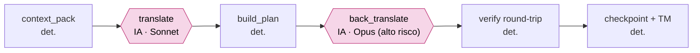

# Translation Cognition Framework

Framework **spec-driven** para tradução baseada em **cognição narrativa**. Separa entendimento,
estrutura, regras, planejamento, execução e validação para preservar **identidade, tom e
consistência** em textos complexos como jogos, filmes e séries.

A ideia central: localização de qualidade não é traduzir linha a linha — é entender o universo,
fixar regras auditáveis e executá-las com verificação contínua. O framework torna cada uma dessas
etapas explícita, com gates que impedem avançar sobre uma base incompleta.

---

## Estrutura do repositório

```
framework/     → O PROCESSO (genérico, reutilizável). Não contém dados de obra nenhuma.
projects/      → AS INSTÂNCIAS. Cada obra traduzida vive em projects/<título>/.
```

- **`framework/`** — os passos do SDD (`00..08`), schemas, perfis de mídia (jogos/filmes/séries) e
  conectores (extração/reinserção). Comece por [`framework/README.md`](framework/README.md).
- **`projects/`** — cada projeto traz seu `project.json` (manifesto), `profile/` (dados curados) e
  `artifacts/` (outputs gerados). O `media_type` vive no manifesto — sem hierarquia de pastas por mídia.

---

## O modelo em camadas

| Camada | Onde | O que é |
|--------|------|---------|
| Processo | `framework/skills/` | Os passos do SDD — genéricos, sem dados de obra |
| Categoria | `framework/media-profiles/` | Preocupações por tipo de mídia (jogos ✅, filmes/séries 🚧) |
| I/O | `framework/connectors/` | Código determinístico que extrai/reinsere texto no meio (binário, etc.) |
| Instância | `projects/<título>/` | Manifesto + perfil + artefatos + scripts do conector |

As skills resolvem tudo que é específico de uma obra lendo o `project.json` e os artefatos gerados.

---

## O pipeline (00 → 08)

```
00 extração      → conector: binário → corpus canônico (+ orçamento de bytes); gate de round-trip
01 discovery     → entidades, tom, aliases, spoilers
02 entidades     → registro canônico
03 conhecimento  → pesquisa colaborativa (IA + usuário) → base de conhecimento
04 glossário     → regras normativas de tradução (+ decision log)
05 planejamento  → plano linha a linha (+ corpus de teste sintético)
06 tradução      → execução em lotes, auto-revisão de voz, orçamento de bytes (shift-left)
06b/06c QA       → micro-QA por lote + ciclo de correção cirúrgica
07 QA final      → consistência global, spoilers cross-segmento
08 reinserção    → conector: tradução → binário + patch (determinístico; LLM só no resíduo)
```

---

## Arquitetura em um olhar

**Princípio central:** a LLM faz **só** o que exige IA — **traduzir** e **verificar alto risco**. Todo o
resto (estado, memória, governança, checkpoints, montagem de contexto, validação) é **determinístico e
externo** à janela. Cada cena é um **job stateless** cujo contexto é O(cena), não O(histórico) — foi isso
que matou o estouro de sessão e destravou rodar a obra inteira em Sonnet a custo previsível.



> As **duas únicas** caixas de IA (rosa) são `translate` e `back_translate`. O desenho completo das
> camadas e o "porquê" medido estão em [`framework/docs/ARCHITECTURE.md`](framework/docs/ARCHITECTURE.md).

---

## Começar

1. Leia [`framework/README.md`](framework/README.md) — modelo de camadas e como instanciar um projeto.
2. Veja a instância de referência em [`projects/utawarerumono/`](projects/utawarerumono/README.md) —
   um jogo (visual novel), EN→pt-BR, com identidades duplas e gestão crítica de spoilers.
3. Para um projeto novo: copie `framework/templates/project.template.json`, preencha o manifesto e
   rode o pipeline na ordem `00..08`.

---

## Status — junho 2026

O framework saiu do "valida em 2 cenas" e entrou em **produção real**: o harness stateless traduz e
verifica capítulos inteiros de forma sustentável, em Sonnet, a custo medido.

- **Processo (skills 00–08):** maduro.
- **Harness de escala (`framework/runtime/`):** ✅ em produção. Cena = job stateless O(cena) → **estouro
  de sessão eliminado**. **Caps 11, 12 e 13 traduzidos e verificados ponta-a-ponta** (round-trip
  byte-idêntico + back-translation) — cap.12 **16/16** cenas, cap.13 **9/9 via Batch API**.
- **Custo sob controle:** Sonnet aprovado por benchmark (nível Opus-à-mão em comédia/registro);
  **~$36/jogo** no setting econômico. Batch API **−50%** comprovado vivo; tiering Haiku/Sonnet, dedup por
  TM e escalonamento cirúrgico codados. Telemetria de gasto-verdade (`api_ledger.jsonl` + `cost_report.py`).
- **Cognição cabeada:** gate de KB + **driver de Fase 0** (`kb_phase.py`); **controle de spoiler** por
  ledger + filtro temporal (comprovado no reveal Ukon=Oshtor em `ch_13_08`).
- **Jogo real (conector `hex_binary`):** ✅ validado **in-game** — ponteiro file-relativo, relocação
  intra-arquivo + reescrita da tabela Pack, transliteração de charset; pt-BR renderiza na tela do jogo.
- **Qualidade travada:** 58 testes (42 runtime + 16 conector), determinismo/idempotência e um guard que
  barra texto da obra hardcoded em `.py`.
- **Pendente:** completar a 2ª metade do jogo (estratégia incremental por capítulo no
  [`ROADMAP.md`](ROADMAP.md)) + pós-produção (build jogável, QA in-game, release).
- **Filmes / séries:** pontos de extensão documentados (`framework/media-profiles/`), ainda não validados.

## Conquistas & design — por que isto é diferente

Não é um "tradutor por linha". É um **framework de execução cognitiva para localização narrativa**, e o
mérito está em escolhas de engenharia que se sustentam:

- **LLM só para cognição.** Isolar a IA em duas funções (traduzir / verificar) e deixar TODO o resto
  determinístico dá **custo previsível, resultado reprodutível e escala** que não depende da memória do chat.
- **Estado externalizado.** Consistência vem de TM + glossário + voice cards + decision log versionados —
  não da janela. Sem banco, sem embeddings, sem 2º serviço pago (só a API Anthropic).
- **Governança explícita.** IA **propõe** → gates **aprovam** (round-trip + back-translation + lint) →
  script **aplica**. Binário read-only; nenhuma tradução escrita à mão dentro dos dados.
- **Anti-overengineering deliberado.** Orquestrador determinístico + 2 papéis de IA é a granularidade
  certa — sem multiagentes, sem indireção que não paga o próprio custo (ver ADRs).
- **Honestidade operacional.** O ledger conta cada centavo cobrado (mesmo em falha); os gates barram
  avançar sobre base incompleta; o controle de spoiler é decisão **por linha**, não só fronteira de wiki.
