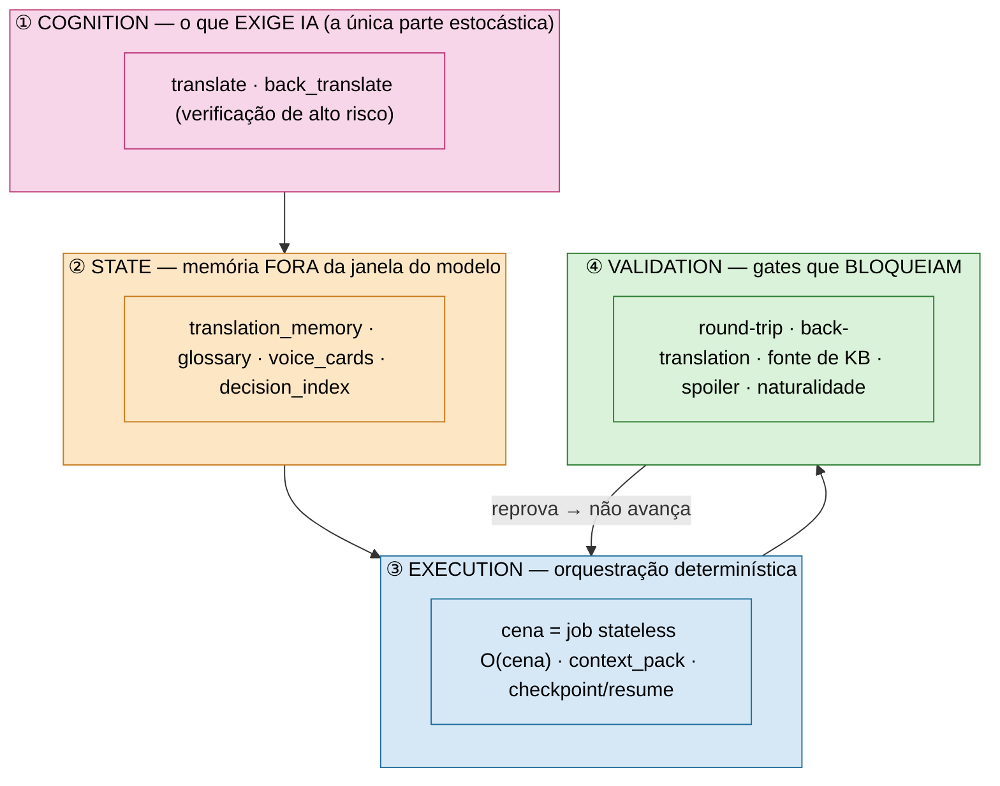
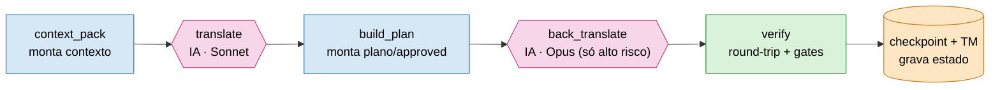
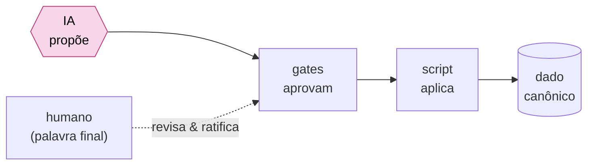
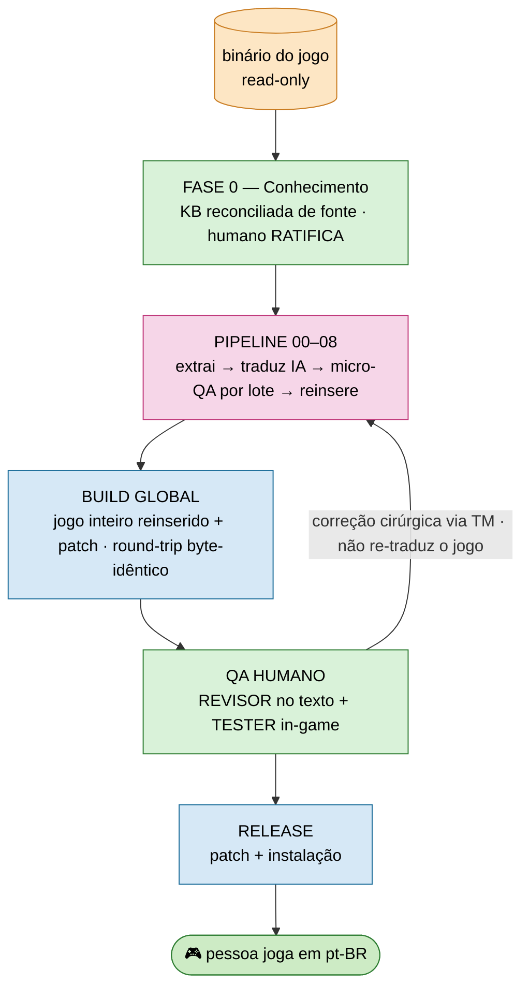
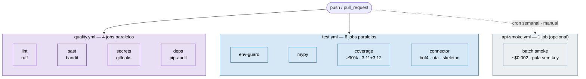

# Translation Cognition Framework
> *AI engineering framework for narrative localization — stateless cognition, deterministic gates, zero wasted cost across 45k lines in production.*

[](https://github.com/scudellerlemos/translation-cognition-framework/actions/workflows/test.yml)    

> **Um framework de engenharia de IA para localizar obras narrativas longas** (jogos, visual novels,
> filmes, séries) **sem perder consistência, identidade de personagem, terminologia nem controle de
> spoiler.** A tradução é o *domínio de validação*; o que se reusa é o **padrão de arquitetura**:
> jobs cognitivos *stateless*, estado externalizado, orquestração determinística e gates de validação.
>
> Validado na prática traduzindo **um jogo real, EN→pt-BR, capítulos inteiros** (ver [Status](#status)).

### Em 30 segundos

| | |
|---|---|
| **O que é** | Engenharia que faz um LLM localizar obras narrativas longas sem perder consistência, voz nem controle de spoiler — tirando memória, governança e fluxo de **dentro** do modelo. |
| **A prova** | Um jogo real **100% traduzido** EN→pt-BR: 16 capítulos, ~45.100 linhas, **round-trip byte-idêntico**, **~R$ 338,46** com **R$ 0 desperdiçado**. |
| **O diferencial** | A IA só **propõe** (tradução); **gates determinísticos julgam**; o **humano tem a palavra final**. Nada entra no dado canônico sem prova reproduzível. |

> Quer ver o filme inteiro numa imagem? Vá direto ao [processo ponta a ponta](#o-processo-ponta-a-ponta)
> e a [quem faz o quê](#papéis-quem-faz-o-quê-ia--gates--humano).

Se você está chegando agora e nunca viu os conceitos, leia nesta ordem: **o problema** → **as 4
camadas** → **os princípios** → **o glossário**. Há também um guia conceitual passo a passo em
[`framework/docs/CONCEPTS.md`](framework/docs/CONCEPTS.md) ("explique como se eu estivesse aprendendo IA").

---

## Por que isto é diferente

Não é um "tradutor por linha". É um **framework de execução cognitiva governada**, e o mérito está em escolhas de engenharia que se sustentam:

- **LLM só para cognição** → custo previsível, resultado verificável e escala que não depende da memória do chat.
- **Estado externalizado** → consistência vem do store versionado, não da janela. Só a API Anthropic; nada de 2º serviço.
- **Governança explícita** → IA propõe, gates aprovam, script aplica; binário read-only; nenhuma tradução à mão no dado.
- **Anti-overengineering deliberado** → orquestrador determinístico + 2 papéis de IA. Sem multiagentes, sem indireção que não se paga (ver ADRs).
- **Honestidade operacional** → o ledger conta cada centavo (mesmo em falha); os gates barram base incompleta; spoiler é decisão **por linha**.

---

## O problema (por que isto é difícil)

Pedir a um LLM "traduza este jogo" quebra de quatro jeitos previsíveis, e todos pioram com a escala:

1. **Memória.** O modelo esquece o que decidiu 200 linhas atrás → o mesmo termo sai traduzido de 3 jeitos.
2. **Spoiler.** Ele usa o nome verdadeiro de um personagem **antes** da revelação na história.
3. **Identidade/voz.** Um personagem cômico começa a falar formal; uma identidade dupla vaza cedo.
4. **Custo e contexto.** Mandar "o jogo todo" pra cada decisão estoura a janela e a fatura.

A resposta ingênua (um chat de vida-longa que "lembra de tudo") **não escala** — o histórico cresce sem
limite, o custo é imprevisível e nada é auditável. Este framework ataca a causa: **tira a memória, a
governança e o controle de fluxo de dentro do LLM** e deixa o modelo fazer só o que exige IA.

---

## A arquitetura em 4 camadas

O sistema inteiro é uma pilha de quatro responsabilidades. A IA vive **só** na primeira; as outras três
são **código determinístico** (mesma entrada → mesma saída, sem rede, testável).


```mermaid
flowchart TB
  subgraph C["① COGNITION — o que EXIGE IA (a única parte estocástica)"]
    c1["translate · back_translate (verificação de alto risco)"]
  end
  subgraph S["② STATE — memória FORA da janela do modelo"]
    s1["translation_memory · glossary · voice_cards · decision_index"]
  end
  subgraph E["③ EXECUTION — orquestração determinística"]
    e1["cena = job stateless O(cena) · context_pack · checkpoint/resume"]
  end
  subgraph V["④ VALIDATION — gates que BLOQUEIAM"]
    v1["round-trip · back-translation · fonte de KB · spoiler · naturalidade"]
  end
  C --> S --> E --> V
  V -->|"reprova → não avança"| E
  classDef cog fill:#f6d6e8,stroke:#c0397b,color:#000;
  classDef sta fill:#fde6c4,stroke:#c97b1f,color:#000;
  classDef exe fill:#d6e8f6,stroke:#1f6f9b,color:#000;
  classDef val fill:#d9f2d9,stroke:#2e7d32,color:#000;
  class C,c1 cog;
  class S,s1 sta;
  class E,e1 exe;
  class V,v1 val;
```

> **Paleta (vale para os dois diagramas):** 🩷 Cognition (a única parte de IA) · 🟧 State · 🟦 Execution · 🟩 Validation.

| Camada | Responsabilidade | Como pensar nela | Onde mora |
|---|---|---|---|
| **① Cognition** | Traduzir e verificar alto risco | "A única coisa que um humano não conseguiria automatizar." É fina e isolada de propósito. | `runtime/model.py`, `back_translate.py` |
| **② State** | Lembrar decisões entre cenas | "A memória que o chat *não* tem — vive em arquivos, não na janela." | `runtime/state_index.py` → `artifacts/state/` |
| **③ Execution** | Rodar cada cena como job isolado | "Cada cena é uma função pura: recebe um pacote, devolve uma tradução, esquece o resto." | `runtime/run_scene.py`, `context_pack.py` |
| **④ Validation** | Provar que cada passo está correto | "Portões: se o round-trip ou a fonte de KB falham, o pipeline **para**." | `runtime/kb_*`, `spoiler_check.py`, conector `verify_*`, `validation/` |

> **A regra de ouro do projeto:** a LLM faz **só** o que exige IA (traduzir / verificar). Estado,
> memória, governança, checkpoints, montagem de contexto e validação são **determinísticos e externos**.
> Foi isso que matou o estouro de sessão e tornou o custo previsível. Detalhe medido em
> [`framework/docs/ARCHITECTURE.md`](framework/docs/ARCHITECTURE.md).

### As duas únicas chamadas de IA, no fluxo de uma cena

As mesmas cores das 4 camadas marcam a que camada cada passo pertence:


```mermaid
flowchart LR
  pack["context_pack<br/>monta contexto"]:::exe --> tr{{"translate<br/>IA · Sonnet"}}:::cog
  tr --> plan["build_plan<br/>monta plano/approved"]:::exe
  plan --> bt{{"back_translate<br/>IA · Opus (só alto risco)"}}:::cog
  bt --> vf["verify<br/>round-trip + gates"]:::val
  vf --> cp[("checkpoint + TM<br/>grava estado")]:::sta
  classDef cog fill:#f6d6e8,stroke:#c0397b,color:#000;
  classDef sta fill:#fde6c4,stroke:#c97b1f,color:#000;
  classDef exe fill:#d6e8f6,stroke:#1f6f9b,color:#000;
  classDef val fill:#d9f2d9,stroke:#2e7d32,color:#000;
```

> 🩷 **Cognition** (`translate`, `back_translate`) · 🟦 **Execution** (`context_pack`, `build_plan`) ·
> 🟩 **Validation** (`verify`) · 🟧 **State** (`checkpoint + TM`). As caixas rosas são as **únicas**
> não-determinísticas; todo o resto é reproduzível.

---

## Princípios arquiteturais

Seis decisões sustentam tudo. Cada uma resolve um dos problemas acima.

- **Scene as Stateless Job** — cada cena roda isolada, com contexto **O(cena)** (não O(histórico)).
  Mata o estouro de janela e torna o pipeline resumível: cair na cena 40 não perde as 39 anteriores.
- **Estado externalizado** — consistência vem de arquivos versionados (TM, glossário, voice cards,
  decision log), não da memória do chat. Sem banco, sem embeddings, sem 2º serviço pago.
- **Runtime agnóstico ao modelo** — a lógica não sabe qual LLM roda. Trocar Haiku/Sonnet/Opus por
  complexidade da linha é configuração, não reescrita (`runtime/model.py` é a única fronteira).
- **SDD — Specification-Driven Development** — as regras de tradução (glossário, vozes, spoilers) são
  **especificações versionadas e checáveis**, produzidas por etapas explícitas (`00..08`), não decisões
  ad-hoc perdidas num chat. Cada etapa tem um *gate* que impede avançar sobre base incompleta.
- **Gates explícitos** — a IA **propõe**, gates determinísticos **aprovam**, um script **aplica**.
  Nada entra no dado canônico sem passar por uma verificação reproduzível. Ver
  [`framework/docs/GOVERNANCE.md`](framework/docs/GOVERNANCE.md).
- **Versionamento de artefatos e prompts** — todo artefato carrega as instruções exatas que o
  produziram (`doctrine_hash`, `model_id`, `skills_revision`). Sem proveniência, melhorar um prompt
  é cego: não há como saber quais cenas foram traduzidas com doutrina obsoleta nem re-traduzir só o
  que mudou. Ver [ROADMAP — Prioridade #1](ROADMAP.md).
- **Generic Connector System** — quando o framework encontra um novo jogo, descobre automaticamente
  os arquivos de diálogo, gera um conector determinístico e valida via round-trip. O LLM participa
  **apenas no bootstrap**; após aprovação, o conector roda sem IA. Piloto: *Breath of Fire IV* (em andamento).


```mermaid
flowchart LR
  ia{{"IA<br/>propõe"}} --> gate["gates<br/>aprovam"] --> script["script<br/>aplica"] --> canon[("dado<br/>canônico")]
  human["humano<br/>(palavra final)"] -.->|"revisa & ratifica"| gate
  classDef ia fill:#f6d6e8,stroke:#c0397b,color:#000;
  class ia ia;
```

---

## Papéis: quem faz o quê (IA · gates · humano)

Três tipos de ator, com fronteiras explícitas. **A IA nunca julga** — ela **propõe** (tradução) e
**revisa** (back-translation). Quem dá veredito é o **gate determinístico** (juiz objetivo das regras)
e, acima de tudo, o **humano (juiz final do sentido, da voz e da tela)**.

| Ator | Papel | Faz | NÃO faz |
|---|---|---|---|
| 🩷 **IA-tradutora** | propõe a tradução | traduz cada linha (Haiku/Sonnet por complexidade) → `translation_plan` | gravar no canônico; decidir lore |
| 🩷 **IA-revisora** (back-translation) | revisão automática **barata** de sentido | re-traduz pt-BR→EN só em alto risco e **aponta** (marca `revise`) | **dar veredito** — só sinaliza, não decide |
| 🟦🟩 **Gates determinísticos** | **juiz objetivo** (regras) | round-trip, fonte de KB, spoiler, largura de balão, glossário — **bloqueiam** | opinar sobre gosto literário |
| 👤 **Humano-Ratificador** | **juiz** da verdade da KB | confirma entidade/gênero **com fonte** (`kb_ratified.csv`) | traduzir linha a linha |
| 👤 **Humano-Revisor** | **juiz final** do **texto** | lê o XLSX, marca `CORRIGIR` → verbatim (R$ 0) ou nota | mexer no binário |
| 👤 **Humano-Tester** | **juiz final** na **tela** | joga, reporta por print + trecho (localizador determinístico) | usar OCR/IA |

> **A linha-mestra:** *determinístico por padrão, IA só onde exige IA, **o humano é o juiz**.* A IA
> **revisa** (a back-translation aponta o que cheira mal); quem **julga** é o gate (objetivo, sobre
> regras) ou o **humano (juiz final, sobre sentido e gosto)**. Detalhe com desenhos em
> [`GOVERNANCE.md`](framework/docs/GOVERNANCE.md) e os papéis humanos em
> [`QA_REVIEW.md`](framework/docs/QA_REVIEW.md).

---

## Engenharia de custo e previsibilidade

A arquitetura diz *onde* a IA vive; a **engenharia** torna rodar uma obra inteira barato,
previsível e auditável. Três alavancas sustentam isso: **custo de pior-caso conhecido antes
de gastar** (estimativa pré-voo + teto duro `--max-usd`), **conserto por LINHA e não por cena**
(retry ∝ linhas quebradas, não ∝ tamanho da cena) e **cada centavo auditável**
(`api_ledger.jsonl` registra toda chamada, inclusive as que falham). O detalhe medido — com o
diagrama de recuperação por-linha — está em
[`framework/docs/ARCHITECTURE.md`](framework/docs/ARCHITECTURE.md#por-que-isto-escala-e-roda-em-sonnet).

| Alavanca de custo | Mecanismo | Efeito |
|---|---|---|
| Reuso | TM *append-only* + dedup por cena | fala repetida não re-paga; o jogo não é re-traduzido após o QA |
| Tier por complexidade | Haiku (linha simples) / Sonnet (com quebra) / Opus (só verificação) | paga o modelo certo por linha |
| Batch | Batch API −50%, Carta cacheada compartilhada | metade do preço no 1º passe |
| Recuperação por-linha | re-traduz só o que quebrou | retry barato e previsível |
| Teto + estimativa | estimativa pré-voo + gate de submissão | gasto de pior-caso ≤ teto, conhecido antes |

> A **governança** (acima) e a **engenharia** (aqui) se reforçam: gates determinísticos garantem que
> nada entra no dado canônico sem prova; a economia garante que provar isso em escala **cabe no bolso**.
> O round-trip byte-idêntico é o oráculo que torna a correção **objetiva** (não opinião).

---

## Glossário (o mínimo antes de mergulhar)

Os 4 termos que aparecem em quase todo diagrama. O guia conceitual completo (com o
"problema → solução → por que importa em IA") está em
[`framework/docs/CONCEPTS.md`](framework/docs/CONCEPTS.md); os demais termos de domínio
(KB, Voice Card, Round-Trip, Back-Translation, Conector, QA, ADR) são definidos ali e no
corpo deste README na primeira vez que aparecem.

| Termo | O que é |
|---|---|
| **Scene as Stateless Job** | Cada cena é traduzida como função isolada: recebe um pacote de contexto, devolve a tradução, não guarda histórico. Contexto O(cena), não O(histórico). |
| **Context Pack** | O pacote **mínimo** de contexto montado por cena (doutrina cacheável + glossário relevante + vozes dos falantes + linhas) — exatamente o que o LLM vê, nada além. |
| **TM** (Translation Memory) | Banco *append-only* de traduções já decididas; reusadas de graça, mantêm consistência. É o "coração" — o jogo não é re-traduzido após o QA. |
| **Gate** | Verificação determinística que **bloqueia** o avanço se algo falha (round-trip, fonte de KB, spoiler, naturalidade). |

---

## Estrutura do repositório

```
framework/     → O PROCESSO + O MOTOR (genérico, reutilizável). Zero dado de obra.
projects/      → AS INSTÂNCIAS. Cada obra traduzida vive em projects/<título>/.
```

| Pasta | Papel | Camada(s) |
|---|---|---|
| `framework/skills/` | As etapas do SDD (`00..08`) — o processo, em prosa | Cognition (guia) + Validation (gates) |
| `framework/runtime/` | O harness executável (cena = job stateless, interface de modelo) | State + Execution + Cognition |
| `framework/connectors/` | I/O determinística: binário ↔ corpus (round-trip) | Execution + Validation |
| `framework/validation/` | Validadores determinísticos (schemas, naturalidade, custo) | Validation |
| `framework/media-profiles/` | Preocupações por tipo de mídia (jogos ✅, filmes/séries 🚧) | — |
| `framework/docs/` | ARCHITECTURE, CONCEPTS, GOVERNANCE, NAMING, ADRs, ROADMAP | — |
| `projects/<obra>/` | `project.json` (manifesto) + `profile/` + `artifacts/` + `connector/` | A instância (os dados) |

As skills/runtime resolvem tudo que é específico de uma obra lendo o `project.json` e os artefatos.
Nenhum nome de personagem, termo de lore ou idioma vive dentro de `framework/`.

---

## O processo ponta a ponta

O filme inteiro, do binário do jogo até a pessoa jogando em pt-BR. As cores são as das 4 camadas; o
loop de QA mostra que correções humanas **voltam pela TM** (cirúrgicas), sem re-traduzir o jogo.


```mermaid
flowchart TB
  bin[("binário do jogo<br/>read-only")]:::sta
  bin --> f0["FASE 0 — Conhecimento<br/>KB reconciliada de fonte · humano RATIFICA"]:::val
  f0 --> pipe["PIPELINE 00–08<br/>extrai → traduz IA → micro-QA por lote → reinsere"]:::cog
  pipe --> build["BUILD GLOBAL<br/>jogo inteiro reinserido + patch · round-trip byte-idêntico"]:::exe
  build --> qa["QA HUMANO<br/>REVISOR no texto + TESTER in-game"]:::val
  qa -->|"correção cirúrgica via TM · não re-traduz o jogo"| pipe
  qa --> rel["RELEASE<br/>patch + instalação"]:::exe
  rel --> play(["🎮 pessoa joga em pt-BR"]):::good
  classDef cog fill:#f6d6e8,stroke:#c0397b,color:#000;
  classDef sta fill:#fde6c4,stroke:#c97b1f,color:#000;
  classDef exe fill:#d6e8f6,stroke:#1f6f9b,color:#000;
  classDef val fill:#d9f2d9,stroke:#2e7d32,color:#000;
  classDef good fill:#cdebc5,stroke:#2e7d32,color:#000;
```

> 🟧 binário (read-only) · 🟩 gates/QA (Fase 0 + QA humano) · 🩷 IA (tradução) · 🟦 build/release
> (determinístico). A Fase 0 e o QA humano **cercam** a parte de IA — nada é traduzido sem KB de fonte,
> nada é entregue sem revisão humana.

## O pipeline (00 → 08)

As etapas do SDD. Cada uma lê os artefatos da anterior e tem um *gate* de entrada.

```
00 extração      → conector: binário → corpus canônico (+ orçamento de bytes); gate de round-trip
01 discovery     → entidades, tom, aliases, spoilers
02 entidades     → registro canônico
03 conhecimento  → pesquisa reconciliada (IA + humano, por fonte) → Knowledge Base
04 glossário     → regras normativas de tradução (+ decision log)
05 planejamento  → plano linha a linha (+ corpus de teste sintético)
06 tradução      → execução em lotes, auto-revisão de voz, orçamento de bytes (shift-left)
06b/06c QA       → micro-QA por lote + ciclo de correção cirúrgica
07 QA final      → consistência global, spoilers cross-segmento
08 reinserção    → conector: tradução → binário + patch (determinístico; LLM só no resíduo)
```

---

## A esteira de CI (paralela por desenho)

O pipeline de tradução (00→08, acima) é sequencial porque é **dependência real de dado**. A
esteira de **CI é o oposto**: todos os checks rodam em paralelo, cada um em runner isolada, sem
nenhum `needs:` encadeando jobs — o tempo total é o do **maior** job, não a soma. Três workflows
disparam a cada push/PR (o de smoke só em cron/manual):


```mermaid
flowchart TB
  push(["push / pull_request"]) --> q & t
  push -.->|"cron semanal · manual"| s
  subgraph q["quality.yml — 4 jobs paralelos"]
    direction LR
    q1["lint<br/>ruff"] ~~~ q2["sast<br/>bandit"] ~~~ q3["secrets<br/>gitleaks"] ~~~ q4["deps<br/>pip-audit"]
  end
  subgraph t["test.yml — 6 jobs paralelos"]
    direction LR
    t1["env-guard"] ~~~ t2["mypy"] ~~~ t3["coverage<br/>≥90% · 3.11+3.12"] ~~~ t4["connector<br/>bof4 · uta · skeleton"]
  end
  subgraph s["api-smoke.yml — 1 job (opcional)"]
    s1["batch smoke<br/>~$0.002 · pula sem key"]
  end
  classDef qual fill:#e8dff5,stroke:#6a3d9b,color:#000;
  classDef test fill:#d6e8f6,stroke:#1f6f9b,color:#000;
  classDef smoke fill:#eceff1,stroke:#607d8b,color:#000;
  class q,q1,q2,q3,q4 qual;
  class t,t1,t2,t3,t4 test;
  class s,s1 smoke;
```

> 🟪 **Quality** (estilo + segurança: lint, SAST, secret-scan, CVEs) · 🟦 **Tests** (guard de
> `.env`, type-check, cobertura ≥90% em 2 versões de Python, contrato round-trip dos 3 conectores) ·
> ⬜ **API Smoke** (só cron/manual). Paleta própria de propósito — este é o eixo de **engenharia**,
> não as 4 camadas do produto. **Zero `needs:` nos 3 workflows:** nenhum gargalo sequencial artificial.
> Sem branch protection no `main` (repo solo dev): um check vermelho é aviso visual, não trava merge.
> Detalhe job a job em [`framework/README.md`](framework/README.md#ci--esteira-de-verificação-paralela-sem-encadeamento).

---

## Começar

1. Leia [`framework/docs/CONCEPTS.md`](framework/docs/CONCEPTS.md) se os conceitos acima são novos.
2. Leia [`framework/README.md`](framework/README.md) — o modelo de camadas e como instanciar um projeto.
3. Veja a instância de referência em [`projects/utawarerumono/`](projects/utawarerumono/README.md) —
   um jogo (visual novel), EN→pt-BR, com identidades duplas e gestão crítica de spoilers.
4. Veja a segunda instância em [`projects/breath_of_fire_4/`](projects/breath_of_fire_4/README.md) —
   piloto de portabilidade para novo engine Capcom.
5. Para um projeto novo: copie `framework/templates/project.template.json`, preencha o manifesto e
   rode o pipeline `00..08`.

Aprofundar: [`ARCHITECTURE.md`](framework/docs/ARCHITECTURE.md) (o porquê medido) ·
[`GOVERNANCE.md`](framework/docs/GOVERNANCE.md) (quem propõe/aprova/aplica) ·
[`SDD_RUNTIME.md`](framework/SDD_RUNTIME.md) (mapa skill↔runtime, quem produz/consome cada artefato) ·
[`QA_REVIEW.md`](framework/docs/QA_REVIEW.md) (revisão humana: papéis REVISOR + TESTER) ·
[`CHANGELOG.md`](CHANGELOG.md) (histórico de versões) ·
[`adr/`](framework/docs/adr/) (as decisões de IA, registradas) · [`ROADMAP.md`](ROADMAP.md).

---

## Status — junho 2026

**Versão estável: [1.0.0](CHANGELOG.md).** Ver [ROADMAP](ROADMAP.md) para o detalhamento técnico.

### Framework — objetivos alcançados

- Harness stateless em produção: cena = job isolado, contexto O(cena), sem estouro de sessão ✅
- Batch API (−50%) + tiering Haiku/Sonnet/Opus validado em escala de capítulo ✅
- Gates de cognição: KB-gate (entidade sem fonte BLOQUEIA), controle de spoiler e gênero ✅
- Revisão humana via XLSX → verbatim (R$ 0) ou nota cirúrgica; TM como coração ✅
- Ledger auditável (`api_ledger.jsonl`): toda chamada cobrada registrada, inclusive falhas ✅
- Generic Connector System: dois engines distintos (Aquaplus + Capcom) com round-trip byte-idêntico ✅
- Protocolo estruturado do conector (exit codes + `VERIFY_STATUS`), `paths.py`, `batch_smoke.py` ✅
- 316 testes passando / 21 skipped · cobertura do core 90.17% (gate `--cov-fail-under=90`) ✅
- CI paralela: 3 workflows (quality 4 jobs · tests 6 jobs · api-smoke) sem encadeamento (`needs:` = 0) ✅

### Utawarerumono: Mask of Deception — CONCLUÍDO ✅

**16 capítulos (11–23 + 30, 31, 39), 146 cenas, ~45.100 linhas.** Traduzidas, verificadas, reinseridas. Projeto arquivado.

- Round-trip byte-idêntico (resíduo T4=0) · back-translation de alto risco · controle de spoiler (reveal Ukon=Oshtor) ✅
- Custo: **~R$ 338,46** (Sonnet R$ 260,17 · Opus R$ 40,01 · Haiku R$ 38,28) · **R$ 0 desperdiçado** ✅
- Validado in-game: pt-BR renderiza na tela, jogo avança sem travar ✅

### Breath of Fire IV — ciclo de tradução completo, pendências em aberto

**125 cenas (AREAD + AREAS), todas `verified`. Reinserção concluída** (125 DAT files em `output/`, T4=0).
Custo: **~$11,04 USD** (Haiku $6,04 · Opus $2,61 · Sonnet $2,40).

**Objetivos alcançados:**
- Conector Capcom DAT: extração + reinserção + round-trip byte-idêntico ✅
- Pipeline completo (Fases 00–08): KB, glossário, planejamento, 125 cenas traduzidas e reinseridas ✅
- QA humana concluída; DAT files de output gerados ✅
- Validação in-game: OK (foco do projeto era o pipeline, não QA in-game extensiva) ✅

**Débito técnico:**

| Item | Tipo |
|---|---|
| TM busca semântica (B2: `paraphrase-multilingual-MiniLM-L12-v2` local) — não implementada | débito técnico |

**Próximos passos:**
1. TM semântica (B2) — quando corpus multi-game justificar

---

### Dívidas do framework (independentes de projeto)

| Dívida | Quando |
|---|---|
| `run_game` — driver ponta-a-ponta (capítulos + Fase 0 gating sem intervenção manual) | P2.5 — agora (barato) |
| Observabilidade de progresso (linhas/min, % do jogo, ETA, taxa de falha) | P2.5 — agora (barato) |
| `state_index` rebuild 1×/capítulo no batch (hoje por cena, redundante) | P2.5 — agora (barato) |
| TM busca semântica (B2) — implementação pendente | pós-produção |
| Evolução do conector: registry de detecção + síntese governada (round-trip como oráculo) | P4 (pós-produção) |
| Filmes / séries: pontos de extensão documentados, sem validação em produção | futuro |

