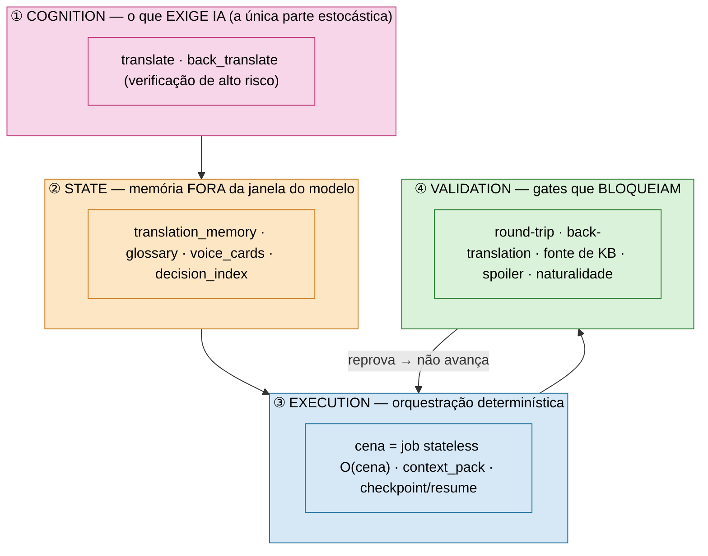
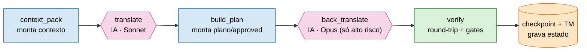
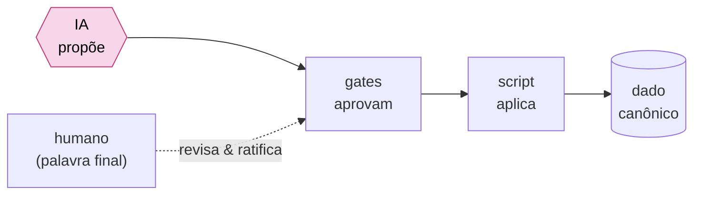
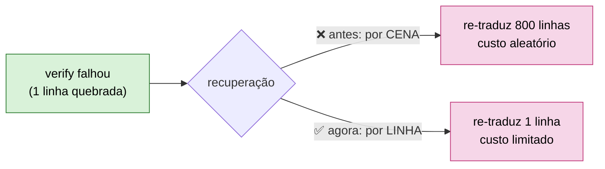
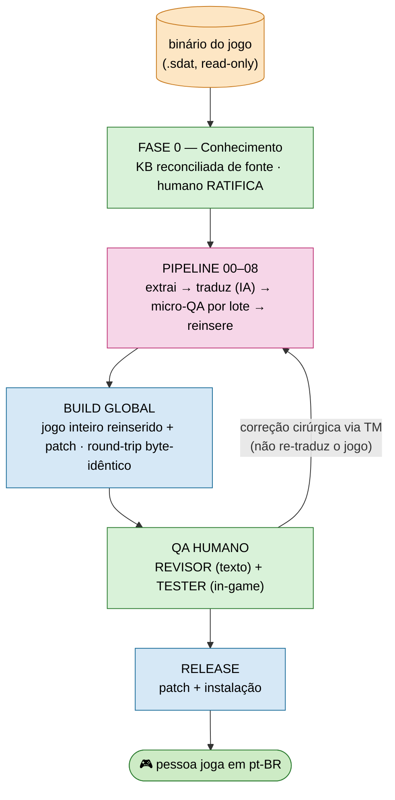

# Translation Cognition Framework

> **Um framework de engenharia de IA para localizar obras narrativas longas** (jogos, visual novels,
> filmes, séries) **sem perder consistência, identidade de personagem, terminologia nem controle de
> spoiler.** A tradução é o *domínio de validação*; o que se reusa é o **padrão de arquitetura**:
> jobs cognitivos *stateless*, estado externalizado, orquestração determinística e gates de validação.
>
> Validado na prática traduzindo **um jogo real, EN→pt-BR, capítulos inteiros** (ver [Status](#status)).

### Em 30 segundos

| | |
|---|---|
| **O que é** | Engenharia que faz um LLM localizar obras narrativas longas sem perder consistência, voz nem controle de spoiler — tirando memória, governança e fluxo de **dentro** do modelo. |
| **A prova** | Um jogo real **100% traduzido** EN→pt-BR: 16 capítulos, ~45.100 linhas, **round-trip byte-idêntico**, **~$65,9** com **$0 desperdiçado**. |
| **O diferencial** | A IA só **propõe** (tradução); **gates determinísticos julgam**; o **humano tem a palavra final**. Nada entra no dado canônico sem prova reproduzível. |

> Quer ver o filme inteiro numa imagem? Vá direto ao [processo ponta a ponta](#o-processo-ponta-a-ponta-fase-0--jogando)
> e a [quem faz o quê](#papéis-quem-faz-o-quê-ia--gates--humano).

Se você está chegando agora e nunca viu os conceitos, leia nesta ordem: **o problema** → **as 4
camadas** → **os princípios** → **o glossário**. Há também um guia conceitual passo a passo em
[`framework/docs/CONCEPTS.md`](framework/docs/CONCEPTS.md) ("explique como se eu estivesse aprendendo IA").

---

## O problema (por que isto é difícil)

Pedir a um LLM "traduza este jogo" quebra de quatro jeitos previsíveis, e todos pioram com a escala:

1. **Memória.** O modelo esquece o que decidiu 200 linhas atrás → o mesmo termo sai traduzido de 3 jeitos.
2. **Spoiler.** Ele usa o nome verdadeiro de um personagem **antes** da revelação na história.
3. **Identidade/voz.** Um personagem cômico começa a falar formal; uma identidade dupla vaza cedo.
4. **Custo e contexto.** Mandar "o jogo todo" pra cada decisão estoura a janela e a fatura.

A resposta ingênua (um chat de vida-longa que "lembra de tudo") **não escala** — o histórico cresce sem
limite, o custo é imprevisível e nada é auditável. Este framework ataca a causa: **tira a memória, a
governança e o controle de fluxo de dentro do LLM** e deixa o modelo fazer só o que exige IA.

---

## A arquitetura em 4 camadas

O sistema inteiro é uma pilha de quatro responsabilidades. A IA vive **só** na primeira; as outras três
são **código determinístico** (mesma entrada → mesma saída, sem rede, testável).


```mermaid
flowchart TB
  subgraph C["① COGNITION — o que EXIGE IA (a única parte estocástica)"]
    c1["translate · back_translate (verificação de alto risco)"]
  end
  subgraph S["② STATE — memória FORA da janela do modelo"]
    s1["translation_memory · glossary · voice_cards · decision_index"]
  end
  subgraph E["③ EXECUTION — orquestração determinística"]
    e1["cena = job stateless O(cena) · context_pack · checkpoint/resume"]
  end
  subgraph V["④ VALIDATION — gates que BLOQUEIAM"]
    v1["round-trip · back-translation · fonte de KB · spoiler · naturalidade"]
  end
  C --> S --> E --> V
  V -->|reprova → não avança| E
  classDef cog fill:#f6d6e8,stroke:#c0397b,color:#000;
  classDef sta fill:#fde6c4,stroke:#c97b1f,color:#000;
  classDef exe fill:#d6e8f6,stroke:#1f6f9b,color:#000;
  classDef val fill:#d9f2d9,stroke:#2e7d32,color:#000;
  class C,c1 cog;
  class S,s1 sta;
  class E,e1 exe;
  class V,v1 val;
```

> **Paleta (vale para os dois diagramas):** 🩷 Cognition (a única parte de IA) · 🟧 State · 🟦 Execution · 🟩 Validation.

| Camada | Responsabilidade | Como pensar nela | Onde mora |
|---|---|---|---|
| **① Cognition** | Traduzir e verificar alto risco | "A única coisa que um humano não conseguiria automatizar." É fina e isolada de propósito. | `runtime/model.py`, `back_translate.py` |
| **② State** | Lembrar decisões entre cenas | "A memória que o chat *não* tem — vive em arquivos, não na janela." | `runtime/state_index.py` → `artifacts/state/` |
| **③ Execution** | Rodar cada cena como job isolado | "Cada cena é uma função pura: recebe um pacote, devolve uma tradução, esquece o resto." | `runtime/run_scene.py`, `context_pack.py` |
| **④ Validation** | Provar que cada passo está correto | "Portões: se o round-trip ou a fonte de KB falham, o pipeline **para**." | `runtime/kb_*`, `spoiler_check.py`, conector `verify_*`, `validation/` |

> **A regra de ouro do projeto:** a LLM faz **só** o que exige IA (traduzir / verificar). Estado,
> memória, governança, checkpoints, montagem de contexto e validação são **determinísticos e externos**.
> Foi isso que matou o estouro de sessão e tornou o custo previsível. Detalhe medido em
> [`framework/docs/ARCHITECTURE.md`](framework/docs/ARCHITECTURE.md).

### As duas únicas chamadas de IA, no fluxo de uma cena

As mesmas cores das 4 camadas marcam a que camada cada passo pertence:


```mermaid
flowchart LR
  pack["context_pack<br/>monta contexto"]:::exe --> tr{{"translate<br/>IA · Sonnet"}}:::cog
  tr --> plan["build_plan<br/>monta plano/approved"]:::exe
  plan --> bt{{"back_translate<br/>IA · Opus (só alto risco)"}}:::cog
  bt --> vf["verify<br/>round-trip + gates"]:::val
  vf --> cp[("checkpoint + TM<br/>grava estado")]:::sta
  classDef cog fill:#f6d6e8,stroke:#c0397b,color:#000;
  classDef sta fill:#fde6c4,stroke:#c97b1f,color:#000;
  classDef exe fill:#d6e8f6,stroke:#1f6f9b,color:#000;
  classDef val fill:#d9f2d9,stroke:#2e7d32,color:#000;
```

> 🩷 **Cognition** (`translate`, `back_translate`) · 🟦 **Execution** (`context_pack`, `build_plan`) ·
> 🟩 **Validation** (`verify`) · 🟧 **State** (`checkpoint + TM`). As caixas rosas são as **únicas**
> não-determinísticas; todo o resto é reproduzível.

---

## Princípios arquiteturais

Cinco decisões sustentam tudo. Cada uma resolve um dos problemas acima.

- **Scene as Stateless Job** — cada cena roda isolada, com contexto **O(cena)** (não O(histórico)).
  Mata o estouro de janela e torna o pipeline resumível: cair na cena 40 não perde as 39 anteriores.
- **Estado externalizado** — consistência vem de arquivos versionados (TM, glossário, voice cards,
  decision log), não da memória do chat. Sem banco, sem embeddings, sem 2º serviço pago.
- **Runtime agnóstico ao modelo** — a lógica não sabe qual LLM roda. Trocar Haiku/Sonnet/Opus por
  complexidade da linha é configuração, não reescrita (`runtime/model.py` é a única fronteira).
- **SDD — Specification-Driven Development** — as regras de tradução (glossário, vozes, spoilers) são
  **especificações versionadas e checáveis**, produzidas por etapas explícitas (`00..08`), não decisões
  ad-hoc perdidas num chat. Cada etapa tem um *gate* que impede avançar sobre base incompleta.
- **Gates explícitos** — a IA **propõe**, gates determinísticos **aprovam**, um script **aplica**.
  Nada entra no dado canônico sem passar por uma verificação reproduzível. Ver
  [`framework/docs/GOVERNANCE.md`](framework/docs/GOVERNANCE.md).


```mermaid
flowchart LR
  ia{{"IA<br/>propõe"}} --> gate["gates<br/>aprovam"] --> script["script<br/>aplica"] --> canon[("dado<br/>canônico")]
  human["humano<br/>(palavra final)"] -.->|revisa & ratifica| gate
  classDef ia fill:#f6d6e8,stroke:#c0397b,color:#000;
  class ia ia;
```

---

## Papéis: quem faz o quê (IA · gates · humano)

Três tipos de ator, com fronteiras explícitas. **A IA nunca tem a palavra final** — ela propõe; quem
*julga* é um gate determinístico (objetivo) ou um humano (gosto literário/experiência na tela).

| Ator | Papel | Faz | NÃO faz |
|---|---|---|---|
| 🩷 **IA-tradutora** | propõe a tradução | traduz cada linha (Haiku/Sonnet por complexidade) → `translation_plan` | gravar no canônico; decidir lore |
| 🩷 **IA-juíza** (back-translation) | crivo **barato** de sentido | re-traduz pt-BR→EN só em alto risco e **marca** `revise` | aprovar sozinha — é sinal, não veredito |
| 🟦🟩 **Gates determinísticos** | o **juiz objetivo** | round-trip, fonte de KB, spoiler, largura de balão, glossário — **bloqueiam** | opinar sobre gosto literário |
| 👤 **Humano-Ratificador** | âncora de verdade da KB | confirma entidade/gênero **com fonte** (`kb_ratified.csv`) | traduzir linha a linha |
| 👤 **Humano-Revisor** | palavra final do **texto** | lê o XLSX, marca `CORRIGIR` → verbatim ($0) ou nota | mexer no binário |
| 👤 **Humano-Tester** | palavra final na **tela** | joga, reporta por print + trecho (localizador determinístico) | usar OCR/IA |

> **A linha-mestra:** *determinístico por padrão, IA só onde exige IA, humano com a palavra final.* A
> back-translation é uma IA que **acusa barato**; quem **decide** é o gate (objetivo) ou o humano (gosto).
> Detalhe com desenhos em [`GOVERNANCE.md`](framework/docs/GOVERNANCE.md) e os papéis humanos em
> [`QA_REVIEW.md`](framework/docs/QA_REVIEW.md).

---

## Engenharia de custo e previsibilidade

A arquitetura diz *onde* a IA vive; a **engenharia** é o que torna rodar uma obra inteira **barato,
previsível e auditável** — o requisito real de quem tem orçamento apertado. Três propriedades sustentam isso.

**1. Custo de pior-caso conhecido ANTES de gastar.** Todo capítulo imprime uma **estimativa pré-voo**
(linhas × faixa medida) e respeita um **teto duro**: o `--max-usd` não é só um corte no meio — o driver
**só compromete ao batch as cenas cujo custo pessimista cabe no teto** e adia o resto (resumível). Você
sabe o número antes de pagar, e ele não estoura.

**2. O conserto é por LINHA, não por cena.** A causa nº1 de gasto imprevisível era: um defeito de **1
linha** (cobertura, paridade de quebra, byte budget) re-traduzia a **cena inteira**. Como o gatilho é
variância do LLM (aleatória), o custo virava aleatório. A recuperação agora re-traduz **só as linhas
quebradas** — custo de retry ∝ linhas com defeito, não ∝ tamanho da cena.


```mermaid
flowchart LR
  v["verify falhou<br/>(1 linha quebrada)"]:::val --> q{recuperação}
  q -->|"❌ antes: por CENA"| a["re-traduz 800 linhas<br/>custo aleatório"]:::cog
  q -->|"✅ agora: por LINHA"| b["re-traduz 1 linha<br/>custo limitado"]:::cog
  classDef cog fill:#f6d6e8,stroke:#c0397b,color:#000;
  classDef val fill:#d9f2d9,stroke:#2e7d32,color:#000;
```

**3. Cada centavo é auditável.** O `api_ledger.jsonl` registra **toda** chamada (modelo, tokens, custo)
**antes** de qualquer parse — inclusive as que falham. Isso permite responder, com dados, *onde* o
dinheiro vai (1º passe vs re-tradução vs back-translation) e provar `$0 desperdiçado`.

| Alavanca de custo | Mecanismo | Efeito |
|---|---|---|
| Reuso | TM *append-only* + dedup por cena | fala repetida não re-paga; o jogo não é re-traduzido após o QA |
| Tier por complexidade | Haiku (linha simples) / Sonnet (com quebra) / Opus (só verificação) | paga o modelo certo por linha |
| Batch | Batch API −50%, Carta cacheada compartilhada | metade do preço no 1º passe |
| Recuperação por-linha | re-traduz só o que quebrou | retry barato e previsível |
| Teto + estimativa | estimativa pré-voo + gate de submissão | gasto de pior-caso ≤ teto, conhecido antes |

> A **governança** (acima) e a **engenharia** (aqui) se reforçam: gates determinísticos garantem que
> nada entra no dado canônico sem prova; a economia garante que provar isso em escala **cabe no bolso**.
> O round-trip byte-idêntico é o oráculo que torna a correção **objetiva** (não opinião).

---

## Glossário (leia antes de mergulhar)

Os termos do projeto na primeira vez que você os encontra. Detalhe conceitual em
[`framework/docs/CONCEPTS.md`](framework/docs/CONCEPTS.md).

| Termo | O que é |
|---|---|
| **SDD** (Specification-Driven Development) | As regras de tradução viram especificações versionadas e checáveis, produzidas por etapas explícitas — não decisões soltas de chat. |
| **Scene as Stateless Job** | Cada cena é traduzida como uma função isolada: recebe um pacote de contexto, devolve a tradução, não guarda histórico. |
| **Context Pack** | O pacote **mínimo** de contexto montado por cena (doutrina cacheável + glossário relevante + vozes dos falantes + as linhas) — é exatamente o que o LLM vê, e nada além. |
| **Estado externalizado** | A "memória" do sistema vive em arquivos (não na janela do LLM): TM, glossário, voice cards, decision index. |
| **TM** (Translation Memory) | Banco *append-only* de traduções já decididas; reusadas de graça e mantêm consistência. É o "coração" — o jogo não é re-traduzido após o QA. |
| **KB** (Knowledge Base) | Glossário + lore + vozes **reconciliados de fonte confiável** e congelados **antes** de traduzir. |
| **Voice Card** | Ficha de voz de um personagem (registro, tiques, léxico) que mantém a fala consistente em todo o corpus. |
| **Round-Trip** | Extrair → reinserir **sem mudar nada** deve regenerar o binário byte a byte. É a prova de que não corrompemos o jogo (prova **bytes**, não qualidade da tradução). |
| **Back-Translation** | Traduzir o pt-BR de volta ao inglês com **outro** modelo, só em linhas de alto risco, para checar se o sentido sobreviveu. |
| **Gate** | Verificação determinística que **bloqueia** o avanço se algo falha (round-trip, fonte de KB, spoiler, naturalidade). |
| **Spoiler Ledger / frontier** | Registro de quando cada revelação acontece + uma "fronteira" que avança por capítulo, para nunca vazar nomes/fatos futuros. |
| **Conector** | Código determinístico que extrai o texto do binário do jogo e o reinsere (round-trip). Específico por engine. |
| **QA** | Quality Assurance — micro-QA por lote + revisão humana final. |
| **ADR** | Architecture Decision Record — registro de uma decisão de arquitetura e seu porquê (em `framework/docs/adr/`). |

---

## Estrutura do repositório

```
framework/     → O PROCESSO + O MOTOR (genérico, reutilizável). Zero dado de obra.
projects/      → AS INSTÂNCIAS. Cada obra traduzida vive em projects/<título>/.
```

| Pasta | Papel | Camada(s) |
|---|---|---|
| `framework/skills/` | As etapas do SDD (`00..08`) — o processo, em prosa | Cognition (guia) + Validation (gates) |
| `framework/runtime/` | O harness executável (cena = job stateless, interface de modelo) | State + Execution + Cognition |
| `framework/connectors/` | I/O determinística: binário ↔ corpus (round-trip) | Execution + Validation |
| `framework/validation/` | Validadores determinísticos (schemas, naturalidade, custo) | Validation |
| `framework/media-profiles/` | Preocupações por tipo de mídia (jogos ✅, filmes/séries 🚧) | — |
| `framework/docs/` | ARCHITECTURE, CONCEPTS, GOVERNANCE, NAMING, ADRs, ROADMAP | — |
| `projects/<obra>/` | `project.json` (manifesto) + `profile/` + `artifacts/` + `connector/` | A instância (os dados) |

As skills/runtime resolvem tudo que é específico de uma obra lendo o `project.json` e os artefatos.
Nenhum nome de personagem, termo de lore ou idioma vive dentro de `framework/`.

---

## O processo ponta a ponta (Fase 0 → jogando)

O filme inteiro, do binário do jogo até a pessoa jogando em pt-BR. As cores são as das 4 camadas; o
loop de QA mostra que correções humanas **voltam pela TM** (cirúrgicas), sem re-traduzir o jogo.


```mermaid
flowchart TB
  bin[("binário do jogo<br/>(.sdat, read-only)")]:::sta
  bin --> f0["FASE 0 — Conhecimento<br/>KB reconciliada de fonte · humano RATIFICA"]:::val
  f0 --> pipe["PIPELINE 00–08<br/>extrai → traduz (IA) → micro-QA por lote → reinsere"]:::cog
  pipe --> build["BUILD GLOBAL<br/>jogo inteiro reinserido + patch · round-trip byte-idêntico"]:::exe
  build --> qa["QA HUMANO<br/>REVISOR (texto) + TESTER (in-game)"]:::val
  qa -->|"correção cirúrgica via TM<br/>(não re-traduz o jogo)"| pipe
  qa --> rel["RELEASE<br/>patch + instalação"]:::exe
  rel --> play(["🎮 pessoa joga em pt-BR"]):::good
  classDef cog fill:#f6d6e8,stroke:#c0397b,color:#000;
  classDef sta fill:#fde6c4,stroke:#c97b1f,color:#000;
  classDef exe fill:#d6e8f6,stroke:#1f6f9b,color:#000;
  classDef val fill:#d9f2d9,stroke:#2e7d32,color:#000;
  classDef good fill:#cdebc5,stroke:#2e7d32,color:#000;
```

> 🟧 binário (read-only) · 🟩 gates/QA (Fase 0 + QA humano) · 🩷 IA (tradução) · 🟦 build/release
> (determinístico). A Fase 0 e o QA humano **cercam** a parte de IA — nada é traduzido sem KB de fonte,
> nada é entregue sem revisão humana.

## O pipeline (00 → 08)

As etapas do SDD. Cada uma lê os artefatos da anterior e tem um *gate* de entrada.

```
00 extração      → conector: binário → corpus canônico (+ orçamento de bytes); gate de round-trip
01 discovery     → entidades, tom, aliases, spoilers
02 entidades     → registro canônico
03 conhecimento  → pesquisa reconciliada (IA + humano, por fonte) → Knowledge Base
04 glossário     → regras normativas de tradução (+ decision log)
05 planejamento  → plano linha a linha (+ corpus de teste sintético)
06 tradução      → execução em lotes, auto-revisão de voz, orçamento de bytes (shift-left)
06b/06c QA       → micro-QA por lote + ciclo de correção cirúrgica
07 QA final      → consistência global, spoilers cross-segmento
08 reinserção    → conector: tradução → binário + patch (determinístico; LLM só no resíduo)
```

---

## Começar

1. Leia [`framework/docs/CONCEPTS.md`](framework/docs/CONCEPTS.md) se os conceitos acima são novos.
2. Leia [`framework/README.md`](framework/README.md) — o modelo de camadas e como instanciar um projeto.
3. Veja a instância de referência em [`projects/utawarerumono/`](projects/utawarerumono/README.md) —
   um jogo (visual novel), EN→pt-BR, com identidades duplas e gestão crítica de spoilers.
4. Para um projeto novo: copie `framework/templates/project.template.json`, preencha o manifesto e
   rode o pipeline `00..08`.

Aprofundar: [`ARCHITECTURE.md`](framework/docs/ARCHITECTURE.md) (o porquê medido) ·
[`GOVERNANCE.md`](framework/docs/GOVERNANCE.md) (quem propõe/aprova/aplica) ·
[`QA_REVIEW.md`](framework/docs/QA_REVIEW.md) (revisão humana: papéis REVISOR + TESTER) ·
[`adr/`](framework/docs/adr/) (as decisões de IA, registradas) · [`ROADMAP.md`](ROADMAP.md).

---

## Status

> junho 2026 — **o jogo de referência está 100% traduzido, verificado e com QA.** O framework saiu do
> "valida em 2 cenas" e entregou uma obra inteira de ponta a ponta, a custo medido e previsível.

- **Obra de referência COMPLETA:** *Utawarerumono: Mask of Deception*, EN→pt-BR — **16 capítulos
  (11–23 + 30, 31, 39), 146 cenas, ~45.100 linhas**, todas com **round-trip byte-idêntico (resíduo 0)**
  + **back-translation de alto risco**. Validado **in-game** (pt-BR renderiza na tela; conector `hex_binary`).
- **Custo medido:** gasto real acumulado **~$65,9** (Sonnet $50,6 · Opus $7,8 · Haiku $7,5),
  **$0 desperdiçado** (`api_ledger.jsonl` audita cada centavo, mesmo em falha). Batch API **−50%** vivo;
  tiering Haiku/Sonnet/Opus, dedup por TM, recuperação **por-linha** e teto **previsível**.
- **Custo previsível (engenharia desta fase):** estimativa **pré-voo** por capítulo, **teto duro** que
  não estoura (gate de submissão do batch + por-cena), e **recuperação por-linha** (um defeito de 1
  linha re-traduz ~1 linha, não a cena). Ver [Engenharia de custo](#engenharia-de-custo-e-previsibilidade).
- **Cognição cabeada:** **gate de fonte de KB** (entidade nova sem fonte declarada BLOQUEIA);
  **controle de spoiler/gênero** por ledger + filtro temporal (provado no reveal Ukon=Oshtor).
- **Humano no loop:** revisão única por **XLSX amigável** → aplicação **verbatim ($0)** ou nota
  cirúrgica; **TM como coração** (o jogo não é re-traduzido inteiro após o QA).
- **Qualidade travada:** **125 testes** (80 runtime + 29 validação + 16 conector), determinismo/
  idempotência e um guard que barra texto da obra hardcoded em `.py`.
- **Filmes / séries:** pontos de extensão documentados, ainda não validados.

> **Maturidade & riscos:** a postura honesta de risco (alto/médio/baixo: validação estreita, QA humana
> pendente, pós-produção, etc.) vive em [ROADMAP.md → Riscos do projeto](ROADMAP.md#riscos-do-projeto) — fonte única.

---

## Por que isto é diferente

Não é um "tradutor por linha". É um **framework de execução cognitiva governada**, e o mérito está em
escolhas de engenharia que se sustentam:

- **LLM só para cognição** → custo previsível, resultado verificável e escala que não depende da memória do chat.
- **Estado externalizado** → consistência vem do store versionado, não da janela. Só a API Anthropic; nada de 2º serviço.
- **Governança explícita** → IA propõe, gates aprovam, script aplica; binário read-only; nenhuma tradução à mão no dado.
- **Anti-overengineering deliberado** → orquestrador determinístico + 2 papéis de IA. Sem multiagentes, sem indireção que não se paga (ver ADRs).
- **Honestidade operacional** → o ledger conta cada centavo (mesmo em falha); os gates barram base incompleta; spoiler é decisão **por linha**.
