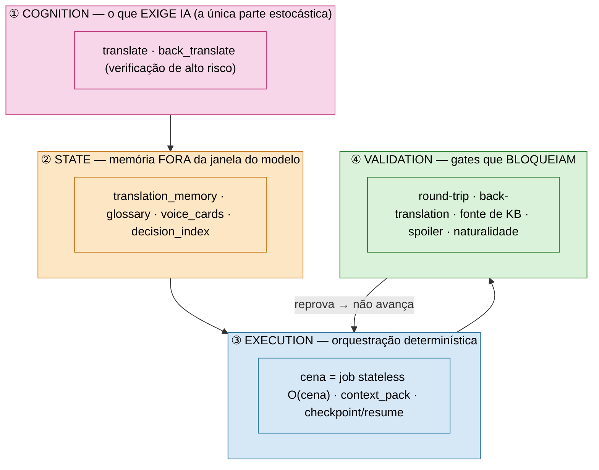
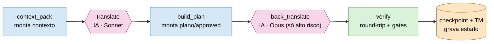
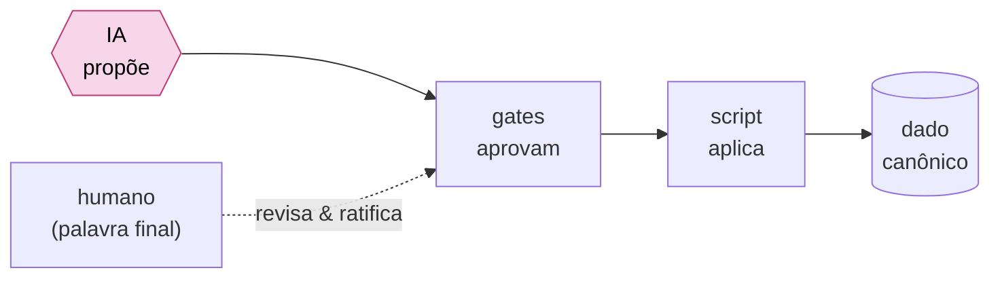

# Translation Cognition Framework

> **Um framework de engenharia de IA para localizar obras narrativas longas** (jogos, visual novels,
> filmes, séries) **sem perder consistência, identidade de personagem, terminologia nem controle de
> spoiler.** A tradução é o *domínio de validação*; o que se reusa é o **padrão de arquitetura**:
> jobs cognitivos *stateless*, estado externalizado, orquestração determinística e gates de validação.
>
> Validado na prática traduzindo **um jogo real, EN→pt-BR, capítulos inteiros** (ver [Status](#status)).

Se você está chegando agora e nunca viu os conceitos, leia nesta ordem: **o problema** → **as 4
camadas** → **os princípios** → **o glossário**. Há também um guia conceitual passo a passo em
[`framework/docs/CONCEPTS.md`](framework/docs/CONCEPTS.md) ("explique como se eu estivesse aprendendo IA").

---

## O problema (por que isto é difícil)

Pedir a um LLM "traduza este jogo" quebra de quatro jeitos previsíveis, e todos pioram com a escala:

1. **Memória.** O modelo esquece o que decidiu 200 linhas atrás → o mesmo termo sai traduzido de 3 jeitos.
2. **Spoiler.** Ele usa o nome verdadeiro de um personagem **antes** da revelação na história.
3. **Identidade/voz.** Um personagem cômico começa a falar formal; uma identidade dupla vaza cedo.
4. **Custo e contexto.** Mandar "o jogo todo" pra cada decisão estoura a janela e a fatura.

A resposta ingênua (um chat de vida-longa que "lembra de tudo") **não escala** — o histórico cresce sem
limite, o custo é imprevisível e nada é auditável. Este framework ataca a causa: **tira a memória, a
governança e o controle de fluxo de dentro do LLM** e deixa o modelo fazer só o que exige IA.

---

## A arquitetura em 4 camadas

O sistema inteiro é uma pilha de quatro responsabilidades. A IA vive **só** na primeira; as outras três
são **código determinístico** (mesma entrada → mesma saída, sem rede, testável).


```mermaid
flowchart TB
  subgraph C["① COGNITION — o que EXIGE IA (a única parte estocástica)"]
    c1["translate · back_translate (verificação de alto risco)"]
  end
  subgraph S["② STATE — memória FORA da janela do modelo"]
    s1["translation_memory · glossary · voice_cards · decision_index"]
  end
  subgraph E["③ EXECUTION — orquestração determinística"]
    e1["cena = job stateless O(cena) · context_pack · checkpoint/resume"]
  end
  subgraph V["④ VALIDATION — gates que BLOQUEIAM"]
    v1["round-trip · back-translation · fonte de KB · spoiler · naturalidade"]
  end
  C --> S --> E --> V
  V -->|reprova → não avança| E
  classDef cog fill:#f6d6e8,stroke:#c0397b,color:#000;
  classDef sta fill:#fde6c4,stroke:#c97b1f,color:#000;
  classDef exe fill:#d6e8f6,stroke:#1f6f9b,color:#000;
  classDef val fill:#d9f2d9,stroke:#2e7d32,color:#000;
  class C,c1 cog;
  class S,s1 sta;
  class E,e1 exe;
  class V,v1 val;
```

> **Paleta (vale para os dois diagramas):** 🩷 Cognition (a única parte de IA) · 🟧 State · 🟦 Execution · 🟩 Validation.

| Camada | Responsabilidade | Como pensar nela | Onde mora |
|---|---|---|---|
| **① Cognition** | Traduzir e verificar alto risco | "A única coisa que um humano não conseguiria automatizar." É fina e isolada de propósito. | `runtime/model.py`, `back_translate.py` |
| **② State** | Lembrar decisões entre cenas | "A memória que o chat *não* tem — vive em arquivos, não na janela." | `runtime/state_index.py` → `artifacts/state/` |
| **③ Execution** | Rodar cada cena como job isolado | "Cada cena é uma função pura: recebe um pacote, devolve uma tradução, esquece o resto." | `runtime/run_scene.py`, `context_pack.py` |
| **④ Validation** | Provar que cada passo está correto | "Portões: se o round-trip ou a fonte de KB falham, o pipeline **para**." | `runtime/kb_*`, `spoiler_check.py`, conector `verify_*`, `validation/` |

> **A regra de ouro do projeto:** a LLM faz **só** o que exige IA (traduzir / verificar). Estado,
> memória, governança, checkpoints, montagem de contexto e validação são **determinísticos e externos**.
> Foi isso que matou o estouro de sessão e tornou o custo previsível. Detalhe medido em
> [`framework/docs/ARCHITECTURE.md`](framework/docs/ARCHITECTURE.md).

### As duas únicas chamadas de IA, no fluxo de uma cena

As mesmas cores das 4 camadas marcam a que camada cada passo pertence:


```mermaid
flowchart LR
  pack["context_pack<br/>monta contexto"]:::exe --> tr{{"translate<br/>IA · Sonnet"}}:::cog
  tr --> plan["build_plan<br/>monta plano/approved"]:::exe
  plan --> bt{{"back_translate<br/>IA · Opus (só alto risco)"}}:::cog
  bt --> vf["verify<br/>round-trip + gates"]:::val
  vf --> cp[("checkpoint + TM<br/>grava estado")]:::sta
  classDef cog fill:#f6d6e8,stroke:#c0397b,color:#000;
  classDef sta fill:#fde6c4,stroke:#c97b1f,color:#000;
  classDef exe fill:#d6e8f6,stroke:#1f6f9b,color:#000;
  classDef val fill:#d9f2d9,stroke:#2e7d32,color:#000;
```

> 🩷 **Cognition** (`translate`, `back_translate`) · 🟦 **Execution** (`context_pack`, `build_plan`) ·
> 🟩 **Validation** (`verify`) · 🟧 **State** (`checkpoint + TM`). As caixas rosas são as **únicas**
> não-determinísticas; todo o resto é reproduzível.

---

## Princípios arquiteturais

Cinco decisões sustentam tudo. Cada uma resolve um dos problemas acima.

- **Scene as Stateless Job** — cada cena roda isolada, com contexto **O(cena)** (não O(histórico)).
  Mata o estouro de janela e torna o pipeline resumível: cair na cena 40 não perde as 39 anteriores.
- **Estado externalizado** — consistência vem de arquivos versionados (TM, glossário, voice cards,
  decision log), não da memória do chat. Sem banco, sem embeddings, sem 2º serviço pago.
- **Runtime agnóstico ao modelo** — a lógica não sabe qual LLM roda. Trocar Haiku/Sonnet/Opus por
  complexidade da linha é configuração, não reescrita (`runtime/model.py` é a única fronteira).
- **SDD — Specification-Driven Development** — as regras de tradução (glossário, vozes, spoilers) são
  **especificações versionadas e checáveis**, produzidas por etapas explícitas (`00..08`), não decisões
  ad-hoc perdidas num chat. Cada etapa tem um *gate* que impede avançar sobre base incompleta.
- **Gates explícitos** — a IA **propõe**, gates determinísticos **aprovam**, um script **aplica**.
  Nada entra no dado canônico sem passar por uma verificação reproduzível. Ver
  [`framework/docs/GOVERNANCE.md`](framework/docs/GOVERNANCE.md).


```mermaid
flowchart LR
  ia{{"IA<br/>propõe"}} --> gate["gates<br/>aprovam"] --> script["script<br/>aplica"] --> canon[("dado<br/>canônico")]
  human["humano<br/>(palavra final)"] -.->|revisa & ratifica| gate
  classDef ia fill:#f6d6e8,stroke:#c0397b,color:#000;
  class ia ia;
```

---

## Glossário (leia antes de mergulhar)

Os termos do projeto na primeira vez que você os encontra. Detalhe conceitual em
[`framework/docs/CONCEPTS.md`](framework/docs/CONCEPTS.md).

| Termo | O que é |
|---|---|
| **SDD** (Specification-Driven Development) | As regras de tradução viram especificações versionadas e checáveis, produzidas por etapas explícitas — não decisões soltas de chat. |
| **Scene as Stateless Job** | Cada cena é traduzida como uma função isolada: recebe um pacote de contexto, devolve a tradução, não guarda histórico. |
| **Context Pack** | O pacote **mínimo** de contexto montado por cena (doutrina cacheável + glossário relevante + vozes dos falantes + as linhas) — é exatamente o que o LLM vê, e nada além. |
| **Estado externalizado** | A "memória" do sistema vive em arquivos (não na janela do LLM): TM, glossário, voice cards, decision index. |
| **TM** (Translation Memory) | Banco *append-only* de traduções já decididas; reusadas de graça e mantêm consistência. É o "coração" — o jogo não é re-traduzido após o QA. |
| **KB** (Knowledge Base) | Glossário + lore + vozes **reconciliados de fonte confiável** e congelados **antes** de traduzir. |
| **Voice Card** | Ficha de voz de um personagem (registro, tiques, léxico) que mantém a fala consistente em todo o corpus. |
| **Round-Trip** | Extrair → reinserir **sem mudar nada** deve regenerar o binário byte a byte. É a prova de que não corrompemos o jogo (prova **bytes**, não qualidade da tradução). |
| **Back-Translation** | Traduzir o pt-BR de volta ao inglês com **outro** modelo, só em linhas de alto risco, para checar se o sentido sobreviveu. |
| **Gate** | Verificação determinística que **bloqueia** o avanço se algo falha (round-trip, fonte de KB, spoiler, naturalidade). |
| **Spoiler Ledger / frontier** | Registro de quando cada revelação acontece + uma "fronteira" que avança por capítulo, para nunca vazar nomes/fatos futuros. |
| **Conector** | Código determinístico que extrai o texto do binário do jogo e o reinsere (round-trip). Específico por engine. |
| **QA** | Quality Assurance — micro-QA por lote + revisão humana final. |
| **ADR** | Architecture Decision Record — registro de uma decisão de arquitetura e seu porquê (em `framework/docs/adr/`). |

---

## Estrutura do repositório

```
framework/     → O PROCESSO + O MOTOR (genérico, reutilizável). Zero dado de obra.
projects/      → AS INSTÂNCIAS. Cada obra traduzida vive em projects/<título>/.
```

| Pasta | Papel | Camada(s) |
|---|---|---|
| `framework/skills/` | As etapas do SDD (`00..08`) — o processo, em prosa | Cognition (guia) + Validation (gates) |
| `framework/runtime/` | O harness executável (cena = job stateless, interface de modelo) | State + Execution + Cognition |
| `framework/connectors/` | I/O determinística: binário ↔ corpus (round-trip) | Execution + Validation |
| `framework/validation/` | Validadores determinísticos (schemas, naturalidade, custo) | Validation |
| `framework/media-profiles/` | Preocupações por tipo de mídia (jogos ✅, filmes/séries 🚧) | — |
| `framework/docs/` | ARCHITECTURE, CONCEPTS, GOVERNANCE, NAMING, ADRs, ROADMAP | — |
| `projects/<obra>/` | `project.json` (manifesto) + `profile/` + `artifacts/` + `connector/` | A instância (os dados) |

As skills/runtime resolvem tudo que é específico de uma obra lendo o `project.json` e os artefatos.
Nenhum nome de personagem, termo de lore ou idioma vive dentro de `framework/`.

---

## O pipeline (00 → 08)

As etapas do SDD. Cada uma lê os artefatos da anterior e tem um *gate* de entrada.

```
00 extração      → conector: binário → corpus canônico (+ orçamento de bytes); gate de round-trip
01 discovery     → entidades, tom, aliases, spoilers
02 entidades     → registro canônico
03 conhecimento  → pesquisa reconciliada (IA + humano, por fonte) → Knowledge Base
04 glossário     → regras normativas de tradução (+ decision log)
05 planejamento  → plano linha a linha (+ corpus de teste sintético)
06 tradução      → execução em lotes, auto-revisão de voz, orçamento de bytes (shift-left)
06b/06c QA       → micro-QA por lote + ciclo de correção cirúrgica
07 QA final      → consistência global, spoilers cross-segmento
08 reinserção    → conector: tradução → binário + patch (determinístico; LLM só no resíduo)
```

---

## Começar

1. Leia [`framework/docs/CONCEPTS.md`](framework/docs/CONCEPTS.md) se os conceitos acima são novos.
2. Leia [`framework/README.md`](framework/README.md) — o modelo de camadas e como instanciar um projeto.
3. Veja a instância de referência em [`projects/utawarerumono/`](projects/utawarerumono/README.md) —
   um jogo (visual novel), EN→pt-BR, com identidades duplas e gestão crítica de spoilers.
4. Para um projeto novo: copie `framework/templates/project.template.json`, preencha o manifesto e
   rode o pipeline `00..08`.

Aprofundar: [`ARCHITECTURE.md`](framework/docs/ARCHITECTURE.md) (o porquê medido) ·
[`GOVERNANCE.md`](framework/docs/GOVERNANCE.md) (quem propõe/aprova/aplica) ·
[`adr/`](framework/docs/adr/) (as decisões de IA, registradas) · [`ROADMAP.md`](ROADMAP.md).

---

## Status

> junho 2026 — o framework saiu do "valida em 2 cenas" e entrou em **produção real**: o harness
> stateless traduz e verifica capítulos inteiros de forma sustentável, em Sonnet, a custo medido.

- **Harness de escala (`framework/runtime/`):** ✅ em produção. **Caps 11–19 traduzidos e verificados
  ponta-a-ponta** (round-trip byte-idêntico + back-translation de alto risco) — **77 cenas**. Caps
  20–23, 30, 31 e 39 já **extraídos**, em tradução (~2ª metade do jogo).
- **Custo medido:** gasto real acumulado **~$43,5** (Sonnet $36,7 · Haiku $3,6 · Opus $3,2),
  **$0 desperdiçado** (`api_ledger.jsonl`). Batch API **−50%** vivo; tiering Haiku/Sonnet/Opus, dedup
  por TM, escalonamento cirúrgico e teto uniforme `--max-usd`.
- **Cognição cabeada:** **gate de fonte de KB** (entidade nova sem fonte declarada BLOQUEIA);
  **controle de spoiler/gênero** por ledger + filtro temporal (provado no reveal Ukon=Oshtor).
- **Humano no loop:** revisão única por **XLSX amigável** → aplicação **verbatim ($0)** ou nota
  cirúrgica; **TM como coração** (o jogo não é re-traduzido inteiro após o QA).
- **Jogo real (conector `hex_binary`):** ✅ validado **in-game** — pt-BR renderiza na tela do jogo.
- **Qualidade travada:** **100 testes** (68 runtime + 16 conector + 16 validação), determinismo/
  idempotência e um guard que barra texto da obra hardcoded em `.py`.
- **Filmes / séries:** pontos de extensão documentados, ainda não validados.

> **Maturidade & riscos:** a postura honesta de risco (alto/médio/baixo: validação estreita, QA humana
> pendente, pós-produção, etc.) vive em [ROADMAP.md → Riscos do projeto](ROADMAP.md#riscos-do-projeto) — fonte única.

---

## Por que isto é diferente

Não é um "tradutor por linha". É um **framework de execução cognitiva governada**, e o mérito está em
escolhas de engenharia que se sustentam:

- **LLM só para cognição** → custo previsível, resultado verificável e escala que não depende da memória do chat.
- **Estado externalizado** → consistência vem do store versionado, não da janela. Só a API Anthropic; nada de 2º serviço.
- **Governança explícita** → IA propõe, gates aprovam, script aplica; binário read-only; nenhuma tradução à mão no dado.
- **Anti-overengineering deliberado** → orquestrador determinístico + 2 papéis de IA. Sem multiagentes, sem indireção que não se paga (ver ADRs).
- **Honestidade operacional** → o ledger conta cada centavo (mesmo em falha); os gates barram base incompleta; spoiler é decisão **por linha**.
