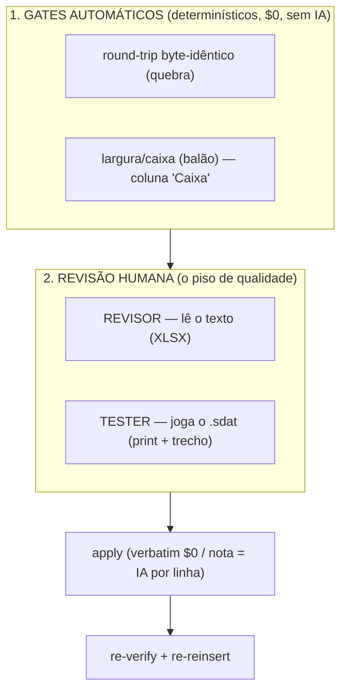

# QA & Revisão Humana — guia do framework

Como garantir **qualidade** numa tradução feita em escala por IA, sem cair na armadilha de "IA julgando
IA". Este guia vale para qualquer projeto do framework (troque `<projeto>` pelo caminho da sua instância).

> **Princípio:** o **piso de qualidade é o humano**. A IA traduz e faz uma auto-verificação barata
> (back-translation), mas quem *aprova* a qualidade literária e a experiência in-game são **pessoas**,
> em dois papéis: **REVISOR** (lê o texto) e **TESTER** (joga o resultado). Tudo converge num único
> `apply` determinístico: **humano propõe → gate aprova → script aplica**.

---

## As duas camadas de QA



- **Gates automáticos** rodam sozinhos e são **prova** (não opinião). Não pedem humano; bloqueiam o que
  é objetivamente errado.
- **Revisão humana** cobre o que máquina não prova: naturalidade, voz, sentido, e o que **realmente**
  aparece na tela.

---

## Camada 1 — Gates determinísticos (automáticos)

Rodam sem IA e sem custo. São **medida**, não heurística.

| Gate | O que pega | Como é determinístico |
|---|---|---|
| **Round-trip** | "quebrou" — reinserção corrompe o binário | extrair→reinserir sem mudar nada reproduz os bytes originais; resíduo = 0 |
| **Caixa / largura** | "saiu do balão" | a fonte é monoespaçada (RE) → **nº de chars = pixels**; cada linha pt-BR é comparada à **sua própria EN** (mesmo offset = mesma caixa, e a EN já rodou no jogo) |
| **Consistência de glossário** | termo do glossário não seguido em algum capítulo | `glossary_lint.py`: onde o EN usa o termo mas o pt-BR não tem a forma canônica (nome `manter_original` ausente / tradução `traduzir` não usada). Nomes sempre; palavras-comuns genéricas são puladas (traduzem por contexto). Saída = candidatos p/ revisão. |

A coluna **"Caixa (cresceu vs EN?)"** no relatório de revisão classifica cada linha:
- **vazio** = pt-BR ≤ a EN → **cabe, provado**;
- **`rever +Nc`** = cresceu vs o original (provável OK, usa a folga da caixa);
- **`ESTOUROU +Nc`** = mais largo que **qualquer** diálogo EN que o jogo mostrou → quebra quase certa.

Gate de loop (opcional, pós-reinserção):
```
quality_review.py width <projeto>     # lista só as 'ESTOUROU' (exit 1 se houver); conserte e repita até 0
```

> Limite do determinismo (honesto): o `rever` depende da folga real da caixa, que vive no engine. Sem RE
> do executável, é o **TESTER** (na tela) que confirma — e o gate já isola o subconjunto suspeito.

---

## Camada 2 — Revisão humana (dois papéis)

O sistema **sempre** gera o relatório ao fim de cada capítulo (QA obrigatório) e o disponibiliza em
duas pastas, dentro de `<projeto>/artifacts/qa_revisao/`:

```
qa_revisao/
├── para_revisar/      OUTBOX — o sistema disponibiliza o review_*.xlsx (você LÊ)
├── devolvido/         INBOX  — você DEVOLVE o arquivo marcado
└── teste_ingame/      TESTER — prints/ + relato_tester.csv
```

### Papel A — REVISOR (lê o texto)
1. Abra **`para_revisar/review_all.xlsx`** (ou `review_cap_NN.xlsx`).
2. Priorize pelas dicas (não são decisão, só "onde olhar", $0):
   - **"Revisar (onde olhar)"** — risco alto, amostra do tier barato, igual-à-fonte, `micro-qa:revise`
     (a back-translation da IA, já paga, achou divergência).
   - **"Caixa (cresceu vs EN?)"** — `ESTOUROU` primeiro.
3. Na linha errada, escreva **CORRIGIR** na coluna *Corrigir?* e preencha **uma**:
   - **Correção** = o texto certo → aplicado **verbatim, $0 de IA** (só charset/paridade/round-trip);
   - **Nota** = instrução (ex.: "encurtar", "mais formal") → a IA reescreve **só aquela linha**.
   - Linha sem CORRIGIR = aprovada, **nunca tocada** (lê-se só o marcado).
4. Salve em **`devolvido/`** e aplique:
   ```
   quality_review.py apply <projeto>      # lê o inbox; processa só o marcado
   ```

### Papel B — TESTER (joga o resultado)
Acha o que só aparece **na tela**: balão estourado, texto cortado, termo errado no contexto. Como
in-game não há offset, o fluxo é **determinístico, sem OCR/IA** — o print é **prova**, não a fonte:
1. Largue o **print** em `teste_ingame/prints/`.
2. Preencha `teste_ingame/relato_tester.csv` (uma linha por achado):
   | print | texto_visto (≈3-5 palavras do que apareceu) | problema (balão/quebra/sentido) | sugestao (opcional) |
3. Rode:
   ```
   quality_review.py tester <projeto>     # localiza a linha pelo trecho -> CORRIGIR no inbox
   quality_review.py apply  <projeto>     # aplica (mesmo caminho do REVISOR)
   ```
   O localizador casa o trecho com acento dobrado (= o transliterado da tela). Ambíguos (trecho
   repetido) ou não-achados são listados para você desempatar pelo print.

> **Por que não OCR?** OCR de verdade é ML ("IA"); OCR caseiro da tela é frágil (escala/anti-aliasing).
> Quem "lê" a tela é o tester (custo zero, determinístico); o print prova e desempata.

---

## Depois de aplicar (sempre)
```
verify_chapter <cap>            # round-trip/charset dos capítulos tocados
state_index.py --rebuild        # a TM passa a reusar o texto corrigido (consistência futura)
```
A **TM é o coração**: depois do QA, o jogo **não é re-traduzido** — correções entram cirúrgicas e a TM
propaga a versão certa para conteúdo futuro.

---

## Custo (resumo)
| Ação | Custo |
|---|---|
| Gates determinísticos (round-trip, caixa, width) | **R$ 0** |
| Gerar o relatório de revisão (export) | **R$ 0** |
| Correção **verbatim** (texto certo do humano) | **R$ 0** |
| **Nota** (instrução → IA reescreve 1 linha) | só aquela linha |
| Localizar relato do TESTER (texto→offset) | **R$ 0** |

> Regra de ouro: **nunca** re-traduzir o jogo todo após o QA. Corrige-se **por linha**, e só o que o
> humano marcou.
