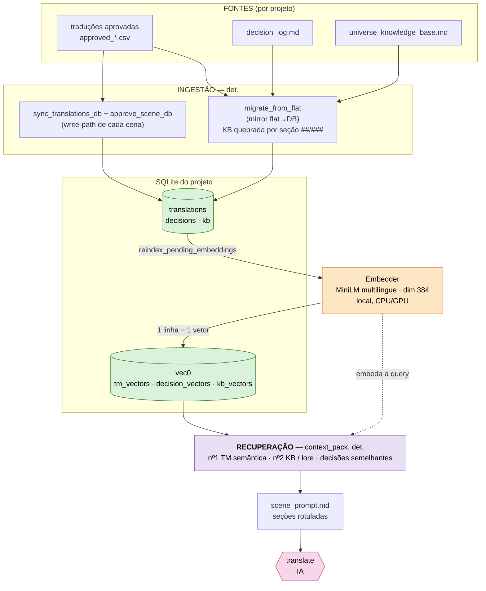
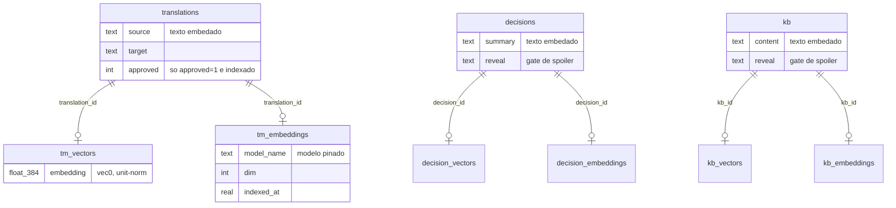
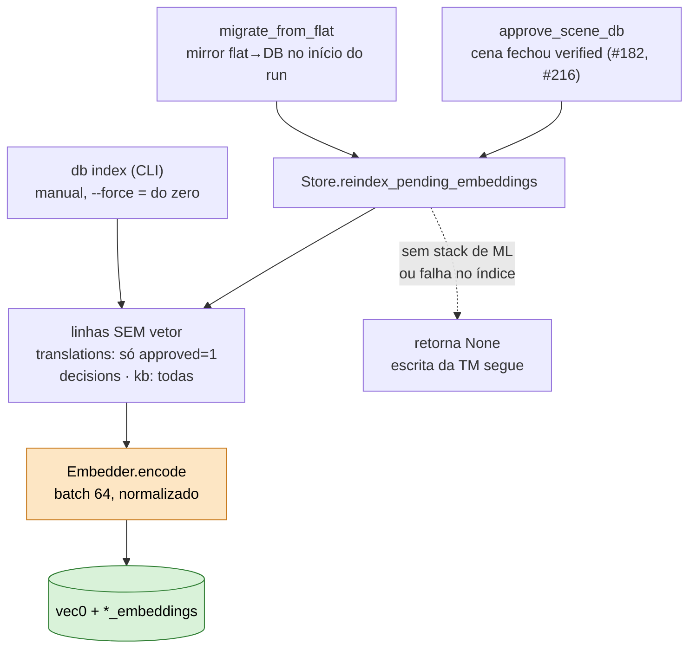
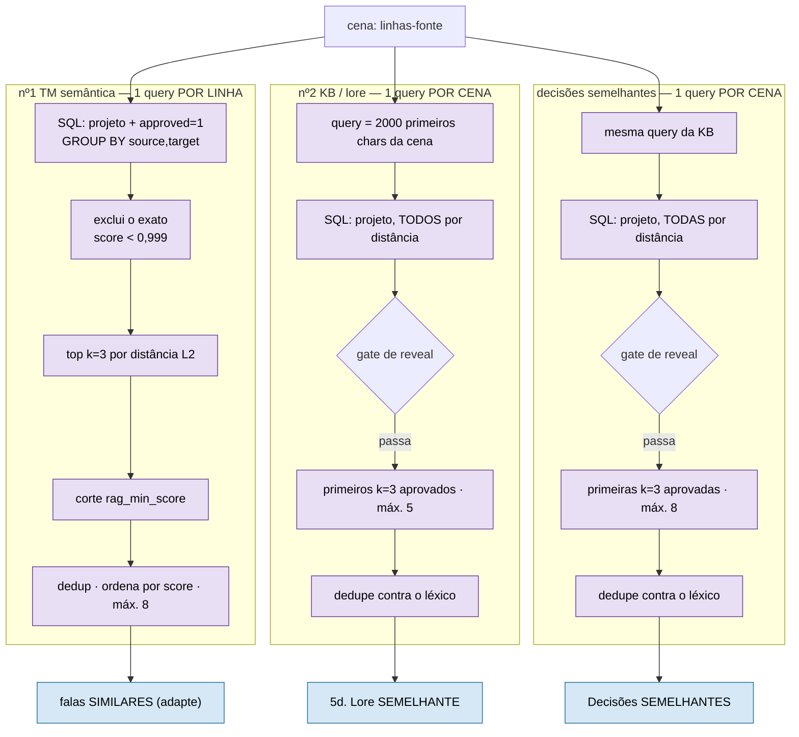
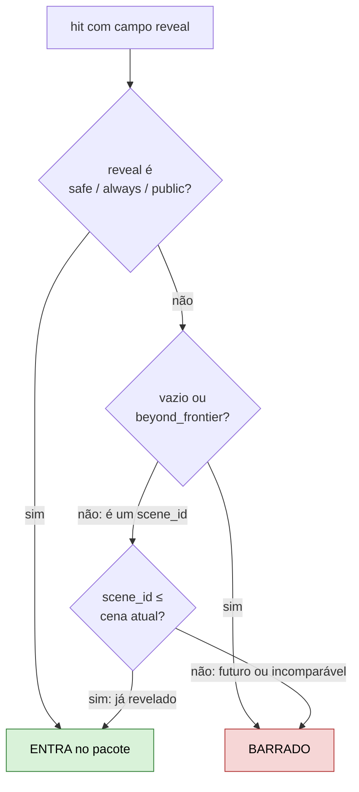
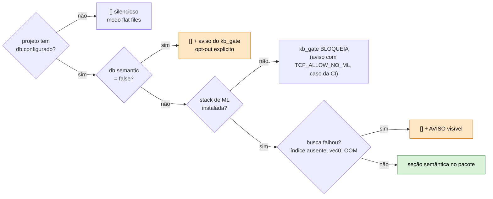
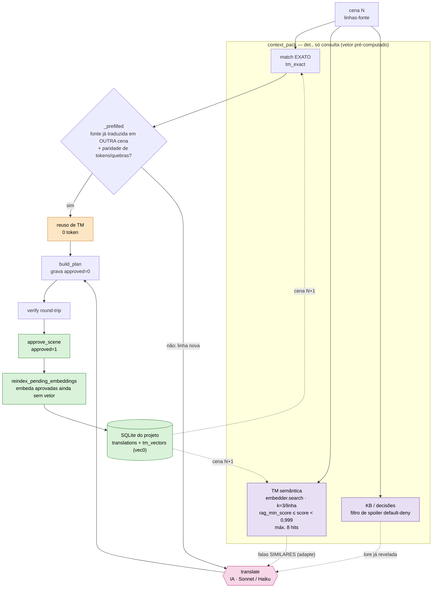

# RAG_ARCHITECTURE.md — arquitetura do RAG semântico

Só o RAG, de ponta a ponta: de onde vem o dado, como vira vetor, como é consultado na hora de
traduzir e o que impede vazamento de spoiler. Visão de stack inteira (modelo, execução,
persistência) → [`STACK.md`](STACK.md). ROI medido → [ADR 0016](adr/0016-rag-roi-validado-reindex-obrigatorio.md).

**Em uma frase:** o `context_pack` já recupera contexto por match léxico (TM exata, glossário, voice
cards); o RAG semântico é um **suplemento rotulado e limitado** em cima disso — três retrievers
sobre o mesmo SQLite do projeto, todos opcionais, nenhum no caminho crítico.

---

## 1. Visão geral



| Peça | Onde | Papel |
|---|---|---|
| `Embedder` | `framework/db/embedder.py` | `encode` / `index_project` / `search` / `search_decisions` / `search_kb` |
| `Store` | `framework/db/store.py` | tabelas-fonte + `reindex_pending_embeddings()` |
| `context_pack` | `framework/runtime/context_pack.py` | `_load_tm_semantic` / `_load_kb_semantic` / `_load_decisions_semantic` + `_reveal_allowed` |
| write-path | `connector_io.sync_translations_db` → `state_index.approve_scene_db` | grava a cena (`approved=0`); ao fechar `verified`, aprova e dispara o reindex |

### Para que serve a TM semântica

Ela cobre o caso que o hash não pega: a fala **quase igual** a uma já traduzida. Uma vírgula ou
uma palavra de diferença muda a chave da TM exata, e a fala vai ao modelo como se fosse nova. Sem
referência, o modelo traduz do zero e pode escolher outro fraseado para o que, no jogo, é a mesma
frase com uma variação.

Jogos têm muito texto assim: a mesma pergunta de NPC com pontuação diferente, a mesma mensagem de
sistema com outro nome de item, a fala que um personagem repete com pequena mudança. Para o
jogador, traduções diferentes dessas falas parecem descuido.

A TM semântica acha essas falas vizinhas e as coloca no prompt, com a tradução que foi aprovada,
numa seção rotulada:

```
**Falas SIMILARES (nao identicas) — use p/ voz/fraseado, ADAPTE ao contexto:**
- (~0.87) `Where do you want to go?` -> `Para onde você quer ir?`
```

O par acima é ilustrativo. O número entre parênteses é o score de similaridade, que o modelo vê
junto com o par.

Três propriedades definem o papel dela:

- **É referência, não substituição.** A fala continua indo ao modelo. A instrução é adaptar, e não
  copiar, porque a diferença entre as duas falas pode importar. Quem substitui é só o caminho
  exato.
- **Não decide nada no pipeline.** Um vizinho ruim custa algumas linhas de prompt e pode ser
  ignorado pelo modelo. Por isso o limiar pode ser mais permissivo do que seria aceitável para
  reuso automático.
- **Só mostra tradução aprovada.** O que serve de referência já passou no round-trip.

Na calibração do `rag_min_score` (abaixo), as faixas úteis foram as de fala quase idêntica (score
de 0,83 a 0,89) e de paráfrase (0,71 a 0,89). É nelas que a referência ajuda.

O que está e o que não está medido: a medição do ADR 0016 mostrou que o ganho de **custo** veio do
reuso exato, e que ligar a busca semântica não piorou os lints de glossário e de naturalidade. O
ganho de **consistência** da TM semântica é a intenção do desenho e ainda não foi medido
isoladamente.

---

## 2. Modelo de dados

Mesma estrutura para os três tipos (`_KIND_CONFIG` em `embedder.py`): tabela-fonte já atômica →
tabela virtual `vec0` com o vetor → tabela de metadados que pina o modelo.



- **O que é embedado**: a coluna-fonte passada por `strip_codes` (sem códigos de controle do jogo).
  Na TM é o `source` — a qualidade do `target` não entra no score.
- **Sem chunking no embedder** ([ADR 0014](adr/0014-chunking-rag-na-ingestao-nao-no-embedder.md)):
  conteúdo não-atômico (a KB em markdown) é quebrado **na ingestão**, por seção.
- **Linha editada sai da busca**: trigger em `decisions.summary` / `kb.content` apaga o metadado de
  embedding; `search_decisions` / `search_kb` fazem JOIN nele, então a linha some até o reindex.

---

## 3. Caminho de escrita — quando o vetor nasce



- **Incremental**: pula o que já tem vetor. **Nunca derruba a escrita**: o dado já está em SQL
  antes da chamada; falha de embedding nunca derruba a escrita.
- **Custo é latência, não dinheiro**: ~9–12 s por cena para carregar o modelo (roda local); o
  encode de uma linha é ~0,06 s. Processo isolado por projeto, sem daemon
  ([ADR 0015](adr/0015-embedder-isolado-por-processo-nao-daemon-compartilhado.md)).
- **Reindex é na aprovação, não no `build_plan`**: no `build_plan` a cena ainda está `approved=0`
  e o embedder só embeda `approved=1`. Rodando depois do `approve_scene`, a cena N já é vizinha
  semântica da cena N+1 (coberto por `test_verified_scene_is_semantically_searchable_end_to_end`).

---

## 4. Caminho de leitura — os três retrievers



- **Filtro antes do top-k, sempre**: projeto, `approved` e exclusão do exato vão no SQL. Cortar
  depois devolvia menos de k hits (ou zero, em fala curta tipo "Yes." com muitos exatos).
- **Gate antes do corte, na KB e nas decisões**: a busca traz tudo em ordem de distância e o k é
  contado só entre o que passou no gate — senão os k mais próximos ainda não revelados zeravam a seção.
- **Busca exata, não aproximada**: scan linear sobre os vetores do projeto, pelo determinismo.
  Reavaliar ANN a partir de ~50–100 mil vetores por projeto.
- **Score** = `1 − L2²/2` sobre vetores unit-norm (idêntico 1,0 · ortogonal 0,0). `rag_min_score`
  é por projeto, em `project.json`; calibração → [abaixo](#rag_min_score--calibração-com-dado-real).
- **Sem reranker**: o pacote ordena por score (ordem estável). O FlashRank foi removido em
  2026-10-07 — medido, não mudava o que entrava no pacote e custava ~200 ms por linha.
- **Texto embedado sem códigos do jogo**: `strip_codes` remove os códigos de controle antes do
  encode, para a similaridade medir o sentido da fala e não a formatação.
- **Determinismo**: vetores pré-computados + ordenação estável → `context_pack` rodado 2× sai
  byte-idêntico.

### Implementação e parâmetros

A consulta da TM semântica, com os filtros antes do `LIMIT`. Com o operador `MATCH ... k` do
`vec0` o corte vinha primeiro, sobre a tabela inteira, e por isso a busca usa varredura com
`vec_distance_l2`:

```sql
SELECT ..., MIN(vec_distance_l2(v.embedding, :consulta)) AS l2
FROM tm_vectors v JOIN translations t ON t.id = v.translation_id
WHERE t.project_id = :projeto AND t.approved = 1
GROUP BY t.source, t.target          -- o mesmo par em N cenas ocupa 1 vaga, não N
HAVING l2 > :l2_do_match_exato       -- exclui o que o caminho léxico já trouxe
ORDER BY l2 LIMIT :k
```

**Parâmetros de recuperação** (em `context_pack.py`):

| Parâmetro | TM semântica | KB e decisões semânticas |
|---|---|---|
| Consulta | uma por fala da cena | uma por cena (os primeiros 2.000 caracteres do texto da cena) |
| `k` (vizinhos por consulta) | 3 | 3 |
| Teto por cena | 8 pares fonte→tradução | 3 decisões e 3 seções de KB |
| Score mínimo | `rag_min_score` (0,55; calibrado, ver abaixo) | sem limiar; o corte é o `k` |
| Score máximo | 0,999 (acima disso é match exato) | — |
| Filtro | só `approved=1`, só do projeto | marca `reveal` já ultrapassada (default-deny) |
| Deduplicação | por par (fonte, tradução), no SQL e no pacote | o que já entrou pelo caminho léxico não repete |
| Ordenação | score decrescente, desempate pelo texto (saída estável) | idem |

Sobre a calibração: o único parâmetro calibrado com dado real é o `rag_min_score`. O `k=3` e o
teto de 8 são valores fixos de projeto, escolhidos para limitar o tamanho da seção; não houve
experimento variando `k`. A medição de custo (ADR 0016) mostrou que o ganho não vinha dali, então
afinar `k` ficou sem prioridade.

### `rag_min_score` — calibração com dado real

`rag_min_score` é o score mínimo para um vizinho semântico entrar no prompt. O score é o cosseno
entre a fala consultada e a fala-fonte indexada: 1,0 é idêntico, 0,0 é sem relação. Só o texto na
língua de origem entra no cálculo; a tradução vai junto como metadado.

A calibração usou um índice real: 12 cenas do Breath of Fire IV traduzidas pelo pipeline e
aprovadas (323 falas, 323 vetores), e 40 consultas em 5 categorias.

| Categoria da consulta | Exemplo | Score do melhor hit |
|---|---|---|
| Texto idêntico ao do corpus | `"Monsters! They're everywhere!..."` | **1,0** (5 de 5) |
| Quase idêntico (pontuação ou aspas diferentes) | "Where do you want to go?" | 0,83–0,89 |
| Paráfrase (mesmo sentido, outras palavras) | "So what is the state of the sacrifice now?" | 0,71–0,89 (um caso em 0,57) |
| Mesmo tema, conteúdo diferente | "Take this sword, it was forged by ancient smiths" | 0,37–0,51 |
| Fora do domínio | "Preheat the oven to 200 degrees..." | 0,13–0,38 |

Leitura: acima de 0,71 os hits são paráfrases de verdade, úteis como referência. Abaixo de 0,57
eles casam só por vocabulário de tema (fantasia/RPG), sem relação de sentido. O maior score de
ruído observado foi **0,51**.

**Valor escolhido: `rag_min_score = 0.55`**, acima do teto de ruído (0,51) e abaixo do piso das
paráfrases (0,57). Fica em `projects/translation_software/project.json`; é configurável por
projeto, porque depende do par de idiomas.

Limite dessa medição: 323 falas são uma fração do corpus completo (6.046 falas). A amostra serve
para ver a **forma** da distribuição de scores, que depende só do texto, mas não mede cobertura em
produção. O modelo também só foi validado para inglês→português; para outro par de idiomas,
`tcf db validate-model` refaz a medição.

Fases e decisões de design do banco e do índice → [`DB_MIGRATION_ROADMAP.md`](DB_MIGRATION_ROADMAP.md).

---

## 5. Gate de spoiler (`_reveal_allowed`)

Vale para KB (léxico e semântico) e decisões semânticas. **Default-deny**: só entra o que é provadamente
seguro. Decisões léxicas usam gate opt-in (`_decision_reveal_ok`): sem tag `reveal`, a decisão entra.



A garantia vem do dado explícito por item, não de casar texto. Consequência prática: seção de KB
sem `reveal` tagueado nunca aparece — projeto novo precisa taguear para o nº2 render algo. Hoje
nenhum projeto tem a KB marcada, então a KB semântica fica vazia em produção.

---

## 6. Degradação — o RAG nunca derruba o pacote



Nenhum caminho com `db` fica calado: sem a stack o `kb_gate` bloqueia antes de qualquer chamada de
modelo, o opt-out (`db.semantic: false`) aparece como aviso, e "stack presente e quebrou" avisa —
mascarar como "sem vizinhos" esconderia índice desatualizado.

---

## 7. Na execução

O laço completo de uma cena — consulta, reuso exato sem LLM, tradução, aprovação e volta para o
índice — está desenhado [abaixo](#fluxo-em-execução--o-laço-de-reuso).

Ponto que costuma confundir: **a economia medida (−24%, ADR 0016) vem do reuso exato**, que tira a
linha do LLM. Os retrievers semânticos desta página só enriquecem o prompt das linhas novas.

### Fluxo em execução — o laço de reuso

O que acontece com **uma cena** em projeto com `db`, e por onde a tradução aprovada volta para
alimentar a cena seguinte:



- **Onde está a economia** (laranja): uma fala cuja fonte já foi traduzida em outra cena **não vai
  ao LLM** (`model._select_reuse`); a tradução aprovada é reusada. Uma cena 100% reaproveitada não
  faz chamada nenhuma. Foi esse caminho que rendeu a redução de 24% de custo medida em 10 cenas
  (ADR 0016). A busca semântica (roxo) só **informa** o prompt das falas novas; não corta tokens.
- **Só vira TM o que passou no round-trip.** O `build_plan` grava a tradução com `approved=0`; o
  `approve_scene` promove para `approved=1` depois do `verify`. As buscas exata e semântica só
  leem `approved=1`, então uma tradução reprovada nunca contamina as cenas seguintes.
- **O vetor nasce na aprovação.** `reindex_pending_embeddings` embeda as linhas aprovadas que ainda
  não têm vetor, logo depois do `approve_scene`. A cena N+1 já enxerga a cena N. É incremental e
  não derruba a escrita: o dado já está gravado em SQL antes da indexação.

---

## Decisões de desenho

| Decisão | Por quê | Onde |
|---|---|---|
| Vetor dentro do SQLite do projeto (`sqlite-vec`), embedding local | sem serviço externo nem 2º fornecedor pago; um arquivo por projeto | [`DB_MIGRATION_ROADMAP.md`](DB_MIGRATION_ROADMAP.md) · contexto: [ADR 0003](adr/0003-state-substrate-flatfiles-then-index.md) (vetor adiado até haver necessidade) |
| Chunking na ingestão, nunca no embedder | 1 linha = 1 vetor; kind novo é só config | [ADR 0014](adr/0014-chunking-rag-na-ingestao-nao-no-embedder.md) |
| Embedder por processo, sem daemon | isolamento entre projetos; reload aceito | [ADR 0015](adr/0015-embedder-isolado-por-processo-nao-daemon-compartilhado.md) |
| Reindex no write-path é obrigatório | índice defasado devolve vazio sem erro | [ADR 0016](adr/0016-rag-roi-validado-reindex-obrigatorio.md) |
| Semântico é suplemento rotulado | núcleo do pacote tem que ser determinístico | [`STACK.md`](STACK.md#rag-recuperação-semântica) |
| RAG **não** entra em glossário nem voice cards | match léxico é preciso; semântico traria falso-positivo | [`STACK.md`](STACK.md#rag-recuperação-semântica) |

## Linha do tempo

| Data | Marco |
|---|---|
| 2026-06-11 | precursor: retrieval por keyword reforçado no `context_pack` |
| 2026-06-29 | TM semântica (nº1) e KB com gate de spoiler (nº2) entram no pacote |
| 2026-07-05 | decisões semelhantes (#105) |
| 2026-09-09 | ROI medido (ADR 0016) e reindex no write-path (#182) |
| 2026-09-10 | `rag_min_score` calibrado com dado real (#184) |
| 2026-09-25 | leva de correções: filtro antes do top-k, gate antes do corte, linha editada fora da busca |
| 2026-10-07 | reindex movido para a aprovação da cena (fim do atraso de uma cena); FlashRank removido |
