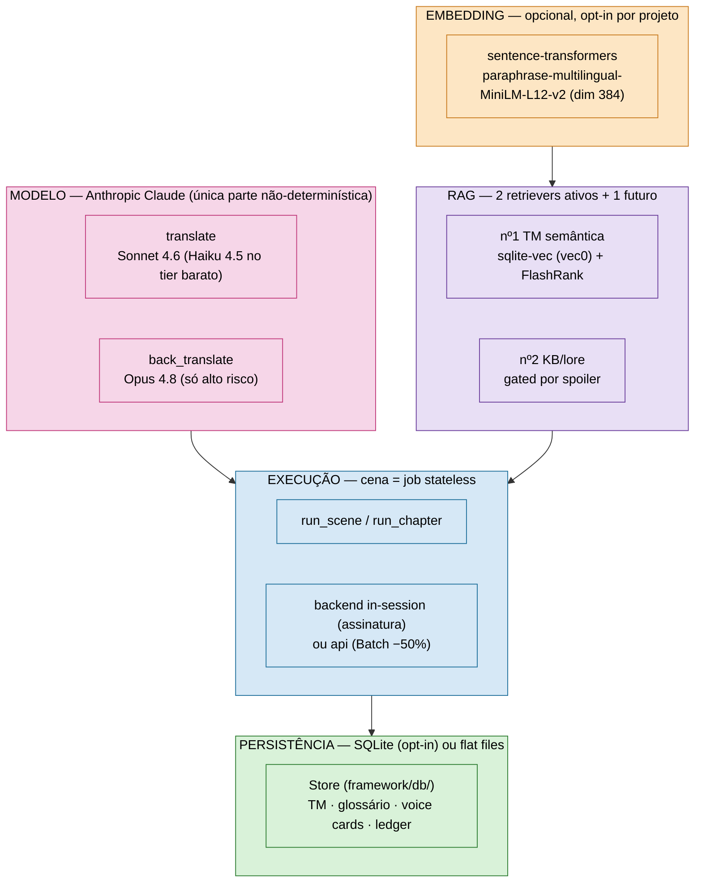

# Stack técnica — modelo, embedding, RAG, execução

Visão consolidada da tecnologia por trás do harness: qual LLM roda onde, qual stack de embedding
alimenta a busca semântica, onde entra RAG e como a execução escala. Cada seção linka pro doc
profundo correspondente — este arquivo é o mapa, não o detalhe.



---

## Modelo (LLM)

**Anthropic Claude**, via SDK oficial (`anthropic`), com tiering por complexidade de linha — trocar
modelo é trocar uma string em `framework/runtime/config.py`, nada mais no harness sabe qual modelo rodou:

| Papel | Modelo | Constante | Quando |
|---|---|---|---|
| Tradução (padrão) | `claude-sonnet-4-6` | `MODEL_TRANSLATE` | maioria das linhas; contexto curado dispensa Opus |
| Tradução (tier barato) | `claude-haiku-4-5` | `MODEL_TRANSLATE_CHEAP` | só linhas single-line no caminho batch (−67%/linha) |
| Verificação | `claude-opus-4-8` | `MODEL_BACK` | back-translation, só linhas `risk >= high` |

**Duas chamadas de IA, e só estas** (`translate`, `back_translate`) — o resto do harness é
determinístico. Dois backends por trás do mesmo contrato: `in-session` (assinatura, sem chamada de
rede, contexto O(cena)) e `api` (SDK Anthropic — streaming, prompt-caching da doutrina, Batch API
−50%, backoff exponencial em 429/500/timeout). `effort:low` sem thinking na tradução (thinking
custaria ~5× — medido); back-translation mantém thinking (raciocínio importa em ambiguidade).

Detalhe do contrato, backends e benchmarks reais → [`MODEL_INTERFACE.md`](MODEL_INTERFACE.md).
Plumbing HTTP/streaming/backoff → `framework/runtime/llm_client.py`.

---

## Embedding

**Opcional e opt-in** — não entra no push/PR (`test.yml`) nem é exigido pelo runtime
determinístico (sem a stack, o retriever semântico cai para `[]`, testado). Testada de verdade
(sem mock) semanalmente por `ml-coverage-optional.yml` (#181), piso de 85% em `embedder.py`/
`validate_model.py` — mesma cadência do audit de CVE (`dep-audit-optional.yml`, #89), fora do
push/PR pelo mesmo motivo de custo (torch do zero). Stack (`requirements-ml.txt`):

- **`sentence-transformers`** — modelo `paraphrase-multilingual-MiniLM-L12-v2`, vetores de
  dimensão **384**, normalizados (`normalize_embeddings=True`) para o cosseno virar `1 - L2²/2`.
- **Hardware**: CPU por padrão; roda em GPU automaticamente se torch+ROCm detectado (alvo:
  AMD RX 6650 XT). No Windows fica CPU (ok para corpus de milhares de linhas, poucos minutos).
- **Onde mora**: `framework/db/embedder.py` (`Embedder.encode`/`index_project`/`search`).
- **Como ligar**: `pip install -r requirements-ml.txt` (pesado: ~700 MB–1,5 GB, puxa torch) e
  `python framework/cli.py db index <projeto>.db <project_id>`.
- **Multi-projeto**: processo isolado por projeto, sem daemon compartilhado — cache de download do
  modelo já é por-máquina (default do Hugging Face Hub), reload por processo aceito (ver ADR 0015).

---

## RAG (recuperação semântica)

O `context_pack` já é retrieval-augmented por natureza — a recuperação **padrão é léxica** (match
exato de TM, glossário por termo, voice card por nome de falante). RAG **semântico** entra só como
**suplemento rotulado e bounded** em cima disso, nunca substituindo o núcleo determinístico
(o `context_pack` roda 2× → tem que sair byte-idêntico).

| RAG | Onde | Mecanismo | Status |
|---|---|---|---|
| **nº1 — TM semântica** | `embedder.search()` → seção "falas SIMILARES (adapte)" no pacote | `sqlite-vec` (tabela virtual `vec0`) para o índice vetorial dentro do próprio SQLite do projeto + reranker **FlashRank** (`ms-marco-MiniLM-L-12-v2`, opcional) | ✅ **validado tecnicamente e por ROI real**. ROI medido em produção (10 cenas reais, #175): -24% custo, +2 sucessos/10. Ver [ADR 0016](adr/0016-rag-roi-validado-reindex-obrigatorio.md) — manter índice atualizado é **requisito obrigatório**. Desde #182, isso é automático: `reindex_pending_embeddings()` roda no próprio write-path de tradução (`connector_io.sync_translations_db`, chamado por `run_scene`/`run_chapter` a cada cena), não só em `db migrate` manual. Calibração de `rag_min_score` com dado real (#184) → ver subseção abaixo |
| **nº2 — KB/lore** | `context_pack.select_kb()` (léxico) + `_load_kb_semantic()` (semântico, #169) → seções "5c." e "5d." do pacote | **léxico**: token do título da seção citado na cena. **semântico** (suplemento, nunca substitui): `embedder.search_kb()` sobre `kb_vectors`, dedupe contra o léxico. Ambos **gated pela mesma trava temporal de spoiler** (default-deny por reveal-por-seção) | ✅ ligado (léxico sempre; semântico se a stack de ML estiver instalada E o projeto tiver `kb` indexada — validado com o KB real do BoF4, mas nenhum projeto hoje tem `reveal` tagueado, então o gate barra a seção semântica em produção até isso mudar) |
| **nº3 — cross-game/franquia** | corpus compartilhado por série, retrieval por cena | reusa a mesma infra | 🔮 futuro (multi-game) |

### `rag_min_score` — calibração com dado real (#184)

`Embedder.search()` casa só a coluna `source` (texto em inglês) — a qualidade da tradução em
`target` **não** entra no score, só aparece como metadado na sugestão "falas SIMILARES (adapte)".
Score = `1.0 - distancia_L2² / 2` sobre vetores unit-norm (`paraphrase-multilingual-MiniLM-L12-v2`,
dim 384): idêntico → 1.0, ortogonal → 0.0, oposto → -1.0.

**Amostra real usada** (não sintética): 12 cenas do BoF4 recém-traduzidas via backend `api`
(pipeline real, custo real) e aprovadas em `build_plan_chapter` — 323 linhas, 323 vetores
indexados em `projects/translation_software/translation_software.db`. **Caveat de tamanho**: é
uma fração pequena do corpus completo (125 cenas / 6.046 linhas) — o corpus original de 6.046
vetores citado em versões antigas desta página foi apagado como efeito colateral da investigação
do #175, e regenerá-lo integralmente custaria a mais que o orçamento aprovado para esta calibração
($3,5 reais em chamadas de API); a chave usada esgotou o crédito (`credit balance too low`) em
$3,445 gastos, no meio do lote de regeneração. A amostra é real e suficiente para calibrar a
**forma da distribuição** (que é o que importa aqui — o score depende só do texto-fonte, não da
cobertura do corpus), mas não é representativa de recall/cobertura em produção.

40 queries de teste em 5 categorias, rodadas contra o índice real (`sample_queries.py`, não
versionado — script de calibração pontual):

| Categoria | Exemplo | Score (top hit) |
|---|---|---|
| Verbatim normalizado (texto do corpus após `strip_codes`, sem alteração) | `"Monsters! They're everywhere!..."` | **1,0** (5/5 queries) |
| Quase-verbatim (mesma frase digitada à mão, pequena diferença de pontuação/aspas) | "Where do you want to go?" | 0,83–0,89 |
| Paráfrase genuína (mesmo sentido, palavras diferentes) | "So what is the state of the sacrifice now?" | 0,71–0,89 (uma cauda em 0,57) |
| Mesmo domínio temático, conteúdo específico diferente (ruído plausível) | "Take this sword, it was forged by ancient smiths" → hit sobre uma lâmina que não corta | 0,37–0,51 |
| Fora de domínio (não relacionado ao jogo) | "Preheat the oven to 200 degrees..." | 0,13–0,38 |

**Onde a qualidade cai**: inspecionando os hits manualmente, a partir de ~0,57 pra baixo os
resultados retornados já não são genuinamente reaproveitáveis — casam só por vocabulário temático
comum (fantasia/RPG), não por conteúdo real da fala (ex.: query sobre "espada forjada por ferreiros
antigos" retorna, com score 0,51, uma fala sobre "esta lâmina não corta", sem relação de sentido
real). Acima de ~0,71 os hits são paráfrases genuínas, direto reaproveitáveis como referência de
adaptação. O teto de ruído observado (falas de domínio-mas-não-relacionadas + fora de domínio) foi
**0,51**.

**Valor escolhido: `rag_min_score = 0.55`** — acima do teto de ruído medido (0,51) com margem de
segurança, abaixo do piso da paráfrase genuína (0,57+). Corta o lixo temático e o fora-de-domínio
sem descartar paráfrases úteis. Configurado em `projects/translation_software/project.json`.

**Onde RAG deliberadamente NÃO entra** (decidido, não esquecido): glossário (match léxico é
preciso; semântico traria falso-positivo), voice cards (identidade por nome, não similaridade),
núcleo do pacote (match exato/contagens/hashes — determinismo é inegociável ali).

Vetores são **pré-computados** (build do pacote só consulta, não reinfere) e o **modelo é pinado**
(`tm_embeddings.model_name` grava o nome; trocar modelo = reindex explícito). Reindex incremental
(`Store.reindex_pending_embeddings()`, pula o que já tem vetor, nunca levanta sem deps de ML) roda
tanto em `db migrate` (#171) quanto no write-path real de tradução (#182) — uma linha aprovada via
`run_scene` fica pesquisável sem passo manual. Detalhe de fases e decisões de design →
[`DB_MIGRATION_ROADMAP.md`](DB_MIGRATION_ROADMAP.md).

---

## Execução

Cada cena roda como **job stateless e limitado** — contexto O(cena), não O(histórico):

```
run_scene(cena): context_pack → translate[IA] → build_plan → back_translate[IA, só alto risco]
                 → verify (round-trip) → checkpoint + state_index
```

- **`run_scene.py`** — orquestrador de 1 cena; **`run_chapter.py`** — driver de capítulo, loop
  resumível, `--max-usd` como teto duro de gasto (estimativa pré-voo antes de comprometer).
- **Escala**: Batch API (−50%, paralelo pela Anthropic, ~1h/corpus) é o default para >5 cenas;
  `--backend api` (tempo real) fica só para piloto/debug individual.
- **Checkpoints**: `run_state.json` por cena — cair na cena 40 não perde as 39 anteriores.
- **Custo auditável**: `api_ledger.jsonl` registra toda chamada cobrada (inclusive falhas);
  recuperação por-linha (não por-cena) mantém o retry ∝ linhas quebradas.

Detalhe medido (custo, recuperação por-linha, benchmarks) → [`ARCHITECTURE.md`](ARCHITECTURE.md)
e [`TRANSLATION_PIPELINE.md`](TRANSLATION_PIPELINE.md).

---

## Persistência

Dois modos, **gated por projeto** (`project.json` com `db` populado → SQLite; senão, flat files):

- **SQLite** (`framework/db/store.py`, classe `Store`) — WAL + thread-safe, schema único
  (`projects`, `scenes`, `translations`, `scene_lines`, `kb`, `glossary`, `entities`,
  `voice_cards`, `decisions`, `spoiler_entries`, `jobs`, `metrics`, `warnings`,
  `qa_effectiveness`). É o modo que habilita RAG (o vetor precisa de um lugar pra morar).
- **Flat files** (legado) — `translation_memory.jsonl`, `glossary.csv`, `state/*.json`. BoF4 e
  Utawarerumono seguem flat; `translation_software` é o único projeto com `db` ligado hoje.
- **Ponte**: `migrate_from_flat.py` / `export_to_flat.py` — paridade DB==flat é o oráculo; o
  write-path usa um hook único gated em `state_index.build()` (não upsert espalhado).

Detalhe → [`STATE_MANAGEMENT.md`](STATE_MANAGEMENT.md).

---

## Onde cada projeto está hoje

| Projeto | DB/RAG | Modelo | Execução |
|---|---|---|---|
| `utawarerumono` | flat files | Sonnet/Opus (API) | concluído — 16 capítulos, Batch API |
| `breath_of_fire_4` | flat files (corpus migrado *para dentro* de `translation_software`) | Haiku/Sonnet/Opus | concluído — 125 cenas |
| `souldiers` | flat files | Haiku/Sonnet/Opus (Batch API) | concluído — 470 cenas, terceiro engine (Unity Addressables) |
| `trails_sky_sc` | flat files | — (ainda não traduzido via harness) | em andamento — quarto engine (Falcom); 67 cenas extraídas, cena-piloto com round-trip fechado |
| `translation_software` | **SQLite + RAG nº1/nº2 ativos** | — | referência de arquitetura DB, não um projeto de tradução em progresso |
| `translation_local` | — | — | **DESCONTINUADO** (ADR 0008) — POC de tier Ollama local p/ tradução, regressão de velocidade + erro de terminologia na validação |
