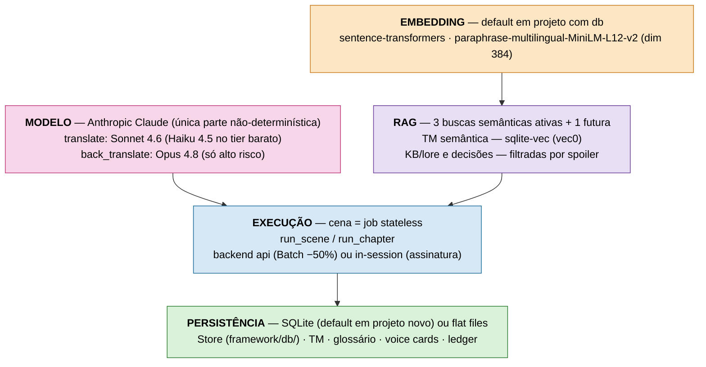
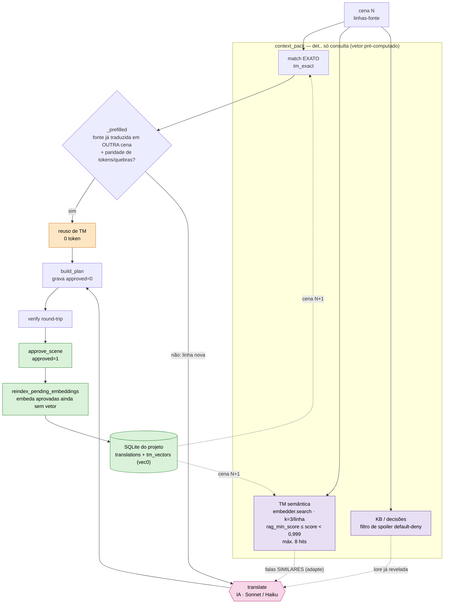

# Stack técnica — modelo, embedding, RAG, execução

Este documento descreve a tecnologia do framework para quem nunca viu o projeto: o que cada camada
faz, com que biblioteca, e por que foi desenhada assim. Cada seção aponta para o documento que
aprofunda o assunto.

## O sistema em um parágrafo

O framework traduz o texto de jogos (e, no futuro, legendas) e o devolve ao arquivo original do
jogo. O fluxo é: extrair as falas do binário para um CSV, traduzir cena por cena com um LLM, e
reinserir a tradução no binário respeitando o espaço em bytes de cada fala. **O LLM é a única parte
não determinística.** Todo o resto (montar o contexto do prompt, validar a tradução, reinserir,
controlar custo) é código Python comum, testado e reprodutível.

## Resumo da stack

| Camada | Tecnologia | Papel |
|---|---|---|
| Linguagem | Python ≥ 3.11 | todo o framework; sem serviço externo além da API do LLM |
| LLM | Anthropic Claude, SDK `anthropic` | traduz e faz a verificação por back-translation |
| Embedding | `sentence-transformers`, modelo `paraphrase-multilingual-MiniLM-L12-v2` (384 dimensões), local | transforma texto em vetor para a busca por similaridade |
| Índice vetorial | `sqlite-vec` (tabela virtual `vec0`) | guarda e consulta os vetores dentro do próprio SQLite |
| Persistência | SQLite (biblioteca padrão, modo WAL) ou arquivos JSON/CSV | memória de tradução, glossário, base de conhecimento, estado do run |
| Execução | CLI `tcf` + Message Batches API da Anthropic | uma cena por job; lote assíncrono com 50% de desconto |
| Qualidade | pytest, Hypothesis, ruff, mypy, bandit, pip-audit, gitleaks | 7 workflows no GitHub Actions; cobertura mínima de 90% |


```mermaid
%%{init: {'flowchart': {'wrappingWidth': 520}}}%%
flowchart TB
  model["<b>MODELO</b> — Anthropic Claude (única parte não-determinística)<br/>translate: Sonnet 4.6 (Haiku 4.5 no tier barato)<br/>back_translate: Opus 4.8 (só alto risco)"]:::mod
  embed["<b>EMBEDDING</b> — default em projeto com db<br/>sentence-transformers · paraphrase-multilingual-MiniLM-L12-v2 (dim 384)"]:::emb
  rag["<b>RAG</b> — 3 buscas semânticas ativas + 1 futura<br/>TM semântica — sqlite-vec (vec0)<br/>KB/lore e decisões — filtradas por spoiler"]:::rg
  exec["<b>EXECUÇÃO</b> — cena = job stateless<br/>run_scene / run_chapter<br/>backend api (Batch −50%) ou in-session (assinatura)"]:::ex
  store["<b>PERSISTÊNCIA</b> — SQLite (default em projeto novo) ou flat files<br/>Store (framework/db/) · TM · glossário · voice cards · ledger"]:::st
  model --> exec
  embed --> rag
  rag --> exec
  exec --> store
  classDef mod fill:#f6d6e8,stroke:#c0397b,color:#000;
  classDef emb fill:#fde6c4,stroke:#c97b1f,color:#000;
  classDef rg fill:#e8dff5,stroke:#6a3d9b,color:#000;
  classDef ex fill:#d6e8f6,stroke:#1f6f9b,color:#000;
  classDef st fill:#d9f2d9,stroke:#2e7d32,color:#000;
```

## Vocabulário usado neste documento

| Termo | O que é |
|---|---|
| **Cena** | unidade de trabalho: um bloco de falas do jogo (dezenas de linhas). Cada cena é traduzida em uma chamada. |
| **Conector** | código específico de um jogo que extrai o texto do binário e o reinsere. Fica em `projects/<jogo>/connector/`. |
| **Pacote de contexto** | o prompt montado para uma cena: as falas, mais só os trechos de memória, glossário e lore relevantes para ela. Gerado por `context_pack.py`. |
| **TM** (translation memory) | pares fonte→tradução já aprovados. Serve para reusar e manter consistência. |
| **KB** (knowledge base) | pesquisa sobre o universo do jogo (personagens, termos, lore), feita antes de traduzir. |
| **Voice card** | ficha de como cada personagem fala (registro, tratamento, bordões). |
| **Decisão** | escolha de tradução registrada para valer no resto do projeto (ex.: como traduzir um título). |
| **Round-trip** | teste determinístico: reinserir a tradução no binário, extrair de novo e conferir byte a byte. |
| **Back-translation** | segunda chamada de LLM que traduz de volta para a língua de origem, para detectar perda de sentido. |
| **Gate** | verificação que bloqueia o run (ou marca a cena para revisão) quando uma condição falha. |
| **`verified`** | estado da cena que passou no round-trip. Só cenas `verified` alimentam a TM. |

---

## Pacote de contexto — a peça central

O problema que ele resolve: um jogo tem milhares de falas, um glossário de centenas de termos e um
histórico de decisões que só cresce. Colocar tudo isso em cada prompt custa caro e estoura a
janela do modelo. O pacote de contexto (`framework/runtime/context_pack.py`) monta, para cada
cena, um prompt que contém **só o que aquela cena precisa**. O tamanho do prompt depende do
tamanho da cena, e não do tamanho do projeto.

`build_pack(projeto, cena)` é uma função pura sobre arquivos: lê as falas da cena e as fontes do
projeto, seleciona um subconjunto de cada fonte e grava dois arquivos no diretório da cena:
`pack.json` (estruturado, consumido pelo backend `api`) e `scene_prompt.md` (o mesmo conteúdo como
prompt pronto, usado pelo backend `in-session`).

### Como a seleção funciona

O texto-fonte de todas as falas da cena é concatenado e passado para minúsculas (`blob_low`). Cada
fonte é filtrada por **presença de termo** nesse texto. A primitiva é uma só, `_present`:

```python
# termo alfanumérico: limite de palavra, com plural inglês opcional
re.search(r"\b" + re.escape(termo) + r"(?:e?s)?\b", blob_low)
# termo com espaço ou pontuação: substring simples
termo in blob_low
```

O limite de palavra evita falso positivo de substring (o termo `system` não casa dentro de outra
palavra); o sufixo opcional faz `cohort` casar `cohorts` sem abrir para substring solta.

| Seção do pacote | Regra de seleção | Limite | Função |
|---|---|---|---|
| Glossário | o termo ou um de seus aliases está presente na cena | 60 entradas, em ordem alfabética | `select_glossary` |
| Voice cards | o nome ou um alias do personagem está presente; personagens de criticidade alta entram sempre | — | `select_voices` |
| Decisões | as universais (regras do conector) primeiro; depois as que têm tag igual a um termo ou falante presente, ou que citam um deles no resumo | 12 | `select_decisions` |
| TM exata | a fala já foi traduzida antes: `sha1(fonte normalizada)[:16]` igual ao de uma entrada da TM | uma por fala | `select_tm` |
| TM de voz | exemplos de falas já traduzidas do mesmo falante, para fixar o registro | 3 por falante | `select_tm` |
| KB / lore | uma palavra (≥ 4 letras) do título da seção está presente na cena **e** a seção tem marca de revelação já ultrapassada | 5 seções | `select_kb` |
| Guardas de spoiler | um fato ainda **não** revelado neste ponto da história tem um gatilho presente na cena; entra a instrução de como manter a ambiguidade | — | `select_spoiler_guards` |
| Regras do projeto | tokens de formatação, token de quebra de linha, orçamento de bytes por fala | fixo | `project_constraints` |

A "fonte normalizada" da TM exata é o texto em minúsculas, com quebras de linha trocadas por
espaço e espaços colapsados (`text_ids.norm_source`). Duas falas que diferem só em caixa ou em
onde a linha quebra têm a mesma chave.

O pacote também grava `doctrine_hash`: um SHA-1 da doutrina de tradução, do glossário e do log de
decisões. Se qualquer um deles mudar depois, dá para saber quais cenas foram traduzidas com a
versão antiga.

### Por que léxico, e não por embedding

Seleção léxica aqui quer dizer comparar strings (match de termo, hash de texto normalizado), sem
modelo de similaridade. A escolha é deliberada:

- **Os alvos são nomes próprios e termos fechados.** A pergunta "o termo *Gigiri* aparece nesta
  cena?" tem resposta exata. Embedding responde "que texto se parece com este?", que é outra
  pergunta: traria termos parecidos que não estão na cena e poderia deixar de fora um termo que
  está. Um termo de glossário que falta no prompt vira inconsistência de tradução.
- **Cada item do pacote é auditável.** Tudo o que entrou tem uma causa verificável a olho: uma
  string que está na cena. Não há limiar de score para calibrar nem resultado que mude com a
  versão do modelo de embedding.
- **É determinístico sem depender de mais nada.** O mesmo estado de projeto gera o mesmo
  `pack.json`, byte a byte (`test_context_pack_deterministic`). Isso permite cachear, comparar
  runs e reproduzir um bug de tradução a partir do pacote que o gerou.
- **Não tem dependência.** Roda só com a biblioteca padrão, sem banco e sem a stack de ML. É por
  isso que os projetos em arquivos funcionam sem embedding.
- **Custa nada.** São expressões regulares e consultas a dicionário sobre o texto de uma cena.

O que o léxico não cobre é a fala **parecida mas não idêntica** a uma já traduzida: o hash muda
com uma palavra de diferença. Esse é o único caso em que similaridade ajuda, e é o que a busca
semântica acrescenta (seção [RAG](#rag-recuperação-semântica)), sempre em seções separadas do
prompt e sem mexer na seleção acima.

---

## Modelo (LLM)

Usa a família **Claude**, pelo SDK oficial `anthropic`. Há **só duas chamadas de IA** no sistema:
`translate` e `back_translate`. O modelo de cada papel é uma constante em
`framework/runtime/config.py`; trocar de modelo é trocar essa string.

| Papel | Modelo | Constante | Quando |
|---|---|---|---|
| Tradução (padrão) | `claude-sonnet-4-6` | `MODEL_TRANSLATE` | maioria das linhas |
| Tradução (tier barato) | `claude-haiku-4-5` | `MODEL_TRANSLATE_CHEAP` | linhas de uma só linha de texto, no caminho de lote (−67% por linha) |
| Verificação | `claude-opus-4-8` | `MODEL_BACK` | back-translation das linhas de risco alto (mais uma amostra de 5% das demais nas cenas de lote); último degrau da re-tradução por estouro de espaço |

Decisões de engenharia nessa camada:

- **Roteamento por complexidade.** O modelo mais caro só vê o que precisa dele. O contexto curado
  do pacote permite que Sonnet e Haiku façam a tradução; Opus fica para verificar.
- **Saída estruturada.** A tradução volta em JSON validado por schema (`json_schema`), uma entrada
  por fala, e não como texto livre a ser parseado.
- **Prompt caching.** A doutrina de tradução (o `system` prompt, igual para todas as cenas) é
  marcada com `cache_control`, então é cobrada cheia uma vez e com desconto nas chamadas seguintes.
- **Sem thinking na tradução.** Roda com `effort: low` e thinking desligado; ligar custou cerca de
  5× na medição. A back-translation mantém thinking, porque ali o raciocínio pesa.
- **Dois backends, um contrato.** `api` (padrão) chama a API com streaming e backoff exponencial em
  429/500/timeout. `in-session` não faz chamada de rede: gera o prompt em arquivo para ser
  respondido dentro de uma sessão de assinatura, e o run retoma depois.
- **Re-tradução por estouro de espaço.** Se a tradução não cabe nos bytes da fala original, só as
  linhas que estouraram são re-traduzidas, escalando de modelo (`MODEL_ESCALATION`).

Contrato, backends e benchmarks → [`MODEL_INTERFACE.md`](MODEL_INTERFACE.md). Cliente HTTP,
streaming e backoff → `framework/runtime/llm_client.py`.

---

## Embedding

Embedding é a conversão de um texto em um vetor numérico, de modo que textos de sentido parecido
fiquem próximos. Aqui ele serve para achar falas **parecidas** (não idênticas) entre as já
traduzidas.

- **Modelo**: `paraphrase-multilingual-MiniLM-L12-v2`, via `sentence-transformers`. Gera vetores de
  **384 dimensões**. Roda **local**: não há chamada de API nem custo por token.
- **Normalização**: os vetores saem com norma 1 (`normalize_embeddings=True`). Com isso a distância
  L2 que o `sqlite-vec` calcula converte direto em cosseno: `cos = 1 − L2²/2`.
- **Hardware**: CPU por padrão. Usa GPU se houver torch com ROCm (Linux/AMD); no Windows fica em
  CPU, o que basta para um corpus de milhares de linhas (poucos minutos).
- **Código**: `framework/db/embedder.py` (`Embedder.encode`, `index_project`, `search`).
- **Modelo fixado por índice**: a tabela de metadados grava o nome do modelo de cada vetor. Trocar
  de modelo exige reindexar tudo, de forma explícita.
- **Um processo por projeto**: não há serviço de embedding compartilhado. O modelo é recarregado a
  cada processo (9 a 12 s); o download fica em cache na máquina (ver ADR 0015).

### É o padrão em projeto com banco

Todo projeto com `db` no `project.json` usa busca semântica por padrão. A stack entra no
`pip install .` (o `pyproject.toml` lê os pins de `requirements.txt` + `requirements-ml.txt`).

- **Sem a stack instalada, o run bloqueia.** O `kb_gate` para antes de qualquer chamada de modelo
  e diz como instalar. Antes disso, a busca semântica voltava vazia sem aviso, e o projeto parecia
  usar RAG sem usar.
- **Desligar é explícito.** `"db": {..., "semantic": false}` no `project.json` desliga a busca
  semântica: o gate vira aviso e o pacote usa só a busca léxica.
- **Projeto sem `db`** (arquivos JSON/CSV) não é afetado.
- **Instalação**: `pip install .` já traz. Num checkout de desenvolvimento,
  `pip install -r requirements-ml.txt` (de 700 MB a 1,5 GB, por causa do torch). Para indexar um
  corpus que já existe: `python framework/cli.py db index <projeto>.db <project_id>`.
- **No CI**: os testes de push/PR (`test.yml`) não instalam torch, pelo custo. Eles rodam com
  `TCF_ALLOW_NO_ML=1` (setado no `conftest.py` da raiz), que rebaixa o bloqueio a aviso. A stack
  real é testada sem mock uma vez por semana (`ml-coverage-optional.yml`, piso de 85% de cobertura
  em `embedder.py` e `validate_model.py`) e auditada por CVE (`dep-audit-optional.yml`).

---

## RAG (recuperação semântica)

RAG (retrieval-augmented generation) é buscar informação relevante e colocá-la no prompt, em vez
de esperar que o modelo a saiba. O [pacote de contexto](#pacote-de-contexto--a-peça-central) já
faz isso de forma **léxica**.

A busca **semântica** (por embedding) é um **suplemento** em cima disso. Ela entra em seções
separadas e rotuladas do prompt, com tamanho limitado, e nunca substitui a seleção léxica.

Arquitetura completa do RAG (dados, indexação, recuperação, filtro de spoiler, degradação) →
[`RAG_ARCHITECTURE.md`](RAG_ARCHITECTURE.md).

| Busca | O que recupera | Como | Estado |
|---|---|---|---|
| **TM semântica** | falas já traduzidas parecidas com as da cena; viram a seção "falas SIMILARES (adapte)" do prompt | `Embedder.search()` sobre `tm_vectors` | ativa; ganho medido (ver [ADR 0016](adr/0016-rag-roi-validado-reindex-obrigatorio.md)) |
| **KB / lore** | seções da base de conhecimento relevantes para a cena | léxica (`select_kb`, pelo título da seção citado na cena) + semântica (`_load_kb_semantic`, sobre `kb_vectors`), sem duplicar | ativa; a parte semântica só devolve seção com marca de revelação (ver filtro de spoiler abaixo) |
| **Decisões** | decisões de tradução relacionadas ao conteúdo da cena | `_load_decisions_semantic`, sobre `decision_vectors`, além do índice léxico | ativa |
| **Entre jogos da mesma série** | TM compartilhada por franquia | mesma infraestrutura | futura |

Detalhes de implementação que importam:

- **Busca exata, não aproximada.** A consulta faz varredura linear com `vec_distance_l2` sobre os
  vetores do projeto, sem índice ANN. Para corpus de milhares de linhas o custo é desprezível, e o
  filtro (só linhas aprovadas, só do projeto) é aplicado antes do corte dos `k` vizinhos.
- **Vetores pré-computados.** Montar o pacote só consulta o índice; o único texto embedado na hora
  é a fala usada como consulta.
- **Limites.** Na TM semântica: 3 vizinhos por fala, no máximo 8 por cena, e só hits com score
  entre `rag_min_score` e 0,999 (acima disso é match exato, que já entrou pelo caminho léxico).
- **Filtro de spoiler.** KB e decisões semânticas só entram se tiverem uma marca `reveal` provando
  que aquele conteúdo já foi revelado no ponto da história em que a cena está. Sem marca, não
  entra (default-deny). Hoje nenhum projeto tem a KB marcada, então a KB semântica fica vazia em
  produção até isso ser feito.
- **Onde a busca semântica não entra, de propósito**: glossário (o match por termo é preciso; o
  semântico traria falso positivo), voice cards (identidade é por nome, não por similaridade) e o
  núcleo do pacote.

### Fluxo em execução — o laço de reuso

O que acontece com **uma cena** em projeto com `db`, e por onde a tradução aprovada volta para
alimentar a cena seguinte:


```mermaid
flowchart TB
  scene["cena N<br/>linhas-fonte"]
  subgraph pack["context_pack — det., só consulta (vetor pré-computado)"]
    direction LR
    ex["match EXATO<br/>tm_exact"]
    sem["TM semântica<br/>embedder.search · k=3/linha<br/>rag_min_score ≤ score &lt; 0,999<br/>máx. 8 hits"]
    kb["KB / decisões<br/>filtro de spoiler default-deny"]
  end
  split{"_prefilled<br/>fonte já traduzida em OUTRA cena<br/>+ paridade de tokens/quebras?"}
  reuse["reuso de TM<br/>0 token"]
  llm{{"translate<br/>IA · Sonnet / Haiku"}}
  plan["build_plan<br/>grava approved=0"]
  vf["verify round-trip"]
  ok["approve_scene<br/>approved=1"]
  idx["reindex_pending_embeddings<br/>embeda aprovadas ainda sem vetor"]
  db[("SQLite do projeto<br/>translations + tm_vectors (vec0)")]

  scene --> ex & sem & kb
  ex --> split
  split -->|"sim"| reuse
  split -->|"não: linha nova"| llm
  sem -. "falas SIMILARES (adapte)" .-> llm
  kb -. "lore já revelada" .-> llm
  reuse --> plan
  llm --> plan
  plan --> vf --> ok --> idx --> db
  db -. "cena N+1" .-> ex
  db -. "cena N+1" .-> sem

  classDef ia fill:#f6d6e8,stroke:#c0397b,color:#000;
  classDef rg fill:#e8dff5,stroke:#6a3d9b,color:#000;
  classDef st fill:#d9f2d9,stroke:#2e7d32,color:#000;
  classDef save fill:#fde6c4,stroke:#c97b1f,color:#000;
  class llm ia;
  class sem,kb rg;
  class db,idx,ok st;
  class reuse save;
```

- **Onde está a economia** (laranja): uma fala cuja fonte já foi traduzida em outra cena **não vai
  ao LLM** (`model._select_reuse`); a tradução aprovada é reusada. Uma cena 100% reaproveitada não
  faz chamada nenhuma. Foi esse caminho que rendeu a redução de 24% de custo medida em 10 cenas
  (ADR 0016). A busca semântica (roxo) só **informa** o prompt das falas novas; não corta tokens.
- **Só vira TM o que passou no round-trip.** O `build_plan` grava a tradução com `approved=0`; o
  `approve_scene` promove para `approved=1` depois do `verify`. As buscas exata e semântica só
  leem `approved=1`, então uma tradução reprovada nunca contamina as cenas seguintes.
- **O vetor nasce na aprovação.** `reindex_pending_embeddings` embeda as linhas aprovadas que ainda
  não têm vetor, logo depois do `approve_scene`. A cena N+1 já enxerga a cena N. É incremental e
  não derruba a escrita: o dado já está gravado em SQL antes da indexação.

### `rag_min_score` — calibração com dado real

`rag_min_score` é o score mínimo para um vizinho semântico entrar no prompt. O score é o cosseno
entre a fala consultada e a fala-fonte indexada: 1,0 é idêntico, 0,0 é sem relação. Só o texto na
língua de origem entra no cálculo; a tradução vai junto como metadado.

A calibração usou um índice real: 12 cenas do Breath of Fire IV traduzidas pelo pipeline e
aprovadas (323 falas, 323 vetores), e 40 consultas em 5 categorias.

| Categoria da consulta | Exemplo | Score do melhor hit |
|---|---|---|
| Texto idêntico ao do corpus | `"Monsters! They're everywhere!..."` | **1,0** (5 de 5) |
| Quase idêntico (pontuação ou aspas diferentes) | "Where do you want to go?" | 0,83–0,89 |
| Paráfrase (mesmo sentido, outras palavras) | "So what is the state of the sacrifice now?" | 0,71–0,89 (um caso em 0,57) |
| Mesmo tema, conteúdo diferente | "Take this sword, it was forged by ancient smiths" | 0,37–0,51 |
| Fora do domínio | "Preheat the oven to 200 degrees..." | 0,13–0,38 |

Leitura: acima de 0,71 os hits são paráfrases de verdade, úteis como referência. Abaixo de 0,57
eles casam só por vocabulário de tema (fantasia/RPG), sem relação de sentido. O maior score de
ruído observado foi **0,51**.

**Valor escolhido: `rag_min_score = 0.55`**, acima do teto de ruído (0,51) e abaixo do piso das
paráfrases (0,57). Fica em `projects/translation_software/project.json`; é configurável por
projeto, porque depende do par de idiomas.

Limite dessa medição: 323 falas são uma fração do corpus completo (6.046 falas). A amostra serve
para ver a **forma** da distribuição de scores, que depende só do texto, mas não mede cobertura em
produção. O modelo também só foi validado para inglês→português; para outro par de idiomas,
`tcf db validate-model` refaz a medição.

Fases e decisões de design do banco e do índice → [`DB_MIGRATION_ROADMAP.md`](DB_MIGRATION_ROADMAP.md).

---

## Execução

Cada cena roda como um **job independente e limitado**: o prompt contém o contexto daquela cena, e
não o histórico do projeto. O tamanho do prompt não cresce com o número de cenas já traduzidas.

```
run_scene(cena):
  gates (conector + KB)      bloqueiam antes de gastar com modelo
  → context_pack             monta o prompt (determinístico)
  → translate [IA]           só as falas sem reuso de TM
  → build_plan               valida e prepara a reinserção
  → verify (round-trip)      bytes conferem? → cena vira `verified`
  → back_translate [IA]      só risco alto; marca para revisão, não bloqueia
  → checkpoint + state_index
```

- **`run_scene.py`** orquestra uma cena. **`run_chapter.py`** roda um capítulo inteiro, em loop
  retomável.
- **Lote por padrão.** No backend `api`, o `run_chapter` envia as cenas pela Message Batches API:
  50% de desconto, processamento assíncrono (até cerca de 1 h por corpus). Tempo real só com
  `--no-batch` ou via `run_scene`, para piloto e depuração.
- **Teto de gasto.** `--max-usd` é um limite duro: o run estima o custo antes de enviar e aborta
  se passar. Se o lote falhar, o padrão é abortar em vez de cair calado no caminho mais caro.
- **Retomada.** `run_state.json` guarda o estado por cena. Uma queda na cena 40 não perde as 39
  anteriores.
- **Custo auditável.** `api_ledger.jsonl` registra toda chamada cobrada, inclusive as que
  falharam. A recuperação de erro é por fala, não por cena, então o custo de um retry é
  proporcional ao que quebrou.

Detalhe e medições → [`ARCHITECTURE.md`](ARCHITECTURE.md) e
[`TRANSLATION_PIPELINE.md`](TRANSLATION_PIPELINE.md).

---

## Persistência

Há dois modos, escolhidos por projeto: com `db` no `project.json`, SQLite; sem, arquivos.

- **SQLite** (`framework/db/store.py`, classe `Store`). Um arquivo `.db` por projeto, modo WAL,
  sem servidor. Schema único em `framework/db/schema.sql`: `projects`, `scenes`, `translations`,
  `scene_lines`, `kb`, `glossary`, `entities`, `voice_cards`, `decisions`, `spoiler_entries`,
  `research_log`, `kb_ratified`, `back_translations`, `jobs`, `metrics`, `warnings`,
  `qa_effectiveness`, mais as tabelas de embedding. É o modo que permite a busca semântica, porque
  os vetores moram no mesmo arquivo. **É o padrão de projeto novo**: o banco é criado sozinho no
  primeiro run.
- **Arquivos** (`translation_memory.jsonl`, `glossary.csv`, `state/*.json`). Modo original,
  versionável no git e legível em diff. Os projetos já concluídos seguem nele.
- **Ponte entre os dois.** `migrate_from_flat.py` e `export_to_flat.py` convertem nos dois
  sentidos, e a paridade entre banco e arquivos é verificada por teste. Durante o run, cada cena
  grava no banco por `sync_translations_db` (ao montar o plano) e `state_index.approve_scene_db`
  (ao aprovar).

Por que SQLite e não um banco vetorial dedicado: o corpus de um jogo cabe em milhares de linhas,
um arquivo local dispensa infraestrutura, e manter dado relacional e vetor no mesmo arquivo
elimina a sincronização entre dois sistemas.

Detalhe → [`STATE_MANAGEMENT.md`](STATE_MANAGEMENT.md).

---

## Onde cada projeto está hoje

| Projeto | Persistência / RAG | Modelo | Estado |
|---|---|---|---|
| `utawarerumono` | arquivos | Sonnet/Opus (API) | concluído — 16 capítulos, Batch API |
| `breath_of_fire_4` | arquivos (o corpus também foi migrado para `translation_software`) | Haiku/Sonnet/Opus | concluído — 125 cenas |
| `souldiers` | arquivos | Haiku/Sonnet/Opus (Batch API) | concluído — 470 cenas, terceira engine (Unity Addressables) |
| `trails_sky_sc` | arquivos | — (ainda não traduzido pelo framework) | em andamento — quarta engine (Falcom); 67 cenas extraídas, cena-piloto com round-trip fechado |
| `translation_software` | **SQLite + busca semântica** | — | referência de arquitetura do modo banco, com o corpus do BoF4; não é uma tradução em andamento |
| `demo` | SQLite, busca semântica desligada (`semantic: false`) | — | exemplo sintético do README |
| `translation_local` | — | — | **descontinuado** (ADR 0008): prova de conceito de tradução com modelo local via Ollama, abandonada por regressão de velocidade e erro de terminologia |
