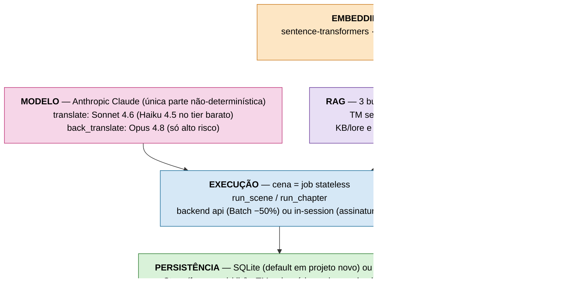

# Stack técnica — modelo, embedding, RAG, execução

Este documento descreve a tecnologia do framework para quem nunca viu o projeto: o que cada camada
faz, com que biblioteca, e por que foi desenhada assim. Cada seção aponta para o documento que
aprofunda o assunto.

## O sistema em um parágrafo

O framework traduz o texto de jogos (e, no futuro, legendas) e o devolve ao arquivo original do
jogo. O fluxo é: extrair as falas do binário para um CSV, traduzir cena por cena com um LLM, e
reinserir a tradução no binário respeitando o espaço em bytes de cada fala. **O LLM é a única parte
não determinística.** Todo o resto (montar o contexto do prompt, validar a tradução, reinserir,
controlar custo) é código Python comum, testado e reprodutível.

## Resumo da stack

| Camada | Tecnologia | Papel |
|---|---|---|
| Linguagem | Python ≥ 3.11 | todo o framework; sem serviço externo além da API do LLM |
| LLM | Anthropic Claude, SDK `anthropic` | traduz e faz a verificação por back-translation |
| Embedding | `sentence-transformers`, modelo `paraphrase-multilingual-MiniLM-L12-v2` (384 dimensões), local | transforma texto em vetor para a busca por similaridade |
| Índice vetorial | `sqlite-vec` (tabela virtual `vec0`) | guarda e consulta os vetores dentro do próprio SQLite |
| Persistência | SQLite (biblioteca padrão, modo WAL) ou arquivos JSON/CSV | memória de tradução, glossário, base de conhecimento, estado do run |
| Execução | CLI `tcf` + Message Batches API da Anthropic | uma cena por job; lote assíncrono com 50% de desconto |
| Qualidade | pytest, Hypothesis, ruff, mypy, bandit, pip-audit, gitleaks | 7 workflows no GitHub Actions; cobertura mínima de 90% |


```mermaid
%%{init: {'flowchart': {'wrappingWidth': 520}}}%%
flowchart TB
  model["<b>MODELO</b> — Anthropic Claude (única parte não-determinística)<br/>translate: Sonnet 4.6 (Haiku 4.5 no tier barato)<br/>back_translate: Opus 4.8 (só alto risco)"]:::mod
  embed["<b>EMBEDDING</b> — default em projeto com db<br/>sentence-transformers · paraphrase-multilingual-MiniLM-L12-v2 (dim 384)"]:::emb
  rag["<b>RAG</b> — 3 buscas semânticas ativas + 1 futura<br/>TM semântica — sqlite-vec (vec0)<br/>KB/lore e decisões — filtradas por spoiler"]:::rg
  exec["<b>EXECUÇÃO</b> — cena = job stateless<br/>run_scene / run_chapter<br/>backend api (Batch −50%) ou in-session (assinatura)"]:::ex
  store["<b>PERSISTÊNCIA</b> — SQLite (default em projeto novo) ou flat files<br/>Store (framework/db/) · TM · glossário · voice cards · ledger"]:::st
  model --> exec
  embed --> rag
  rag --> exec
  exec --> store
  classDef mod fill:#f6d6e8,stroke:#c0397b,color:#000;
  classDef emb fill:#fde6c4,stroke:#c97b1f,color:#000;
  classDef rg fill:#e8dff5,stroke:#6a3d9b,color:#000;
  classDef ex fill:#d6e8f6,stroke:#1f6f9b,color:#000;
  classDef st fill:#d9f2d9,stroke:#2e7d32,color:#000;
```

## Vocabulário usado neste documento

| Termo | O que é |
|---|---|
| **Cena** | unidade de trabalho: um bloco de falas do jogo (dezenas de linhas). Cada cena é traduzida em uma chamada. |
| **Conector** | código específico de um jogo que extrai o texto do binário e o reinsere. Fica em `projects/<jogo>/connector/`. |
| **Pacote de contexto** | o prompt montado para uma cena: as falas, mais só os trechos de memória, glossário e lore relevantes para ela. Gerado por `context_pack.py`. |
| **TM** (translation memory) | pares fonte→tradução já aprovados. Serve para reusar e manter consistência. |
| **KB** (knowledge base) | pesquisa sobre o universo do jogo (personagens, termos, lore), feita antes de traduzir. |
| **Voice card** | ficha de como cada personagem fala (registro, tratamento, bordões). |
| **Decisão** | escolha de tradução registrada para valer no resto do projeto (ex.: como traduzir um título). |
| **Round-trip** | teste determinístico: reinserir a tradução no binário, extrair de novo e conferir byte a byte. |
| **Back-translation** | segunda chamada de LLM que traduz de volta para a língua de origem, para detectar perda de sentido. |
| **Gate** | verificação que bloqueia o run (ou marca a cena para revisão) quando uma condição falha. |
| **`verified`** | estado da cena que passou no round-trip. Só cenas `verified` alimentam a TM. |

---

## Pacote de contexto — a peça central

O problema que ele resolve: um jogo tem milhares de falas, um glossário de centenas de termos e um
histórico de decisões que só cresce. Colocar tudo isso em cada prompt custa caro e estoura a
janela do modelo. O pacote de contexto (`framework/runtime/context_pack.py`) monta, para cada
cena, um prompt que contém **só o que aquela cena precisa**. O tamanho do prompt depende do
tamanho da cena, e não do tamanho do projeto.

`build_pack(projeto, cena)` é uma função pura sobre arquivos: lê as falas da cena e as fontes do
projeto, seleciona um subconjunto de cada fonte e grava dois arquivos no diretório da cena:
`pack.json` (estruturado, consumido pelo backend `api`) e `scene_prompt.md` (o mesmo conteúdo como
prompt pronto, usado pelo backend `in-session`).

A seleção é **léxica**: por termo, por nome de falante e por hash do texto, sem embedding. É
determinística (a mesma cena gera o mesmo prompt, byte a byte), auditável e não custa nada.

Regras de seleção, tetos, a chave da TM exata e a justificativa →
[`CONTEXT_PACK.md`](CONTEXT_PACK.md).

---

## Modelo (LLM)

Usa a família **Claude**, pelo SDK oficial `anthropic`. Há **só duas chamadas de IA** no sistema:
`translate` e `back_translate`. O modelo de cada papel é uma constante em
`framework/runtime/config.py`; trocar de modelo é trocar essa string.

| Papel | Modelo | Constante | Quando |
|---|---|---|---|
| Tradução (padrão) | `claude-sonnet-4-6` | `MODEL_TRANSLATE` | maioria das linhas |
| Tradução (tier barato) | `claude-haiku-4-5` | `MODEL_TRANSLATE_CHEAP` | linhas de uma só linha de texto, no caminho de lote (−67% por linha) |
| Verificação | `claude-opus-4-8` | `MODEL_BACK` | back-translation das linhas de risco alto (mais uma amostra de 5% das demais nas cenas de lote); último degrau da re-tradução por estouro de espaço |

Decisões de engenharia nessa camada:

- **Roteamento por complexidade.** O modelo mais caro só vê o que precisa dele. O contexto curado
  do pacote permite que Sonnet e Haiku façam a tradução; Opus fica para verificar.
- **Saída estruturada.** A tradução volta em JSON validado por schema (`json_schema`), e não como
  texto livre a ser parseado. O formato está descrito logo abaixo.
- **Prompt caching.** A doutrina de tradução (o `system` prompt, igual para todas as cenas) é
  marcada com `cache_control`. O efeito medido é pequeno, porque o custo está na saída e não na
  doutrina (ver [`TOKEN_ECONOMY.md`](TOKEN_ECONOMY.md)).
- **Sem thinking na tradução.** Roda com `effort: low` e thinking desligado; ligar custou cerca de
  5× na medição. A back-translation mantém thinking, porque ali o raciocínio pesa.
- **Dois backends, um contrato.** `api` (padrão) chama a API com streaming e backoff exponencial em
  429/500/timeout. `in-session` não faz chamada de rede: gera o prompt em arquivo para ser
  respondido dentro de uma sessão de assinatura, e o run retoma depois.
- **Re-tradução por estouro de espaço.** Se a tradução não cabe nos bytes da fala original, só as
  linhas que estouraram são re-traduzidas, escalando de modelo (`MODEL_ESCALATION`).

### O formato da resposta

A chamada de tradução usa saída estruturada estrita. O modelo devolve um array com uma entrada por
fala, e a API rejeita qualquer resposta fora do schema (`_TRANSLATION_SCHEMA` em `model.py`):

```json
{"lines": [{
  "offset": "0x1A2B",
  "speaker": "Ryu",
  "tone_register": "informal",
  "intent": "pergunta direta",
  "risk_level": "low",
  "risk_notes": "",
  "t": "Para onde você quer ir?"
}]}
```

Os valores acima são ilustrativos.

| Campo | Para que serve |
|---|---|
| `offset` | identifica a fala no binário; é a chave que liga a resposta à linha de origem |
| `t` | a tradução |
| `speaker`, `tone_register`, `intent` | o que o modelo entendeu da fala; ficam registrados para revisão e alimentam os exemplos de voz |
| `risk_level` | `low`, `medium`, `high` ou `critical`; decide se a fala passa pela back-translation |
| `risk_notes` | o motivo do risco, quando houver |

Esses campos explicam a média de 66 tokens de saída por fala: a tradução é só uma parte do objeto.
Cortar `tone_register` e `intent` para economizar tokens foi avaliado e rejeitado: o gate de
qualidade depende desses campos.

Depois da resposta, o código confere três coisas por fala, sem modelo: se todo `offset` pedido
voltou (cobertura), se a contagem do marcador de quebra de linha é igual à da fonte, e se os
tokens de formatação do jogo foram preservados. A fala que falha volta sozinha na nova tentativa.

Contrato, backends e benchmarks → [`MODEL_INTERFACE.md`](MODEL_INTERFACE.md). Cliente HTTP,
streaming e backoff → `framework/runtime/llm_client.py`.

---

## Embedding

Embedding é a conversão de um texto em um vetor numérico, de modo que textos de sentido parecido
fiquem próximos. Aqui ele serve para achar falas **parecidas** (não idênticas) entre as já
traduzidas.

- **Modelo**: `paraphrase-multilingual-MiniLM-L12-v2`, via `sentence-transformers`. Gera vetores de
  **384 dimensões**. Roda **local**: não há chamada de API nem custo por token.
- **Normalização**: os vetores saem com norma 1 (`normalize_embeddings=True`). Com isso a distância
  L2 que o `sqlite-vec` calcula converte direto em cosseno: `cos = 1 − L2²/2`.
- **Hardware**: CPU por padrão. Usa GPU se houver torch com ROCm (Linux/AMD); no Windows fica em
  CPU, o que basta para um corpus de milhares de linhas (poucos minutos).
- **Código**: `framework/db/embedder.py` (`Embedder.encode`, `index_project`, `search`).
- **Modelo fixado por índice**: a tabela de metadados grava o nome do modelo de cada vetor. Trocar
  de modelo exige reindexar tudo, de forma explícita.
- **Um processo por projeto**: não há serviço de embedding compartilhado. O modelo é recarregado a
  cada processo (9 a 12 s); o download fica em cache na máquina (ver ADR 0015).

### É o padrão em projeto com banco

Todo projeto com `db` no `project.json` usa busca semântica por padrão. A stack entra no
`pip install .` (o `pyproject.toml` lê os pins de `requirements.txt` + `requirements-ml.txt`).

- **Sem a stack instalada, o run bloqueia.** O `kb_gate` para antes de qualquer chamada de modelo
  e diz como instalar. Antes disso, a busca semântica voltava vazia sem aviso, e o projeto parecia
  usar RAG sem usar.
- **Desligar é explícito.** `"db": {..., "semantic": false}` no `project.json` desliga a busca
  semântica: o gate vira aviso e o pacote usa só a busca léxica.
- **Projeto sem `db`** (arquivos JSON/CSV) não é afetado.
- **Instalação**: `pip install .` já traz. Num checkout de desenvolvimento,
  `pip install -r requirements-ml.txt` (de 700 MB a 1,5 GB, por causa do torch). Para indexar um
  corpus que já existe: `python framework/cli.py db index <projeto>.db <project_id>`.
- **No CI**: os testes de push/PR (`test.yml`) não instalam torch, pelo custo. Eles rodam com
  `TCF_ALLOW_NO_ML=1` (setado no `conftest.py` da raiz), que rebaixa o bloqueio a aviso. A stack
  real é testada sem mock uma vez por semana (`ml-coverage-optional.yml`, piso de 85% de cobertura
  em `embedder.py` e `validate_model.py`) e auditada por CVE (`dep-audit-optional.yml`).

---

## RAG (recuperação semântica)

RAG (retrieval-augmented generation) é buscar informação relevante e colocá-la no prompt, em vez
de esperar que o modelo a saiba. O [pacote de contexto](CONTEXT_PACK.md) já
faz isso de forma **léxica**.

A busca **semântica** (por embedding) é um **suplemento** em cima disso. Ela entra em seções
separadas e rotuladas do prompt, com tamanho limitado, e nunca substitui a seleção léxica.

Arquitetura completa do RAG (dados, indexação, recuperação, filtro de spoiler, degradação) →
[`RAG_ARCHITECTURE.md`](RAG_ARCHITECTURE.md).

| Busca | O que recupera | Como | Estado |
|---|---|---|---|
| **TM semântica** | falas já traduzidas parecidas com as da cena; viram a seção "falas SIMILARES (adapte)" do prompt | `Embedder.search()` sobre `tm_vectors` | ativa; serve à consistência, não à economia ([detalhe](RAG_ARCHITECTURE.md#para-que-serve-a-tm-semântica)) |
| **KB / lore** | seções da base de conhecimento relevantes para a cena | léxica (`select_kb`, pelo título da seção citado na cena) + semântica (`_load_kb_semantic`, sobre `kb_vectors`), sem duplicar | ativa; a parte semântica só devolve seção com marca de revelação (ver filtro de spoiler abaixo) |
| **Decisões** | decisões de tradução relacionadas ao conteúdo da cena | `_load_decisions_semantic`, sobre `decision_vectors`, além do índice léxico | ativa |
| **Entre jogos da mesma série** | TM compartilhada por franquia | mesma infraestrutura | futura |

### Onde está a economia de tokens

A busca semântica não reduz tokens; ela acrescenta, com teto. A economia vem de outro lugar:

| Técnica | Efeito medido |
|---|---|
| Reuso exato de TM (a fala repetida não vai ao modelo) | −24% de custo em 10 cenas |
| Thinking desligado na tradução | cerca de 5× menos custo |
| Haiku para falas de uma linha, no lote | −67% por fala roteada |

Mecanismo e origem de cada número, e as demais técnicas → [`TOKEN_ECONOMY.md`](TOKEN_ECONOMY.md).

Implementação da recuperação, o laço de reuso em execução e a calibração do `rag_min_score` →
[`RAG_ARCHITECTURE.md`](RAG_ARCHITECTURE.md).

---

## Execução

Cada cena roda como um **job independente e limitado**: o prompt contém o contexto daquela cena, e
não o histórico do projeto. O tamanho do prompt não cresce com o número de cenas já traduzidas.

```
run_scene(cena):
  gates (conector + KB)      bloqueiam antes de gastar com modelo
  → context_pack             monta o prompt (determinístico)
  → translate [IA]           só as falas sem reuso de TM
  → build_plan               valida e prepara a reinserção
  → verify (round-trip)      bytes conferem? → cena vira `verified`
  → back_translate [IA]      só risco alto; marca para revisão, não bloqueia
  → checkpoint + state_index
```

- **`run_scene.py`** orquestra uma cena. **`run_chapter.py`** roda um capítulo inteiro, em loop
  retomável.
- **Lote por padrão.** No backend `api`, o `run_chapter` envia as cenas pela Message Batches API:
  50% de desconto, processamento assíncrono (até cerca de 1 h por corpus). Tempo real só com
  `--no-batch` ou via `run_scene`, para piloto e depuração.
- **Teto de gasto.** `--max-usd` é um limite duro: o run estima o custo antes de enviar e aborta
  se passar. Se o lote falhar, o padrão é abortar em vez de cair calado no caminho mais caro.
- **Retomada.** `run_state.json` guarda o estado por cena. Uma queda na cena 40 não perde as 39
  anteriores.
- **Custo auditável.** `api_ledger.jsonl` registra toda chamada cobrada, inclusive as que
  falharam. A recuperação de erro é por fala, não por cena, então o custo de um retry é
  proporcional ao que quebrou.
- **Ordem de grandeza.** O gasto real acumulado do projeto Utawarerumono, somado pelo ledger, foi
  de cerca de R$ 338 (Sonnet R$ 260, Opus R$ 40, Haiku R$ 38).

Detalhe e medições → [`ARCHITECTURE.md`](ARCHITECTURE.md) e
[`TRANSLATION_PIPELINE.md`](TRANSLATION_PIPELINE.md).

---

## Conector e round-trip — a garantia de que o jogo não quebra

Traduzir o texto é metade do problema. A outra metade é devolver esse texto a um arquivo binário
que o jogo consiga ler. Essa parte é **determinística**, específica de cada jogo, e é o que o
conector resolve.

O conector é um conjunto de scripts por jogo (`extract`, `build_plan`, `reinsert`, `verify`). O
`verify` reconstrói o arquivo sem tradução e exige o original byte a byte; depois aplica a
tradução e a relê. Se a tradução não cabe, o run re-traduz só as falas que estouraram, com
orçamento mais apertado.

Contrato, protocolo de saída e tratamento de falta de espaço → [`CONNECTORS.md`](CONNECTORS.md).

---

## Verificações antes e depois da tradução

Além do round-trip, três mecanismos cercam a chamada do modelo.

### Gates: bloqueio antes de gastar

Dois gates rodam no início de `run_scene` e `run_chapter`, sem rede e sem modelo. A ideia é falhar
antes do primeiro token pago.

| Gate | Bloqueia quando |
|---|---|
| `connector_gate` | faltam os scripts de plano ou de verificação; eles ainda são a cópia intocada do esqueleto; ou nenhuma cena do projeto jamais passou no round-trip |
| `kb_gate` | a pesquisa do universo do jogo não foi revisada e marcada como conciliada; glossário, base de conhecimento ou voice cards estão vazios; a cena está além do ponto da história que a pesquisa cobre (`kb_frontier`); ou o projeto tem banco e a stack de embedding não está instalada |

Parte das condições é dura (não há como contornar) e parte aceita uma flag explícita de bypass
(`--skip-connector-gate`, `--skip-kb-gate`).

### Back-translation: verificação de sentido

O round-trip prova que os **bytes** estão certos; não diz nada sobre o **sentido**. Para isso há
uma segunda chamada de modelo (`back_translate.py`):

- **O que faz.** O Opus recebe a tradução em português, traduz de volta para o inglês e compara
  com a fonte. Devolve, por fala, um veredito `pass` ou `revise` e uma nota curta.
- **Em que falas.** Nas que o próprio modelo de tradução classificou como `high` ou `critical`, e
  em uma amostra de 5% das demais. A amostra é determinística: depende de
  `sha1(seed|cena|offset)`, então rodar duas vezes escolhe as mesmas falas.
- **Não bloqueia.** O resultado marca a fala para revisão humana. Uma divergência de sentido é
  julgamento, e travar o run por ela trocaria um problema de qualidade por um de disponibilidade.
- **Invalidação.** Se uma fala é re-traduzida depois do veredito, o veredito é marcado como
  vencido e ela é julgada de novo.
- **Custo.** No lote, roda como um passo único no fim do capítulo, pela Batch API.

### Filtro de spoiler

Um tradutor que sabe o fim da história pode entregá-lo sem querer: usar o nome verdadeiro de um
personagem antes da revelação, ou um pronome que denuncia quem ele é. O mesmo vale para o modelo,
se o prompt contiver informação do futuro.

O controle é por **posição na história**. O identificador da cena vira uma tupla numérica
(`12_03` → `(12, 3)`), e todo conteúdo sensível carrega uma marca `reveal` com a cena em que
aquilo é revelado. Compara-se a marca com a cena atual:

| Fonte | Regra |
|---|---|
| KB e decisões recuperadas por busca semântica | só entram com `reveal` já ultrapassado; sem marca, não entram (default-deny) |
| Decisões selecionadas por termo | entram, a menos que tenham `reveal` no futuro |
| Fatos do registro de spoilers | se o fato ainda não foi revelado e um gatilho dele aparece na cena, o prompt recebe a instrução de como manter a ambiguidade |

Quando a posição não pode ser comparada (identificador sem número), o conteúdo é tratado como
futuro. O erro seguro é esconder demais.

Detalhe → [`RAG_ARCHITECTURE.md`](RAG_ARCHITECTURE.md) e
[`TRANSLATION_PIPELINE.md`](TRANSLATION_PIPELINE.md).

---

## Persistência

Há dois modos, escolhidos por projeto: com `db` no `project.json`, SQLite; sem, arquivos.

- **SQLite** (`framework/db/store.py`, classe `Store`). Um arquivo `.db` por projeto, modo WAL,
  sem servidor. Schema único em `framework/db/schema.sql`: `projects`, `scenes`, `translations`,
  `scene_lines`, `kb`, `glossary`, `entities`, `voice_cards`, `decisions`, `spoiler_entries`,
  `research_log`, `kb_ratified`, `back_translations`, `jobs`, `metrics`, `warnings`,
  `qa_effectiveness`, mais as tabelas de embedding. É o modo que permite a busca semântica, porque
  os vetores moram no mesmo arquivo. **É o padrão de projeto novo**: o banco é criado sozinho no
  primeiro run.
- **Arquivos** (`translation_memory.jsonl`, `glossary.csv`, `state/*.json`). Modo original,
  versionável no git e legível em diff. Os projetos já concluídos seguem nele.
- **Ponte entre os dois.** `migrate_from_flat.py` e `export_to_flat.py` convertem nos dois
  sentidos, e a paridade entre banco e arquivos é verificada por teste. Durante o run, cada cena
  grava no banco por `sync_translations_db` (ao montar o plano) e `state_index.approve_scene_db`
  (ao aprovar).

Por que SQLite e não um banco vetorial dedicado: o corpus de um jogo cabe em milhares de linhas,
um arquivo local dispensa infraestrutura, e manter dado relacional e vetor no mesmo arquivo
elimina a sincronização entre dois sistemas.

Detalhe → [`STATE_MANAGEMENT.md`](STATE_MANAGEMENT.md).

---

## Qualidade e CI

O código determinístico é a maior parte do sistema, e é testado como software comum. São 7
workflows no GitHub Actions:

| Workflow | Quando roda | O que verifica |
|---|---|---|
| `test.yml` | PR e push no `main` | mypy; pytest com cobertura mínima de 90%; os testes de cada conector em job separado |
| `quality.yml` | PR e push no `main` | ruff (lint), bandit (segurança no código), pip-audit (CVE nas dependências), gitleaks (credenciais vazadas) |
| `api-smoke.yml` | semanal e manual | uma cena mínima enviada de verdade à Batch API, para detectar mudança de contrato da API antes de um capítulo pago |
| `ml-coverage-optional.yml` | semanal | os testes da stack de embedding sem mock, com piso de 85% |
| `dep-audit-optional.yml` | semanal | pip-audit nas dependências de ML e de pesquisa |
| `branch-hygiene.yml` | semanal | branches já incorporadas ao `main` |
| `release.yml` | tag de versão | gera a release |

Dois pontos de desenho:

- **O binário do jogo não vai para o repositório**, então o teste de round-trip real não roda no
  CI. Para cobrir a lógica mesmo assim, cada conector tem um `test_roundtrip_synthetic.py`: o
  Hypothesis gera textos aleatórios, o teste codifica e decodifica numa tabela sintética em
  memória, e exige o texto e o tamanho em bytes de volta, exatos.
- **Os testes de PR não chamam a API nem carregam o modelo de embedding.** As duas dependências
  externas são exercitadas de verdade nos workflows semanais.

---

## Onde cada projeto está hoje

| Projeto | Persistência / RAG | Modelo | Estado |
|---|---|---|---|
| `utawarerumono` | arquivos | Sonnet/Opus (API) | concluído — 16 capítulos, Batch API |
| `breath_of_fire_4` | arquivos (o corpus também foi migrado para `translation_software`) | Haiku/Sonnet/Opus | concluído — 125 cenas |
| `souldiers` | arquivos | Haiku/Sonnet/Opus (Batch API) | concluído — 470 cenas, terceira engine (Unity Addressables) |
| `trails_sky_sc` | arquivos | — (ainda não traduzido pelo framework) | em andamento — quarta engine (Falcom); 67 cenas extraídas, cena-piloto com round-trip fechado |
| `translation_software` | **SQLite + busca semântica** | — | referência de arquitetura do modo banco, com o corpus do BoF4; não é uma tradução em andamento |
| `demo` | SQLite, busca semântica desligada (`semantic: false`) | — | exemplo sintético do README |
| `translation_local` | — | — | **descontinuado** (ADR 0008): prova de conceito de tradução com modelo local via Ollama, abandonada por regressão de velocidade e erro de terminologia |
