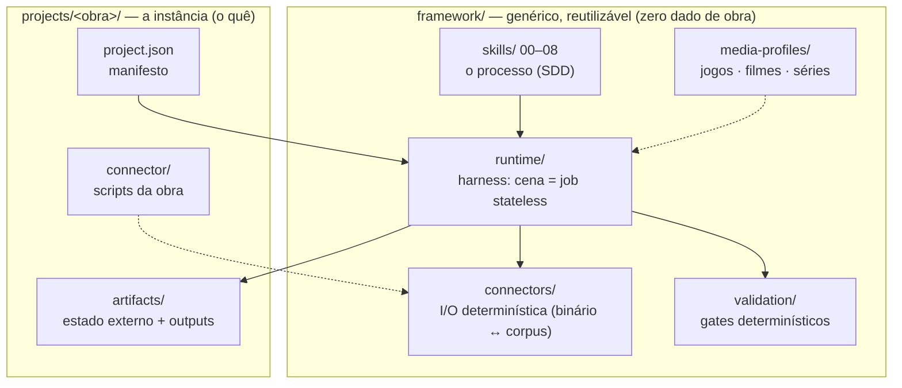
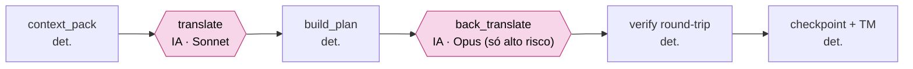

# Arquitetura — Translation-Cognition Framework

Framework spec-driven (SDD) para localização baseada em cognição narrativa. Separa **entender →
estruturar → reger → planejar → executar → validar** para preservar identidade, tom e consistência
em obras longas (jogos, filmes, séries). Este documento descreve a arquitetura **alvo** e o estado atual.

## Princípio central

> A LLM faz **só** o que exige IA: **traduzir** e **verificar alto risco**. Todo o resto — estado,
> memória, governança, checkpoints, métricas, controle de fluxo, montagem de contexto — é
> **determinístico e externo** à janela do modelo.

A regra existe por uma razão medida: o que estourava a sessão **não** era a tradução nem a governança,
e sim o **modo de execução** — a tradução cognitiva sendo feita inline, turno-a-turno, numa sessão de
vida-longa que acumulava todo o histórico (ver `adr/0002-stateless-scene-jobs.md`).

## As 3 camadas (genéricas) + a instância

```
framework/skills/          ← O PROCESSO (como). Genérico. Nunca contém dados de obra.
framework/media-profiles/  ← A CATEGORIA (jogos/filmes/séries). Formato, tokens, timing.
framework/connectors/      ← A I/O (código det.). Extração/reinserção meio↔corpus.
framework/runtime/         ← O HARNESS (orquestração det. + interface de modelo).  [NOVO]
framework/validation/      ← OS GATES (código det.). Schemas, naturalidade, custo.
framework/docs/            ← ARQUITETURA + ADRs + ROADMAP.                          [NOVO]
        +
projects/<título>/         ← A INSTÂNCIA (o quê). Manifesto + perfil + artefatos + conector do título.
```



## O alvo: "uma cena = um job stateless e limitado"

Cada cena é um **job resumível** cujo contexto é **O(cena)**, não O(histórico). O orquestrador
determinístico (`framework/runtime/run_scene.py`) encadeia:

```
run_scene(cena)
  1. context_pack  → pacote LIMITADO (doutrina cacheável + glossário-subset + voice cards dos
                     falantes + decisões relevantes + hits de TM + linhas+budgets) → scene_prompt.md
  2. translate ............................► [IA: Sonnet]   (única parte não-determinística)
  3. build_plan_chapter (valida cobertura/tokens/risk_notes) → approved_<scene_id>.csv
  4. high? back_translate .................► [IA: Opus]     (verificação de alto risco)
  5. verify_chapter (round-trip byte-idêntico + ponteiros within-file)
  6. checkpoint (run_state.json) + state_index (TM cresce)
```



> As **duas únicas** caixas de IA (rosa) são `translate` e `back_translate`. Todo o resto é
> determinístico — é o que torna o custo previsível e os **gates** reprodutíveis.
>
> **Reprodutível com asterisco (H4 — seja preciso):** a **tradução em si** (saída do LLM) é
> **estocástica** — re-rodar uma cena NÃO produz os mesmos bytes de tradução. O que é determinístico/
> reproduzível é **a orquestração + os gates**: dado um `translations_*.json` fixo, `context_pack`
> (`pack.json` byte-idêntico), `build_plan`, `verify` (round-trip byte-idêntico) e a reinserção rodam
> igual toda vez. Em outras palavras: **o veredito é reproduzível; a geração não.** É por isso que o
> `translations_*.json` é trackeado no git (o artefato caro/estocástico) e o `pack.json` é regenerável
> (determinístico). Não confundir "pipeline determinístico" com "tradução determinística".

**Estado externo consultável** (não na janela): `glossary.csv`, `state/translation_memory.jsonl`,
`state/voice_cards.json`, `state/decision_index.json`, `translation_status.json`, `run_state.json`.

## Determinismo vs IA (mapa)

| Responsabilidade | Veredito | Onde |
|---|---|---|
| Parser / extração / reinserção | Determinístico | `connector/` |
| Orquestração / controle de fluxo | Determinístico | `runtime/run_scene.py` |
| Montagem de contexto | Determinístico | `runtime/context_pack.py` |
| Memória / consistência (TM, vozes, decisões) | Determinístico | `runtime/state_index.py` |
| Checkpoints | Determinístico | `run_state.json` |
| Validação (schemas/tokens/naturalidade/custo) | Determinístico | `validation/` |
| **Tradução** | **IA** | `runtime/model.py` |
| **Back-translation (alto risco)** | **IA** | `runtime/model.py` |

A única fronteira não-determinística é `model.py` — por isso ela é fina e isolada. Ver
`MODEL_INTERFACE.md`.

## Por que isto escala e roda em Sonnet

- **Contexto constante por execução** → a janela não cresce com o nº de capítulos (mata o estouro).
- **Doutrina cacheável (~4K tok)** cobrada ~1× via prompt-caching, não a cada cena.
- **Consistência vem do store** (TM/glossário/voice cards), não da memória do chat.
- **Model-mix**: Sonnet traduz, Opus só verifica alto risco (ver `validation/cost_model.py`).

Resultado: Sonnet passa a ser o default de tradução com contexto pequeno e curado. Ver
`adr/0004-model-agnostic-interface.md` e a seção *Sonnet Readiness* do `ROADMAP.md`.

## Estado atual (junho 2026) — a arquitetura alvo está EM PRODUÇÃO

O harness deixou de ser projeto e virou o caminho de produção: **caps 11, 12 e 13 traduzidos e
verificados ponta-a-ponta** (round-trip byte-idêntico + back-translation de alto risco), o cap.12 com
**16/16 cenas** e o cap.13 com **9/9 via Batch API**. O que foi comprovado vivo, além do alvo acima:

- **Estouro de sessão morto:** o contexto por execução é O(cena); a sessão de chat só lança o driver
  (`run_chapter.py`) e lê o resumo — footprint constante, independente do nº de capítulos.
- **Custo medido e controlado:** Sonnet aprovado por benchmark (nível Opus-à-mão em comédia/registro);
  **~$36/jogo** no setting econômico. Alavancas codadas: Batch API **−50%** (comprovado), **tiering** por
  complexidade (Haiku nas linhas simples, Sonnet nas multi-linha), **dedup por TM**, **escalonamento
  cirúrgico** de fitting (re-traduz só a linha que estoura o budget), e **back-translation em batch**.
- **Telemetria de gasto-verdade:** `api_ledger.jsonl` registra TODA chamada cobrada (inclusive as que
  falham depois) → `cost_report.py` agrega; nenhum gasto fica invisível.
- **Cognição cabeada no runtime:** **gate de KB** (`kb_gate.py`, pesquisa reconciliada + fronteira) e
  **driver de Fase 0** (`kb_phase.py`, descobre o gap de lore por capítulo); **controle de spoiler** por
  ledger + filtro temporal (comprovado no reveal Ukon=Oshtor em `ch_13_08`).
- **Travas de qualidade:** 42 testes no runtime + 16 no conector; determinismo, idempotência e um guard
  que barra texto da obra hardcoded em `.py`. Convenção de nomes em `NAMING.md`.

## Documentos relacionados

- `STATE_MANAGEMENT.md` — conhecimento permanente vs temporário; substrato de estado.
- `MODEL_INTERFACE.md` — contrato `translate`/`back_translate`; caminhos assinatura vs API.
- `TRANSLATION_PIPELINE.md` — o fluxo de 1 cena ponta-a-ponta; checkpoint/resume.
- `OBSERVABILITY.md` — métricas a coletar.
- `ROADMAP.md` — backlog priorizado (P0–P3) + fases.
- `adr/` — decisões arquiteturais registradas.
