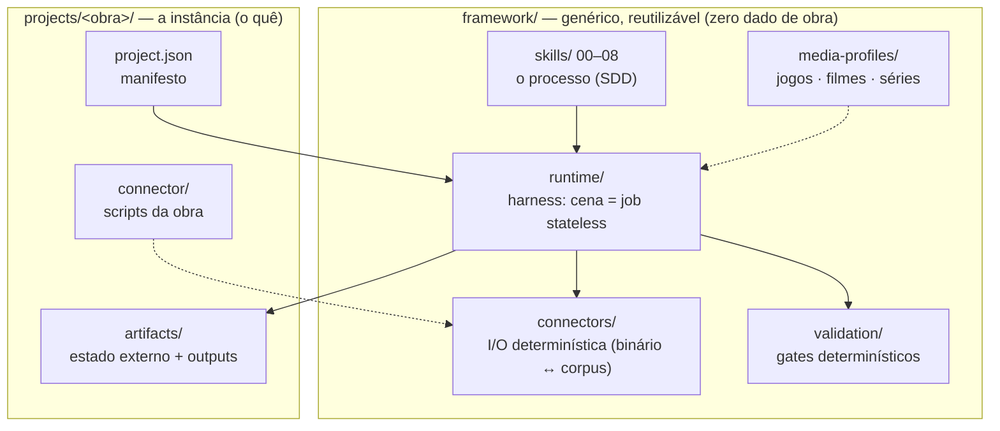
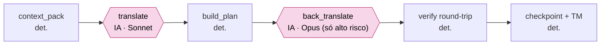

# Arquitetura — Translation-Cognition Framework

Framework spec-driven (SDD) para localização baseada em cognição narrativa. Separa **entender →
estruturar → reger → planejar → executar → validar** para preservar identidade, tom e consistência
em obras longas (jogos, filmes, séries). Este documento descreve a arquitetura **alvo** e o estado atual.

## Princípio central

> A LLM faz **só** o que exige IA: **traduzir** e **verificar alto risco**. Todo o resto — estado,
> memória, governança, checkpoints, métricas, controle de fluxo, montagem de contexto — é
> **determinístico e externo** à janela do modelo.

A regra existe por uma razão medida: o que estourava a sessão **não** era a tradução nem a governança,
e sim o **modo de execução** — a tradução cognitiva sendo feita inline, turno-a-turno, numa sessão de
vida-longa que acumulava todo o histórico (ver `adr/0002-stateless-scene-jobs.md`).

## Organização do framework (genérico) + a instância

> **Eixo diferente das 4 camadas.** Isto é a **organização do código** (genérico reutilizável vs.
> instância da obra) — não confundir com as **4 camadas conceituais** de responsabilidade (Cognition /
> State / Execution / Validation), descritas no [README raiz](../../README.md#a-arquitetura-em-4-camadas).
> Uma pasta pode implementar mais de uma camada (ex.: `runtime/` cobre State + Execution + Cognition).

```
framework/skills/          ← O PROCESSO (como). Genérico. Nunca contém dados de obra.
framework/media-profiles/  ← A CATEGORIA (jogos/filmes/séries). Formato, tokens, timing.
framework/connectors/      ← A I/O (código det.). Extração/reinserção meio↔corpus.
framework/runtime/         ← O HARNESS (orquestração det. + interface de modelo).  [NOVO]
framework/validation/      ← OS GATES (código det.). Schemas, naturalidade, custo.
framework/docs/            ← ARQUITETURA + ADRs + ROADMAP.                          [NOVO]
        +
projects/<título>/         ← A INSTÂNCIA (o quê). Manifesto + perfil + artefatos + conector do título.
```


```mermaid
flowchart TB
  subgraph framework["framework/ — genérico, reutilizável (zero dado de obra)"]
    direction TB
    skills["skills/ 00–08<br/>o processo (SDD)"]
    runtime["runtime/<br/>harness: cena = job stateless"]
    connectors["connectors/<br/>I/O determinística (binário ↔ corpus)"]
    validation["validation/<br/>gates determinísticos"]
    profiles["media-profiles/<br/>jogos · filmes · séries"]
  end
  subgraph project["projects/&lt;obra&gt;/ — a instância (o quê)"]
    direction TB
    manifest["project.json<br/>manifesto"]
    artifacts["artifacts/<br/>estado externo + outputs"]
    pconn["connector/<br/>scripts da obra"]
  end
  skills --> runtime
  profiles -.-> runtime
  runtime --> connectors
  runtime --> validation
  manifest --> runtime
  runtime --> artifacts
  pconn -.-> connectors
```

## O alvo: "uma cena = um job stateless e limitado"

Cada cena é um **job resumível** cujo contexto é **O(cena)**, não O(histórico). O orquestrador
determinístico (`framework/runtime/run_scene.py`) encadeia:

```
run_scene(cena)
  1. context_pack  → pacote LIMITADO (doutrina cacheável + glossário-subset + voice cards dos
                     falantes + decisões relevantes + hits de TM + linhas+budgets) → scene_prompt.md
  2. translate ............................► [IA: Sonnet]   (única parte não-determinística)
  3. build_plan_chapter (valida cobertura/tokens/risk_notes) → approved_<scene_id>.csv
  4. high? back_translate .................► [IA: Opus]     (verificação de alto risco)
  5. verify_chapter (round-trip byte-idêntico + ponteiros within-file)
  6. checkpoint (run_state.json) + state_index (TM cresce)
```


```mermaid
flowchart LR
  pack["context_pack<br/>det."] --> tr{{"translate<br/>IA · Sonnet"}}
  tr --> plan["build_plan<br/>det."]
  plan --> bt{{"back_translate<br/>IA · Opus (só alto risco)"}}
  bt --> vf["verify round-trip<br/>det."]
  vf --> cp["checkpoint + TM<br/>det."]
  classDef ia fill:#f6d6e8,stroke:#c0397b,color:#000;
  class tr,bt ia;
```

> As **duas únicas** caixas de IA (rosa) são `translate` e `back_translate`. Todo o resto é
> determinístico — é o que torna o custo previsível e os **gates** reprodutíveis.
>
> **Reprodutível com asterisco (seja preciso):** a **tradução em si** (saída do LLM) é
> **estocástica** — re-rodar uma cena NÃO produz os mesmos bytes de tradução. O que é determinístico/
> reproduzível é **a orquestração + os gates**: dado um `translations_*.json` fixo, `context_pack`
> (`pack.json` byte-idêntico), `build_plan`, `verify` (round-trip byte-idêntico) e a reinserção rodam
> igual toda vez. Em outras palavras: **o veredito é reproduzível; a geração não.** É por isso que o
> `translations_*.json` é trackeado no git (o artefato caro/estocástico) e o `pack.json` é regenerável
> (determinístico). Não confundir "pipeline determinístico" com "tradução determinística".

**Estado externo consultável** (não na janela): `glossary.csv`, `state/translation_memory.jsonl`,
`state/voice_cards.json`, `state/decision_index.json`, `translation_status.json`, `run_state.json`.

## Determinismo vs IA (mapa)

| Responsabilidade | Veredito | Onde |
|---|---|---|
| Parser / extração / reinserção | Determinístico | `connector/` |
| Orquestração / controle de fluxo | Determinístico | `runtime/run_scene.py` |
| Interface do conector (subprocess, hash, stale) | Determinístico | `runtime/connector_mgr.py` |
| Montagem de contexto | Determinístico | `runtime/context_pack.py` |
| Memória / consistência (TM, vozes, decisões) | Determinístico | `runtime/state_index.py` |
| Checkpoints | Determinístico | `run_state.json` |
| Validação (gates de qualidade/custo/kb) | Determinístico | `runtime/` (`quality_gate.py`, `kb_gate.py`, `kb_review.py`) |
| Constantes, TypedDicts de contrato | Determinístico | `runtime/config.py` |
| Preços, ledger de gasto | Determinístico | `runtime/cost.py` |
| Cliente HTTP / retry / batch | Determinístico | `runtime/llm_client.py` |
| **Tradução** | **IA** | `runtime/model.py` |
| **Back-translation (alto risco)** | **IA** | `runtime/back_translate.py` |

A única fronteira não-determinística é `model.py` + `back_translate.py` — por isso são finas e
isoladas. Ver `MODEL_INTERFACE.md`.

> **Estrutura pós-refatoração (jun/2026):** `model.py` era um god-module. Extraído para módulos
> folha sem deps circulares: `config.py` (constantes + TypedDicts) ← `cost.py` (ledger) ←
> `llm_client.py` (HTTP) ← `back_translate.py` (back-translation) ← `model.py` (translate +
> re-export). O `model` importa e re-exporta os nomes públicos de cada submódulo para
> compatibilidade com call-sites existentes.

## Por que isto escala e roda em Sonnet

- **Contexto constante por execução** → a janela não cresce com o nº de capítulos (mata o estouro).
- **Doutrina cacheável (~4K tok)** cobrada ~1× via prompt-caching, não a cada cena.
- **Consistência vem do store** (TM/glossário/voice cards), não da memória do chat.
- **Model-mix**: Sonnet traduz, Opus só verifica alto risco (ver `validation/cost_model.py`).

Resultado: Sonnet passa a ser o default de tradução com contexto pequeno e curado. Ver
`adr/0004-model-agnostic-interface.md` e a seção *Sonnet Readiness* do `ROADMAP.md`.

## Estado atual (junho 2026) — OBRA DE REFERÊNCIA COMPLETA

O harness deixou de ser projeto e entregou uma obra inteira: **os 16 capítulos do jogo (11–23 + 30, 31,
39) traduzidos e verificados ponta-a-ponta** (round-trip byte-idêntico, resíduo 0, + back-translation de
alto risco) — **146 cenas, ~45.100 linhas**, em capítulos inteiros **via Batch API**. O que foi
comprovado vivo, além do alvo acima:

- **Estouro de sessão morto:** o contexto por execução é O(cena); a sessão de chat só lança o driver
  (`run_chapter.py`) e lê o resumo — footprint constante, independente do nº de capítulos.
- **Custo medido e controlado:** Sonnet aprovado por benchmark (nível Opus-à-mão em comédia/registro);
  gasto real acumulado **~R$ 65,9** (Sonnet R$ 50,6 · Opus R$ 7,8 · Haiku R$ 7,5), **R$ 0 desperdiçado**.
  Alavancas codadas: Batch API **−50%**, **tiering** por complexidade (Haiku simples, Sonnet multi-linha,
  Opus só back-translation), **dedup por TM**, **back-translation em batch**.
- **Custo PREVISÍVEL (a engenharia que fecha o caso p/ orçamento baixo):**
  - **Recuperação por-linha** — quando o `verify` reprova por cobertura/paridade/budget, o re-translate
    manda **só as linhas quebradas** (não a cena inteira). O gatilho é variância do LLM (aleatória); a
    recuperação por-cena transformava isso em custo aleatório. Agora o custo de retry é ∝ linhas com
    defeito. Vale no interativo (`model._api_translate`), no batch (rodada >0 re-batcha só `missing|bad_par`)
    e no fitting (`retranslate_offsets`).
  - **Estimativa pré-voo + teto duro** — `run_chapter` imprime o custo esperado (linhas × faixa medida)
    ANTES de gastar e **só compromete ao batch as cenas cujo custo pessimista cabe no `--max-usd`**
    (`_fit_budget`), adiando o resto (resumível). O gasto de pior-caso é **conhecido e ≤ teto**.
- **Telemetria de gasto-verdade:** `api_ledger.jsonl` registra TODA chamada cobrada (inclusive as que
  falham depois) → `cost_report.py` agrega; nenhum gasto fica invisível. Permite auditar *onde* o
  dinheiro vai (1º passe vs re-tradução vs back) — foi assim que a re-tradução caiu de 58% p/ ~4%.
- **Cognição cabeada no runtime:** **gate de fonte de KB** (`kb_review.py` + `kb_phase.py` — entidade
  nova sem fonte declarada BLOQUEIA; `--strict` exige ratificação humana em `kb_ratified.csv`);
  **controle de spoiler/gênero** por ledger + filtro temporal (comprovado no reveal Ukon=Oshtor em
  `ch_13_08`).
- **Conector robusto:** transliteração **NFD** (canônica) dobra acento (á→a) mas **preserva glifos de
  compatibilidade do charset do jogo** (dígitos circulados ①②③ de sequências de puzzle — NFKD os
  corrompia); encaixe **in_place + relocação intra-arquivo**; round-trip byte-idêntico é o oráculo.
- **Humano no loop:** revisão única por **XLSX amigável** (`quality_review.py`); aplicação verbatim ($0)
  ou nota cirúrgica; **TM como coração** — o jogo não é re-traduzido inteiro após o QA.
- **Travas de qualidade:** **161 testes** (116 runtime + 29 validação + 16 conector); determinismo,
  idempotência e um guard que barra texto da obra hardcoded em `.py`. Convenção de nomes em `NAMING.md`.

## Documentos relacionados

- `GOVERNANCE.md` — quem propõe, quem aprova, quem aplica; gates, fonte de KB e loop humano/TM (com desenhos).
- `SECURITY.md` — modelo de ameaças (API key, path traversal, conector, binário, supply chain) + resposta a incidentes.
- `STATE_MANAGEMENT.md` — conhecimento permanente vs temporário; substrato de estado.
- `MODEL_INTERFACE.md` — contrato `translate`/`back_translate`; caminhos assinatura vs API.
- `TRANSLATION_PIPELINE.md` — o fluxo de 1 cena ponta-a-ponta; checkpoint/resume.
- `OBSERVABILITY.md` — métricas a coletar.
- `ROADMAP.md` — backlog priorizado (P0–P3) + fases.
- `adr/` — decisões arquiteturais registradas.
