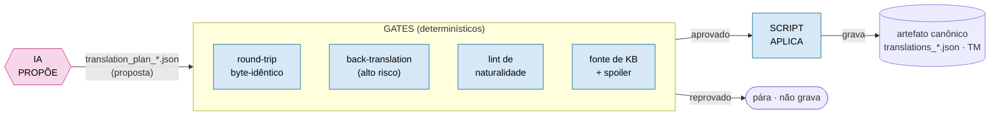
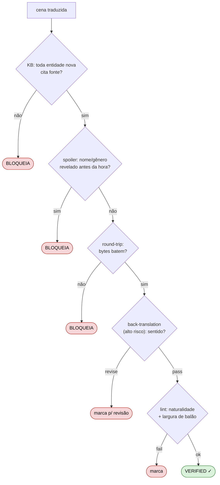
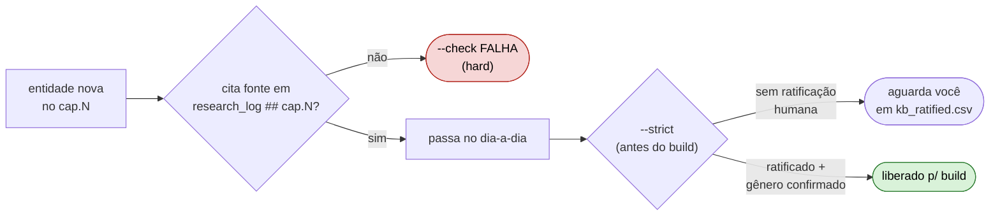
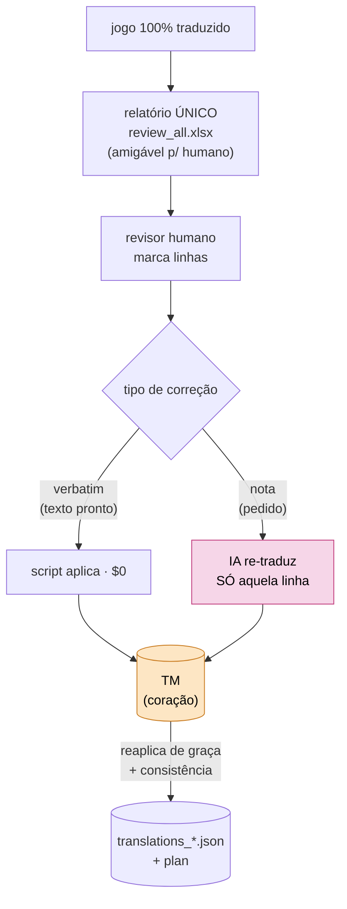

# Governança — Translation-Cognition Framework

> **Em 30 segundos.** Neste framework a IA **nunca tem a palavra final**. Ela só **propõe**;
> **gates determinísticos** (round-trip, back-translation, lint, fonte de KB) **aprovam**; e um
> **script** é quem **aplica** no dado. O binário do jogo é **read-only**, nenhuma tradução é digitada
> à mão dentro dos dados, e **cada centavo cobrado pela API é registrado** — mesmo quando a chamada
> falha. Este documento mostra, com desenhos, *quem decide o quê*.

Os outros dois pilares têm casa própria:
- **Arquitetura** (as camadas, o "porquê" medido) → [`ARCHITECTURE.md`](ARCHITECTURE.md)
- **Engenharia** (a fronteira IA↔determinístico, os módulos, alavancas de custo) → [`ARCHITECTURE.md`](ARCHITECTURE.md) + [`../runtime/README.md`](../runtime/README.md)
- **Governança** (este doc) → *quem propõe, quem aprova, quem aplica, e o que é imutável*

---

## 1. O laço de ouro: IA **propõe** → gate **aprova** → script **aplica**

A regra que vale para **toda** mutação de dado no projeto. A IA escreve numa **proposta**
(`translation_plan_*.json`), um **gate** decide se passa, e só então um **script determinístico**
grava no artefato canônico. Se o gate reprova, o dado não se move.



**Por que isto importa:** a parte estocástica (a IA) fica **cercada**. O veredito é sempre de uma
peça determinística e reproduzível — então um erro da IA não vira um dado ruim silenciosamente; ele
esbarra num gate. Ver o "reproduzível com asterisco" em [`ARCHITECTURE.md`](ARCHITECTURE.md).

---

## 2. As 4 invariantes (o que **nunca** pode acontecer)

| # | Invariante | Como é forçada |
|---|---|---|
| **I1** | **Binário read-only.** O `.sdat` do jogo nunca é editado à mão. | Conector só **lê** o binário; a saída é um arquivo **novo** + patch `.ips`. Round-trip byte-idêntico é gate de regressão (`connector/test_roundtrip.py`). |
| **I2** | **Sem work-text em `.py`.** Nenhuma frase da obra hardcoded em código. | Teste data-driven varre os `.py` e **falha** se achar texto da obra. Scripts leem dos artefatos. |
| **I3** | **A IA não grava no canônico.** Ela propõe; o script aplica. | `translation_plan_*.json` (proposta) ≠ `translations_*.json` (canônico). `tm_correct.py`/`quality_review.py` aplicam; a IA não. |
| **I4** | **Todo gasto é visível.** Nenhuma cobrança fica invisível. | `api_ledger.jsonl` registra **toda** chamada cobrada (inclusive as que falham depois) → `cost_report.py` agrega. |

---

## 3. A pilha de gates (o que cada um garante)

Cada cena atravessa uma pilha de verificações antes de virar "verified". Um gate vermelho **trava** a cena.



| Gate | Pergunta | Onde |
|---|---|---|
| **KB / fonte** | Toda entidade nova (`(cap.N)`) cita fonte no `research_log.md`? | `kb_review.py --gate` · `kb_phase.py --check` |
| **Spoiler** | Nome ou gênero revelado aparece antes do `reveal_timing`? | `spoiler_check.py` (`check` + `check_gender`) |
| **Round-trip** | Extrair→reinserir regenera os bytes? (oráculo de correção) | `connector/verify_chapter.py` · `test_roundtrip.py` |
| **Back-translation** | A linha de alto risco preserva o sentido? | `model.back_translate` (Opus) → `quality_gate.py` |
| **Lint** | pt-BR natural? cabe no balão? | `naturalness_lint.py` · `quality_review` (largura) |

> **O round-trip prova bytes, não qualidade.** Ele garante que a tradução **reentra** no jogo sem
> corromper o arquivo — não que ela está *boa*. A qualidade vem dos outros gates + da revisão humana (§5).

---

## 4. Fonte obrigatória: a IA não se auto-aprova na lore

O elo mais fácil de corromper numa pipeline de tradução é a **base de conhecimento**: se a IA pesquisa
*e* ratifica a própria pesquisa, ela pode "inventar" um fato com confiança. O gate de KB corta isso com
uma **âncora externa**.



- **Fonte (hard):** sem citação no `research_log.md`, `kb_phase --check` reprova. Toda decisão de lore
  fica rastreável a uma fonte (wiki/corpus autorizados).
- **Ratificação humana (`--strict`):** antes do build, exige que **você** marque a entidade em
  `kb_ratified.csv` (só o humano edita) com gênero confirmado. É o seu "segundo par de olhos" real.
- **Gênero:** marcado como spoiler (`gender_quarantine`) **só com fonte confiável** — nunca fabricado.

---

## 5. O humano no centro: revisão única, TM como **coração**

Princípio operacional (decisão travada do dono do projeto):

> **O jogo é processado pela IA UMA vez.** Depois do QA, as correções do revisor humano são aplicadas
> **cirurgicamente** — o jogo **nunca** é re-traduzido inteiro. *"Não vou pagar o processamento do jogo
> todo após o QA, me recuso."*

A peça que torna isso possível é a **Translation Memory (TM)**: ela é o coração que guarda cada decisão
e a reaplica de graça, para que a correção de uma linha custe **uma linha**, não um capítulo.



- **Um relatório, não CSV cru.** `quality_review.py` gera um **XLSX amigável** (aba "Leia-me" +
  "Revisão" com filtro, cores por severidade, colunas de input destacadas) — o revisor não precisa "se
  achar". Flags determinísticas pré-marcam o que merece olhar (alto risco, idêntico à fonte, largura de
  balão, suspeita de pt-PT…).
- **Aplicação barata:** `verbatim` (o revisor já escreveu o texto) custa **$0**; `nota` (o revisor
  descreve o que quer) dispara a IA **só naquela linha**.
- **TM = consistência + reuso.** Reconstruída por `state_index` a partir das `base_translations`, ela
  garante que o mesmo termo seja traduzido igual em todo lugar e que nada precise ser refeito.

---

## 6. Custo é governado, não estimado por fé

```mermaid
flowchart LR
  call["chamada de API"] -->|"sempre"| ledger[("api_ledger.jsonl<br/>(verdade do gasto)")]
  ledger --> report["cost_report.py<br/>(por modelo/tipo/cena)"]
  cap["--max-usd N"] -.->|"teto: pára<br/>e reporta o que sobra"| call
  classDef det fill:#d6e8f6,stroke:#1f6f9b,color:#000;
  class ledger,report,cap det;
```

- **Ledger de gasto-verdade:** toda chamada vai pro `api_ledger.jsonl` **antes** de qualquer merge —
  inclusive as que depois falham. `cost_report.py` agrega; **gasto desperdiçado é medido**, não escondido.
- **Teto uniforme (`--max-usd`):** os drivers caros (`run_chapter`, `quality_fix`, `quality_review`)
  aceitam um teto; ao atingi-lo, **param e reportam** quantas cenas/linhas sobraram. Sem surpresa na fatura.
- **Alavancas:** Batch API −50%, tiering (Haiku linha simples / Sonnet multi-linha / Opus só
  back-translation), dedup por TM, escalonamento cirúrgico de fitting.

---

## 7. Onde cada regra vive (mapa rápido)

| Quero entender… | Vá para |
|---|---|
| O laço propõe→aprova→aplica na prática | `runtime/run_scene.py`, `tm_correct.py`, `quality_review.py` |
| O round-trip (oráculo de bytes) | `projects/<obra>/connector/verify_chapter.py`, `test_roundtrip.py` |
| O gate de fonte de KB | `runtime/kb_review.py`, `runtime/kb_phase.py`, `artifacts/kb_ratified.csv` |
| Controle de spoiler/gênero | `runtime/spoiler_check.py`, `artifacts/spoiler_ledger.json` |
| O relatório humano + aplicação | `runtime/quality_review.py`, `runtime/quality_gate.py` |
| A verdade do gasto | `artifacts/api_ledger.jsonl`, `runtime/cost_report.py` |
| As decisões arquiteturais (ADRs) | [`adr/`](adr/) |

> **Resumindo a filosofia:** determinístico por padrão, IA só onde exige IA, humano com a palavra final,
> e nada se move sem deixar rastro. É isso que faz um projeto de tradução de ~33 mil linhas ser
> auditável por uma pessoa só.
