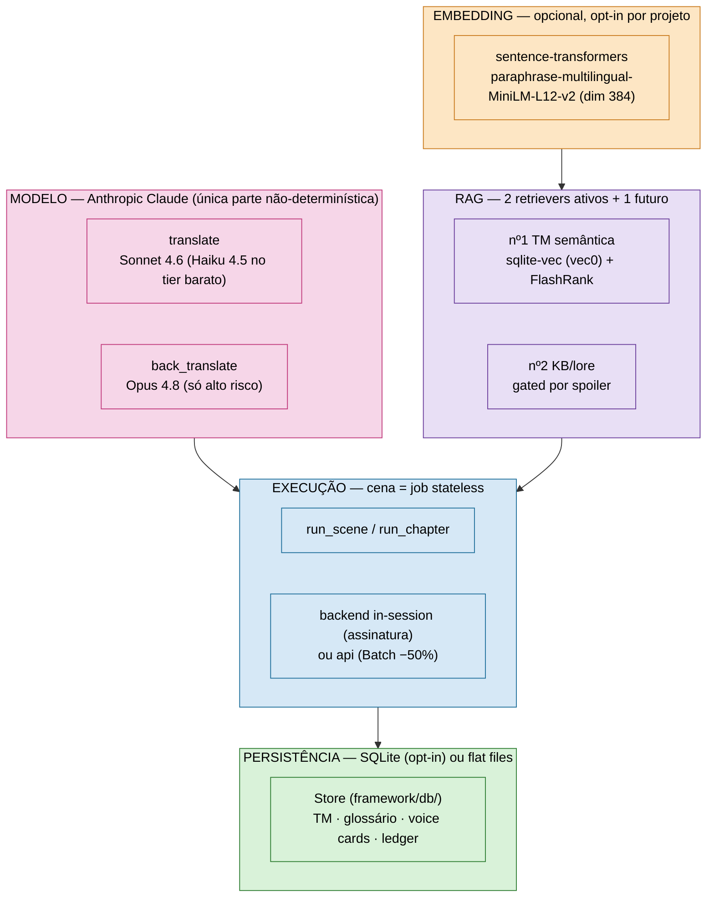

# Stack técnica — modelo, embedding, RAG, execução

Visão consolidada da tecnologia por trás do harness: qual LLM roda onde, qual stack de embedding
alimenta a busca semântica, onde entra RAG e como a execução escala. Cada seção linka pro doc
profundo correspondente — este arquivo é o mapa, não o detalhe.



---

## Modelo (LLM)

**Anthropic Claude**, via SDK oficial (`anthropic`), com tiering por complexidade de linha — trocar
modelo é trocar uma string em `framework/runtime/config.py`, nada mais no harness sabe qual modelo rodou:

| Papel | Modelo | Constante | Quando |
|---|---|---|---|
| Tradução (padrão) | `claude-sonnet-4-6` | `MODEL_TRANSLATE` | maioria das linhas; contexto curado dispensa Opus |
| Tradução (tier barato) | `claude-haiku-4-5` | `MODEL_TRANSLATE_CHEAP` | só linhas single-line no caminho batch (−67%/linha) |
| Verificação | `claude-opus-4-8` | `MODEL_BACK` | back-translation, só linhas `risk >= high` |

**Duas chamadas de IA, e só estas** (`translate`, `back_translate`) — o resto do harness é
determinístico. Dois backends por trás do mesmo contrato: `in-session` (assinatura, sem chamada de
rede, contexto O(cena)) e `api` (SDK Anthropic — streaming, prompt-caching da doutrina, Batch API
−50%, backoff exponencial em 429/500/timeout). `effort:low` sem thinking na tradução (thinking
custaria ~5× — medido); back-translation mantém thinking (raciocínio importa em ambiguidade).

Detalhe do contrato, backends e benchmarks reais → [`MODEL_INTERFACE.md`](MODEL_INTERFACE.md).
Plumbing HTTP/streaming/backoff → `framework/runtime/llm_client.py`.

---

## Embedding

**Opcional e opt-in** — não entra na CI nem é exigido pelo runtime determinístico (sem a stack, o
retriever semântico cai para `[]`, testado). Stack (`requirements-ml.txt`):

- **`sentence-transformers`** — modelo `paraphrase-multilingual-MiniLM-L12-v2`, vetores de
  dimensão **384**, normalizados (`normalize_embeddings=True`) para o cosseno virar `1 - L2²/2`.
- **Hardware**: CPU por padrão; roda em GPU automaticamente se torch+ROCm detectado (alvo:
  AMD RX 6650 XT). No Windows fica CPU (ok para corpus de milhares de linhas, poucos minutos).
- **Onde mora**: `framework/db/embedder.py` (`Embedder.encode`/`index_project`/`search`).
- **Como ligar**: `pip install -r requirements-ml.txt` (pesado: ~700 MB–1,5 GB, puxa torch) e
  `python framework/cli.py db index <projeto>.db <project_id>`.

---

## RAG (recuperação semântica)

O `context_pack` já é retrieval-augmented por natureza — a recuperação **padrão é léxica** (match
exato de TM, glossário por termo, voice card por nome de falante). RAG **semântico** entra só como
**suplemento rotulado e bounded** em cima disso, nunca substituindo o núcleo determinístico
(o `context_pack` roda 2× → tem que sair byte-idêntico).

| RAG | Onde | Mecanismo | Status |
|---|---|---|---|
| **nº1 — TM semântica** | `embedder.search()` → seção "falas SIMILARES (adapte)" no pacote | `sqlite-vec` (tabela virtual `vec0`) para o índice vetorial dentro do próprio SQLite do projeto + reranker **FlashRank** (`ms-marco-MiniLM-L-12-v2`, opcional) | ✅ **validado** — `projects/translation_software/translation_software.db` tem **6.046 vetores** indexados (corpus do BoF4); busca exata→score 1.0, variação→0.944 |
| **nº2 — KB/lore** | retrieval semântico sobre a Knowledge Base | mesma infra `sqlite-vec`, **gated pela trava temporal de spoiler** (default-deny por reveal-por-seção) | ✅ ligado |
| **nº3 — cross-game/franquia** | corpus compartilhado por série, retrieval por cena | reusa a mesma infra | 🔮 futuro (multi-game) |

**Onde RAG deliberadamente NÃO entra** (decidido, não esquecido): glossário (match léxico é
preciso; semântico traria falso-positivo), voice cards (identidade por nome, não similaridade),
núcleo do pacote (match exato/contagens/hashes — determinismo é inegociável ali).

Vetores são **pré-computados** (build do pacote só consulta, não reinfere) e o **modelo é pinado**
(`tm_embeddings.model_name` grava o nome; trocar modelo = reindex explícito). Detalhe de fases e
decisões de design → [`DB_MIGRATION_ROADMAP.md`](DB_MIGRATION_ROADMAP.md).

---

## Execução

Cada cena roda como **job stateless e limitado** — contexto O(cena), não O(histórico):

```
run_scene(cena): context_pack → translate[IA] → build_plan → back_translate[IA, só alto risco]
                 → verify (round-trip) → checkpoint + state_index
```

- **`run_scene.py`** — orquestrador de 1 cena; **`run_chapter.py`** — driver de capítulo, loop
  resumível, `--max-usd` como teto duro de gasto (estimativa pré-voo antes de comprometer).
- **Escala**: Batch API (−50%, paralelo pela Anthropic, ~1h/corpus) é o default para >5 cenas;
  `--backend api` (tempo real) fica só para piloto/debug individual.
- **Checkpoints**: `run_state.json` por cena — cair na cena 40 não perde as 39 anteriores.
- **Custo auditável**: `api_ledger.jsonl` registra toda chamada cobrada (inclusive falhas);
  recuperação por-linha (não por-cena) mantém o retry ∝ linhas quebradas.

Detalhe medido (custo, recuperação por-linha, benchmarks) → [`ARCHITECTURE.md`](ARCHITECTURE.md)
e [`TRANSLATION_PIPELINE.md`](TRANSLATION_PIPELINE.md).

---

## Persistência

Dois modos, **gated por projeto** (`project.json` com `db` populado → SQLite; senão, flat files):

- **SQLite** (`framework/db/store.py`, classe `Store`) — WAL + thread-safe, schema único
  (`projects`, `scenes`, `translations`, `scene_lines`, `kb`, `glossary`, `entities`,
  `voice_cards`, `decisions`, `spoiler_entries`, `jobs`, `metrics`, `warnings`,
  `qa_effectiveness`). É o modo que habilita RAG (o vetor precisa de um lugar pra morar).
- **Flat files** (legado) — `translation_memory.jsonl`, `glossary.csv`, `state/*.json`. BoF4 e
  Utawarerumono seguem flat; `translation_software` é o único projeto com `db` ligado hoje.
- **Ponte**: `migrate_from_flat.py` / `export_to_flat.py` — paridade DB==flat é o oráculo; o
  write-path usa um hook único gated em `state_index.build()` (não upsert espalhado).

Detalhe → [`STATE_MANAGEMENT.md`](STATE_MANAGEMENT.md).

---

## Onde cada projeto está hoje

| Projeto | DB/RAG | Modelo | Execução |
|---|---|---|---|
| `utawarerumono` | flat files | Sonnet/Opus (API) | concluído — 16 capítulos, Batch API |
| `breath_of_fire_4` | flat files (corpus migrado *para dentro* de `translation_software`) | Haiku/Sonnet/Opus | concluído — 125 cenas |
| `souldiers` | flat files | Haiku/Sonnet/Opus (Batch API) | concluído — 470 cenas, terceiro engine (Unity Addressables) |
| `translation_software` | **SQLite + RAG nº1/nº2 ativos** | — | referência de arquitetura DB, não um projeto de tradução em progresso |
| `translation_local` | — | — | **DESCONTINUADO** (ADR 0008) — POC de tier Ollama local p/ tradução, regressão de velocidade + erro de terminologia na validação |
