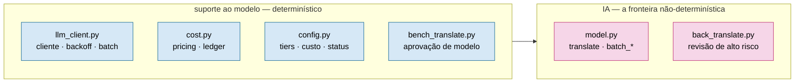

# framework/runtime — harness de execução (orquestração determinística + interface de modelo)

Torna **cada cena um job stateless e limitado**: o contexto por execução é O(cena), não O(histórico).
É a camada que tira a orquestração e a memória da janela da LLM. Ver `framework/docs/ARCHITECTURE.md`.

## Módulos

Agrupados por concern (a fronteira de IA é só `model.py` + `back_translate.py`):

**Orquestração & contexto (det.)**

| Arquivo | Função |
|---|---|
| `run_scene.py` | Orquestrador: encadeia `_pack_and_translate` → `_fitting_loop` → `_back_phase` → verify → checkpoint. Grava `connector_hash` (SHA1[:12] dos scripts) junto com `verified=True`. Resumível. |
| `run_chapter.py` | Driver de capítulo: loop de cenas via `run_scene`; modo `--batch` (−50%); resumível; `--max-usd`. |
| `context_pack.py` | Monta o pacote LIMITADO de 1 cena → `scene_prompt.md` + `pack.json`. A peça central. |
| `artifact_io.py` | Camada única de leitura de artefatos (scenes, plan_lines, translations_map, back_entries). |
| `paths.py` | Fonte única de caminhos de artefato. |

**Modelo — IA + suporte determinístico**

A fronteira não-determinística é **só** `model.py` + `back_translate.py` (as chamadas ao LLM). Todo o
resto deste grupo é plumbing **determinístico** em volta da IA:



| Arquivo | IA? | Função |
|---|---|---|
| `model.py` | 🩷 IA | `translate` / `batch_*`; backends `in-session` (assinatura) e `api` (model-mix); guard anti-blow-up. |
| `back_translate.py` | 🩷 IA | Back-translation de alto risco (Opus) + amostragem ~5% das low/medium; invalidação de stale. |
| `llm_client.py` | det. | Cliente + backoff/retry, await de batch, dotenv. |
| `config.py` | det. | Constantes de tier/modelo/custo/status (sem lógica). |
| `cost.py` | det. | Pricing real + `log_api_call` (escreve o ledger). |
| `bench_translate.py` | det. | Benchmark Sonnet vs Opus-à-mão (gate de aprovação de modelo). |

**Estado & memória (det.)**

| Arquivo | Função |
|---|---|
| `state_index.py` | Materializa `translation_memory.jsonl`, `voice_cards.json`, `decision_index.json`. Idempotente. |
| `tm_correct.py` | Find→replace governado em translations + plan (dado propõe, script aplica; dry-run/`--apply`). |

**Gates de cognição (det.)**

| Arquivo | Função |
|---|---|
| `kb_gate.py` | Cobertura de KB por cena (research reconciliada + `kb_frontier`) ANTES de traduzir. |
| `kb_phase.py` | Driver de Fase 0: descobre o gap de KB do capítulo; `--check` falha sem fonte; `--strict` exige ratificação. |
| `kb_review.py` | Digest + **gate de fonte** do delta de KB (`--gate`/`--strict`; lê `kb_ratified.csv`). |
| `spoiler_check.py` | `check` (nomes) + `check_gender` (gênero) — não vaza reveal antes do `reveal_timing`. |

**Qualidade & custo (det.)**

| Arquivo | Função |
|---|---|
| `quality_gate.py` | Cruza veredito de back-translation + cobertura; `--export` da worklist `revise`. |
| `quality_review.py` | Relatório humano **XLSX** amigável; aplica verbatim (R$ 0) ou nota cirúrgica; `--max-usd`. Persiste `qa_effectiveness.jsonl` (`total_marked` vs `applied`) a cada ciclo. |
| `quality_fix.py` | Re-traduz dirigido só os offsets `revise` da worklist; `--max-usd`. |
| `glossary_lint.py` | Consistência de glossário cross-capítulo: termo do EN sem a forma canônica no pt-BR → candidatos p/ revisão. |
| `cost_report.py` | Agrega `api_ledger.jsonl` (custo real por modelo/tipo/cena; gasto desperdiçado). |
| `batch_smoke.py` | Smoke vivo do contrato da Batch API antes de pagar um capítulo inteiro. |

**Testes**

| Arquivo | Função |
|---|---|
| `test_runtime.py` | 106 testes: determinismo, boundedness, idempotência, recuperação por-linha, teto/estimativa de custo, guard de no-work-text, contrato do conector (hash determinístico, sandbox, protocolo VERIFY_STATUS), round-trip de integração. |

> Mapa skill↔runtime (qual módulo executa cada etapa do SDD, quem produz/consome cada artefato):
> [`../SDD_RUNTIME.md`](../SDD_RUNTIME.md).

> Governança (quem propõe, quem aprova, quem aplica, o que é imutável) com desenhos:
> [`../docs/GOVERNANCE.md`](../docs/GOVERNANCE.md).

> Convenção de nomes (identificadores em inglês, glossário de abreviações aceitas — KB/TM/scene_id… — e o
> **contrato congelado** de nomes de artefato/CLI/`project.json`): ver [`../docs/NAMING.md`](../docs/NAMING.md).

## Uso

```bash
# 1) materializa o estado consultável (idempotente)
python framework/runtime/state_index.py projects/<projeto> --rebuild

# 2) monta o contexto limitado de uma cena (determinístico)
python framework/runtime/context_pack.py projects/<projeto> <cena>

# 3) roda a cena ponta-a-ponta (assinatura: para em 'awaiting' se faltar tradução)
python framework/runtime/run_scene.py projects/<projeto> <cena> [--backend in-session|api] [--require-back] [--no-verify]
```

`<cena>` = subdir em `artifacts/` (ex.: `ch_12_01`). Genérico: nenhum dado de obra aqui; tudo vem de
`project.json` + artefatos. Sem rede no caminho `in-session`. Sem work-text nos `.py` (travado por teste).
