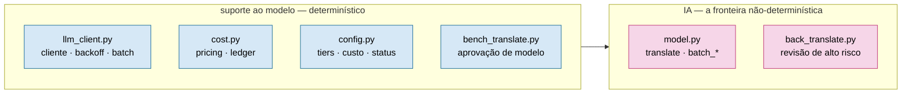

# framework/runtime — harness de execução (orquestração determinística + interface de modelo)

Torna **cada cena um job stateless e limitado**: o contexto por execução é O(cena), não O(histórico).
É a camada que tira a orquestração e a memória da janela da LLM. Ver `framework/docs/ARCHITECTURE.md`.

## Módulos

Agrupados por concern (a fronteira de IA é só `model.py` + `back_translate.py`):

**Orquestração & contexto (det.)**

| Arquivo | Função |
|---|---|
| `run_scene.py` | Orquestrador de 1 cena: `connector_gate` (completude de conector) → `kb_gate` → `_pack_and_translate` → `_fitting_loop` → `_back_phase` → verify → checkpoint. Grava `connector_hash` + `_ts` junto com `verified=True`. Resumível. Flags: `--check-stale`, `--purge-discontinued DAYS`, `--skip-kb-gate`, `--skip-connector-gate`. |
| `scene_lifecycle.py` | Housekeeping/diagnóstico extraído de `run_scene.py` (P4 hardening): `clean_failed_scene`, `prune_discontinued`, `_check_stale`. Reimportado em `run_scene.py` (mesmo nome, zero mudança de caller). |
| `connector_mgr.py` | Interface do conector (A1): `_run`, `_verify_status`, `_connector_script`, `_connector_hash`, `_warn_if_connector_stale`. Detecta conector stale via `run_state.json` antes de executar (S3). |
| `connector_gate.py` | Gate de completude de conector (D6, espelha `kb_gate.py`): hard-block se scripts ausentes; soft-block se nunca houve round-trip verde. `assert_fresh_read()` (D5): prova de leitura completa antes de editar um conector (hash do conteúdo alegado vs. disco). |
| `run_chapter.py` | Driver de capítulo: loop de cenas via `run_scene`; modo `--batch` (−50%); resumível; `--max-usd`; auditoria de spoiler/gênero obrigatória ao fim (`_audit_spoiler`); rebuild de `state_index` 1×/capítulo em modo batch. |
| `run_game.py` | Driver ponta-a-ponta: descobre capítulos (ou modo flat via `--scenes-glob`) e roda todos em sequência; `--max-usd` GLOBAL (encolhe entre capítulos); retomada automática de graça. |
| `progress_report.py` | Observabilidade de progresso do jogo inteiro: % concluído, linhas/min, ETA, taxa de falha — puro (elapsed_s externo, sem `time.time()` interno). |
| `kernel.py` | Fachada fina (B3): consolida `run_scene`/`run_chapter`/`run_game`/`validate_project`/`write_pack` sob um import único. Zero lógica nova — reexport testado por identidade de objeto. |
| `context_pack.py` | Monta o pacote LIMITADO de 1 cena → `scene_prompt.md` + `pack.json`. A peça central. Inclui `validate_dialogs_csv()` — schema guard antes de `load_dialogs` (A4). TM por série (`tm_series`) consultada na entrada via `tm_lookup.py`. |
| `artifact_io.py` | Camada única de leitura de artefatos (scenes, plan_lines, translations_map, back_entries). |
| `paths.py` | Fonte única de caminhos de artefato. |

**Modelo — IA + suporte determinístico**

A fronteira não-determinística é **só** `model.py` + `back_translate.py` (as chamadas ao LLM). Todo o
resto deste grupo é plumbing **determinístico** em volta da IA:



| Arquivo | IA? | Função |
|---|---|---|
| `model.py` | 🩷 IA | `translate` / `batch_*`; backends `in-session` (assinatura) e `api` (model-mix); guard anti-blow-up. |
| `back_translate.py` | 🩷 IA | Back-translation de alto risco (Opus) + amostragem ~5% das low/medium; invalidação de stale. |
| `llm_client.py` | det. | Cliente + backoff/retry, await de batch, dotenv. |
| `config.py` | det. | Constantes de tier/modelo/custo/status (sem lógica). |
| `cost.py` | det. | Pricing real + `log_api_call` (escreve o ledger). |
| `bench_translate.py` | det. | Benchmark Sonnet vs Opus-à-mão (gate de aprovação de modelo). |

**Estado & memória (det.)**

| Arquivo | Função |
|---|---|
| `state_index.py` | Materializa `translation_memory.jsonl`, `voice_cards.json`, `decision_index.json`. Idempotente. |
| `tm_correct.py` | Find→replace governado em translations + plan (dado propõe, script aplica; dry-run/`--apply`). |
| `tm_lookup.py` | TM por SÉRIE (D4): `tm/<série>.json` na raiz do repo (committed), isolamento estrutural entre franquias. Série declarada em `project.json["series"]` (fallback: slug do título). |
| `tm_updater.py` | `sync_scenes()` — upsert na TM da série a partir de `translation_plan_*.json` das cenas VERIFIED tocadas pelo QA; `reset_game()` — remove entradas de 1 jogo (retradução), avisa antes. |
| `fingerprint_monitor.py` | Manifesto de conector por projeto (D3): `connector_manifest.json` (tier/engine/versão/fingerprints). Fingerprint de ARQUIVOS-FONTE do jogo (detecta patch); reusa `_connector_hash` p/ drift de scripts. |

**Gates de cognição (det.)**

| Arquivo | Função |
|---|---|
| `kb_gate.py` | Cobertura de KB por cena (research reconciliada + `kb_frontier`) ANTES de traduzir. Avisa quando `status: reconciled` e `human_input: pending` co-existem (G1). Exige ratificação humana por entidade (`kb_ratified.csv`) pra qualquer research_log `reconciled`, não só o caminho `draft_ollama`. |
| `kb_phase.py` | Driver de Fase 0: descobre o gap de KB do capítulo; `--check` falha sem fonte; `--strict` exige ratificação. |
| `kb_review.py` | Digest + **gate de fonte** do delta de KB (`--gate`/`--strict`; lê `kb_ratified.csv`). |
| `kb_fetch.py` | P1.7-E: busca/normaliza fontes de KB (URL/PDF/.docx/.xlsx/local) pra `artifacts/research_cache/`, zero LLM. `--found-por {ia,usuario}` preserva proveniência. |
| `kb_build_ollama.py` | P1.7-E: extração factual por entidade via Ollama LOCAL a partir do cache — sempre `status: draft_ollama`, nunca `reconciled` sozinho. |
| `kb_reconcile.py` | Promove `draft_ollama` → `reconciled` SÓ após ratificação humana por entidade (`kb_ratified.csv`) + revisão real da seção "Conflitos Resolvidos". |
| `spoiler_check.py` | `check` (nomes) + `check_gender` (gênero) — não vaza reveal antes do `reveal_timing`. `audit_and_persist()` roda OBRIGATORIAMENTE ao fim de todo capítulo (`run_chapter.py`), grava `spoiler_audit.json`. |

**Qualidade & custo (det.)**

| Arquivo | Função |
|---|---|
| `quality_gate.py` | Cruza veredito de back-translation + cobertura; `--export` da worklist `revise`. |
| `quality_review.py` | Relatório humano **XLSX** amigável; aplica verbatim (R$ 0) ou nota cirúrgica; `--max-usd`. Persiste `qa_effectiveness.jsonl` (`total_marked` vs `applied`) a cada ciclo. |
| `quality_fix.py` | Re-traduz dirigido só os offsets `revise` da worklist; `--max-usd`. |
| `glossary_lint.py` | Consistência de glossário cross-capítulo: termo do EN sem a forma canônica no pt-BR → candidatos p/ revisão. |
| `cost_report.py` | Agrega `api_ledger.jsonl` (custo real por modelo/tipo/cena; gasto desperdiçado). `--summary`: linha única p/ embeber em docs (G5); `--json`: saída estruturada. |
| `batch_smoke.py` | Smoke vivo do contrato da Batch API antes de pagar um capítulo inteiro (E5). Validado ao vivo (~$0,0018 por run, 2 linhas Haiku+Sonnet). |

**Testes**

| Arquivo | Função |
|---|---|
| `test_runtime.py` | 125 testes: determinismo, boundedness, idempotência, recuperação por-linha, teto/estimativa de custo, guard de no-work-text, contrato do conector (hash determinístico, sandbox, protocolo VERIFY_STATUS), round-trip de integração, kb_gate human_input, validate_dialogs_csv, prune_discontinued, summary_line, TM por série via `apply()`. Fixture `fake_pack_ctx` (conftest.py) elimina monkeypatches repetidos em testes de batch. Módulos novos (`kb_reconcile`, `connector_gate`, `run_game`, `progress_report`, `tm_lookup`, `tm_updater`, `fingerprint_monitor`, `kernel`, `kb_fetch`, `kb_build_ollama`) têm `test_<módulo>.py` dedicado. |
| `conftest.py` | Fixture `fake_pack_ctx`: patcha `write_pack`, `render_prompt`, `_carta_text` em 3 linhas (E6). |

> Mapa skill↔runtime (qual módulo executa cada etapa do SDD, quem produz/consome cada artefato):
> [`../SDD_RUNTIME.md`](../SDD_RUNTIME.md).

> Governança (quem propõe, quem aprova, quem aplica, o que é imutável) com desenhos:
> [`../docs/GOVERNANCE.md`](../docs/GOVERNANCE.md).

> Convenção de nomes (identificadores em inglês, glossário de abreviações aceitas — KB/TM/scene_id… — e o
> **contrato congelado** de nomes de artefato/CLI/`project.json`): ver [`../docs/NAMING.md`](../docs/NAMING.md).

## Uso

```bash
# 1) materializa o estado consultável (idempotente)
python framework/runtime/state_index.py projects/<projeto> --rebuild

# 2) monta o contexto limitado de uma cena (determinístico)
python framework/runtime/context_pack.py projects/<projeto> <cena>

# 3) roda a cena ponta-a-ponta (assinatura: para em 'awaiting' se faltar tradução)
python framework/runtime/run_scene.py projects/<projeto> <cena> [--backend in-session|api] [--require-back] [--no-verify]
```

`<cena>` = subdir em `artifacts/` (ex.: `ch_12_01`). Genérico: nenhum dado de obra aqui; tudo vem de
`project.json` + artefatos. Sem rede no caminho `in-session`. Sem work-text nos `.py` (travado por teste).
