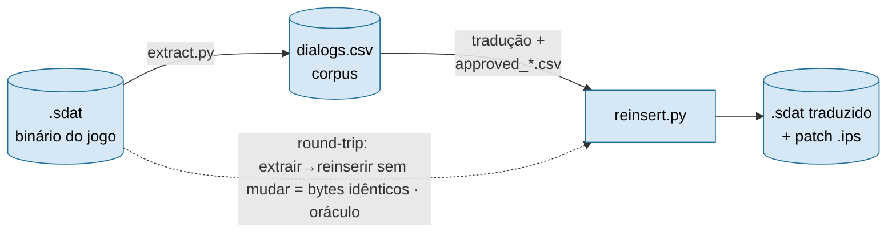

# Conector — Utawarerumono
## Estado: ✅ jogo inteiro reinsere e round-trip íntegro (16 caps, ~45.100 linhas); validado in-game

Este projeto usa o conector `hex_binary` (ver `framework/connectors/hex_binary.md`). O formato do
`ScriptEvent.sdat` foi mapeado por engenharia reversa — ver `table_schema.md`.

### Em 30 segundos

| | |
|---|---|
| **O que é** | Código **determinístico** que tira o texto de dentro do binário do jogo (`.sdat`) e o devolve traduzido — específico desta engine (Aquaplus). Sem IA: é I/O. |
| **O oráculo** | **Round-trip**: extrair → reinserir **sem mudar nada** tem que regenerar o binário **byte a byte**. Se os bytes batem, não corrompemos o jogo. É prova objetiva, não opinião. |
| **A prova** | Jogo inteiro reinsere com **resíduo 0** e renderiza in-game; **16 testes** travam os invariantes. |



> O binário é **read-only**: `reinsert.py` nunca o edita — gera um arquivo **novo** + patch. A tradução
> vem de `approved_*.csv` (a IA propôs, um gate aprovou); o conector só **aplica**.

## Formato (resumo)

- Container: `Filename` (header) → tabela de nomes → `Pack` (count + (offset,size) por arquivo) →
  **353 scripts contíguos, alinhados a 16 bytes**. Cada script = `[bytecode STSC][bloco de texto]`.
- Texto: strings UTF-8 **null-terminated** e **contíguas**; control codes são tokens ASCII literais (`{W75}`…).
- Ponteiros: **inline no bytecode**, sem tabela central. Opcode `50 00` (uint16 LE) + **uint32 LE
  RELATIVO ao início do arquivo** (alvo_abs = file_start + uint32; **não é absoluto**). Continuações =
  strings sem ponteiro, lidas em sequência após o head. **Run** = head + continuações.

## O que está feito (Passo 00 + Passo 08)

- [x] Container `.sdat` totalmente mapeado (`parse_pack`, `rebuild_container`) — `table_schema.md`.
- [x] **Modelo de ponteiro FILE-RELATIVO** (correção crítica; ~42k sites confirmam vs ~63 absolutos) —
      `table_schema.md` SEÇÃO 4.
- [x] `reinsert.py`: round-trip byte-idêntico + cascata de encaixe (1025 linhas: T1=595, RELOC=430, **resíduo T4=0**).
- [x] **Relocação INTRA-ARQUIVO**: o run que estoura é anexado ao fim da região do próprio arquivo; o
      arquivo cresce e a tabela Pack é reescrita (`rebuild_container`, padding a 16 bytes); ponteiro =
      offset local. (EOF-append ao fim do container foi **reprovado in-game**.)
- [x] **Charset**: gate FALHOU (fonte sem diacríticos → `@`); resolvido por **transliteração** na
      gravação. Evidência: `artifacts/evidence/char1.png`, `char2.png`. **Transliteração usa NFD
      (canônica), não NFKD:** dobra acento (á→a, ç→c) mas **preserva glifos de compatibilidade que o
      jogo já usa** — ex.: dígitos circulados ①②③ em sequências de puzzle (`{W12}`). NFKD os reduzia a
      `1/2/3` e quebrava o round-trip do binário original (descoberto no `ch_30_09`).
- [x] **Validação in-game ✅**: pt-BR exibe (`artifacts/evidence/Fasea*.png`); linha relocada pelo Plano B
      exibe e o jogo avança sem travar (`artifacts/evidence/testeplanob.png`, `testeplanob_avanco.png`).
- [x] Patch IPS gerado em `output/ScriptEvent.sdat.ips`.

## Próximos passos

- [x] **Jogo inteiro extraído, reinserido e round-trip verde** — 16 capítulos (11–23 + 30, 31, 39),
      146 cenas, ~45.100 linhas, pelo harness (`framework/runtime/`). Ordem offset × ordem narrativa
      confirmada em todos (nenhuma divergência pega pela back-translation/QA).
- [ ] **Pós-produção:** reinsert do **jogo inteiro num passe só** + patch IPS final (hoje é por
      capítulo) e **gate visual in-game** dos saltos grandes (caps 30/39). Ver `ROADMAP.md`.

## Como rodar

```
python connector/extract.py  artifacts/ScriptEvent.sdat   # -> artifacts/dialogs.csv
python connector/reinsert.py artifacts/ScriptEvent.sdat   # -> output/ScriptEvent.sdat + .ips + reinsertion_report.md
pytest  connector/                                        # gate de regressão (round-trip + ponteiros + IPS)
```

O formato é parseado por `connector/sdat_format.py` (módulo único compartilhado por extract e
reinsert — garante o round-trip). O escopo extraído é controlado por capítulo via
`connector/extract_chapter.py` (prefixos de nome de script por capítulo, ex.: `13` → `ch_13_*`); os
16 capítulos do jogo já extraídos e traduzidos.

O caminho do binário **nunca** é hardcoded: vem do argumento de CLI ou de
`connector.source_binary` no `project.json` (relativo à raiz do projeto).

## Testes (regressão)

`connector/test_roundtrip.py` (pytest, **16 testes**) trava os invariantes do conector: round-trip de
identidade byte-a-byte, binário-fonte intacto, modelo file-relativo, cada head relocado aponta para
**dentro do seu arquivo** com a string traduzida correta (`test_planob_within_file`), integridade do
Pack reconstruído (contíguo/alinhado/nomes/footer — `test_pack_rebuild_integrity`), patch IPS
aplicável, e o **guard de governança** (nenhum texto da obra hardcoded em `.py`). Rodar antes de entregar.
